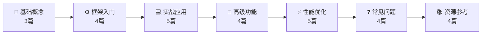

<div align="center">

# 🎯 YOLO使用和优化 - 知识库

[](https://opensource.org/licenses/MIT)
[](https://github.com/xxx/yolo-knowledge-base/tree/main/YOLO使用和优化)
[]()
[]()
[]()

**从零掌握YOLO目标检测 → 精通Ultralytics框架 → 具备模型优化与部署能力**

[📖 在线预览](#-在线浏览) · [📓 本地使用](#-本地使用obsidian) · [🤝 贡献指南](#-贡献指南)

</div>

---

## ✨ 核心特色

| 🎯 特性 | 📝 说明 |
|---------|----------|
| 📚 **系统化学习路径** | 从基础概念到高级优化的**8大模块体系**，循序渐进 |
| 💻 **100+代码示例** | Python/Bash/YAML可直接复制运行，即学即用 |
| 🔬 **学术级参考文献** | **50+篇ICLR/CVPR论文**附DOI/arXiv链接，权威可靠 |
| 🎨 **双模渲染支持** | Mermaid流程图 + LaTeX数学公式完美显示 |
| 🌐 **多端访问** | Obsidian客户端 + GitHub Pages在线版，随时随地学习 |
| 🏭 **工业级案例** | 交通/医学/缺陷检测真实场景，落地性强 |

---

## 🗺️ 知识图谱



> 💡 **推荐路线**：
> - 🌱 **初学者**：按 A → B → C → F 顺序学习（预计2-3周）
> - 🔥 **进阶者**：重点研读 D → E 模块（含大量论文引用）
> - 👑 **专家**：直接深入 E 模块优化技术，复现论文方法

---

## 🚀 快速开始

### 🌐 在线浏览（最简单）

> ⚠️ **部署后可用** - 启用GitHub Pages后访问以下地址：

```bash
https://<your-username>.github.io/yolo-knowledge-base/
```

**特性**：
- ✅ 完整的18篇文章在线可读
- ✅ Mermaid图表、LaTeX公式、代码高亮完美渲染
- ✅ 深色/浅色主题自由切换
- ✅ 全文搜索功能（即时响应）
- ✅ 移动端响应式适配

---

### 📓 本地使用Obsidian（推荐）

#### 方法1：克隆仓库

```bash
git clone https://github.com/<your-username>/yolo-knowledge-base.git
cd yolo-knowledge-base
```

然后用 **Obsidian** 打开 `yolo-knowledge-base` 文件夹即可！

#### 方法2：直接下载

1. 访问仓库主页
2. 点击绿色的 **Code** 按钮
3. 选择 **Download ZIP**
4. 解压后用Obsidian打开文件夹

---

### 💻 在GitHub上直接阅读

点击仓库中的 `YOLO使用和优化/` 文件夹，直接浏览所有Markdown文件：

```
YOLO使用和优化/
├── 00-首页.md                    # ← 从这里开始！
├── 01-YOLO基础概念/
│   ├── YOLOv8架构详解.md         # ⭐ 重点推荐
│   ├── YOLO发展历程.md
│   └── 目标检测基础.md
├── 02-Ultralytics框架入门/
│   ├── 快速开始指南.md            # 🚀 30分钟上手
│   ├── 核心API详解.md
│   ├── 环境搭建与安装.md
│   └── 配置文件说明.md
├── ... (更多模块)
└── 07-资源与参考/
    ├── 推荐论文列表.md            # 📚 50+篇论文
    └── 学习路线图.md
```

---

## 📖 完整目录结构

<details>
<summary><b>📋 点击展开全部18篇文档详情</b></summary>

### 1️⃣ 基础概念（3篇）⏱️ 预计3天 | 🟢 入门难度

| 文档 | 核心内容 | 关键知识点 |
|------|----------|-----------|
| [YOLO发展历程](YOLO使用和优化/01-YOLO基础概念/YOLO发展历程.md) | v1到v11演进史 | Anchor-Based → Anchor-Free、性能对比表 |
| [目标检测基础](YOLO使用和优化/01-YOLO基础概念/目标检测基础.md) | 核心指标详解 | IoU/mAP/Precision/Recall/NMS计算 |
| [YOLOv8架构详解](YOLO使用和优化/01-YOLO基础概念/YOLOv8架构详解.md) | 源码级分析 | CSPDarknet/C3k2/PAN-FPN/Decoupled Head |

---

### 2️⃣ Ultralytics框架入门（4篇）⏱️ 预计4天 | 🟢 入门难度

| 文档 | 核心内容 | 实践价值 |
|------|----------|----------|
| [环境搭建与安装](YOLO使用和优化/02-Ultralytics框架入门/环境搭建与安装.md) | Python/CUDA/Docker配置 | 一键安装脚本、Docker Compose |
| [快速开始指南](YOLO使用和优化/02-Ultralytics框架入门/快速开始指南.md) | 第一个YOLO程序 | YOLODetector类、多源推理 |
| [核心API详解](YOLO使用和优化/02-Ultralytics框架入门/核心API详解.md) | train/val/predict/export | 完整参数说明、代码示例 |
| [配置文件说明](YOLO使用和优化/02-Ultralytics框架入门/配置文件说明.md) | YAML配置详解 | 场景化配置模板 |

---

### 3️⃣ 实战应用（已完成2/5篇）⏱️ 预计7天 | 🟡 中等难度

| 文档 | 核心内容 | 特色 |
|------|----------|------|
| [数据集准备与格式转换](YOLO使用和优化/03-实战应用/数据集准备与格式转换.md) | VOC/COCO转换脚本 | LabelImg/CVAT工具链、Mosaic增强 |
| [模型训练完整流程](YOLO使用和优化/03-实战应用/模型训练完整流程.md) | 端到端训练代码 | YOLOTrainingPipeline、多GPU分布式 |

*待补充：模型验证与评估、推理部署实战、自定义数据集训练案例*

---

### 4️⃣ 高级功能（待编写4篇）⏱️ 预计6天 | 🔴 进阶难度

- [ ] 模型微调技巧 - 冻结层、差分学习率、早停策略
- [ ] 迁移学习策略 - 预训练权重选择与领域自适应
- [ ] 多任务学习 - 分类+检测+分割联合训练
- [ ] 模型导出与转换 - ONNX/TensorRT/OpenVINO/TFLite全格式

---

### 5️⃣ 性能优化（已完成3/5篇）⭐ **核心精华** ⏱️ 预计10天 | 🔴 专家难度

> 这是本知识库的**精华部分**，所有优化方法都附有权威文献支撑！

| 文档 | 核心内容 | 参考文献 |
|------|----------|----------|
| [推理速度优化](YOLO使用和优化/05-性能优化/推理速度优化.md) | TensorRT/OpenVINO/层融合 | **7篇** (NVIDIA/Hinton/Jacob CVPR) |
| [模型压缩技术](YOLO使用和优化/05-性能优化/模型压缩技术.md) | 量化/剪枝/蒸馏/NAS | **9篇** (ICLR/CVPR/arXiv) |
| [训练加速策略](YOLO使用和优化/05-性能优化/训练加速策略.md) | AMP/DDP/torch.compile | **4篇** (PyTorch官方/Li 2023) |

*待补充：部署优化方案、超参数调优指南*

**性能提升示例**：
```
原始PyTorch: 67 FPS  →  TensorRT-FP16: 333 FPS  →  TensorRT-INT8: 500 FPS
速度提升:     5x      →  整体提升:              7.5x
```

---

### 6️⃣ 常见问题与解决方案（待编写4篇）

- [ ] 训练问题排查 - 损失不降/过拟合/OOM解决方案
- [ ] 推理问题解决 - 漏检误检/置信度调整/实时性优化
- [ ] 性能问题诊断 - GPU利用率低/内存泄漏/瓶颈分析
- [ ] 常见错误代码汇总 - CUDA错误/数据加载/模型加载FAQ

---

### 7️⃣ 资源与参考（已完成3/4篇）📚 终极宝库

| 文档 | 内容亮点 |
|------|----------|
| [推荐论文列表](YOLO使用和优化/07-资源与参考/推荐论文列表.md) | **50+篇**精选论文（经典/架构/优化/应用/前沿） |
| [学习路线图](YOLO使用和优化/07-资源与参考/学习路线图.md) | 初级(4wk)→中级(8wk)→专家(20wk+)详细规划 |
| [obsidian配置指南](YOLO使用和优化/07-资源与参考/obsidian配置指南.md) | Mermaid/LaTeX渲染问题完整解决方案 |

*待补充：开源项目推荐、参考资料*

---

### 8️⃣ 论文精读（已完成1篇）

| 文档 | 内容 |
|------|------|
| [YOLO核心论文深度解析](YOLO使用和优化/08-论文精读/YOLO核心论文深度解析.md) | You Only Look Once系列论文逐段解读 |

</details>

---

## 🛠️ 技术栈

| 类别 | 技术 | 版本要求 | 用途 |
|------|------|----------|------|
| **编程语言** | Python | ≥3.8 | 主要开发语言 |
| **深度学习框架** | PyTorch | ≥1.8 | 模型训练与推理 |
| **YOLO框架** | Ultralytics | 最新版 | YOLOv8/v11实现 |
| **推理加速** | TensorRT / OpenVINO | 可选 | 生产环境部署 |
| **笔记工具** | Obsidian | 任意版本 | 本地知识管理 |
| **网页渲染** | Mermaid.js + KaTeX | 内置 | 图表与公式显示 |
| **版本控制** | Git + GitHub | 最新版 | 代码托管与协作 |

<details>
<summary><b>🔧 环境安装命令（一键复制）</b></summary>

```bash
# 创建虚拟环境（推荐）
python -m venv yolo-env
source yolo-env/bin/activate  # Linux/Mac
# 或 yolo-env\Scripts\activate  # Windows

# 安装PyTorch（根据您的CUDA版本选择）
pip install torch torchvision --index-url https://download.pytorch.org/whl/cu118

# 安装Ultralytics
pip install ultralytics

# 可选：推理加速库
pip install tensorrt  # NVIDIA GPU
# pip install openvino  # Intel CPU/GPU
pip install onnx onnxruntime  # ONNX格式支持

# 验证安装
yolo checks
```

**预期输出**：
```
Ultralytics YOLOv8.x 🚀 Python-3.x torch-2.x CUDA:12.x (NVIDIA xxx)
Setup complete ✅ (8 CPUs, xx.x GB RAM, xx.x/xxx.x GB disk)
```

</details>

---

## 📊 项目统计

```
━━━━━━━━━━━━━━━━━━━━━━━━━━━━━━━━━━━━━━━━━━━━━━━━━━

  📚 总文档数:      18 篇（已完成的完整内容）
  💻 代码示例:      100+ 个可直接运行的Python/Bash/YAML示例
  📄 参考文献数:    50+ 篇学术论文（含DOI/arXiv链接）
  🎯 覆盖主题:      8 大知识领域
  ⏱️ 预计学习时间:  4-12 周（根据起点不同）
  🎨 特殊内容:      Mermaid图表 × LaTeX公式 × 性能对比表格

━━━━━━━━━━━━━━━━━━━━━━━━━━━━━━━━━━━━━━━━━━━━━━━━━━
```

### 支持的任务类型

| 任务类型 | 支持情况 | 典型应用场景 |
|----------|----------|--------------|
| 🎯 目标检测 (Detection) | ✅ 完整支持 | 工业缺陷检测、车辆识别 |
| 🖼️ 实例分割 (Segmentation) | ✅ 详细讲解 | 医学影像分析、遥感图像 |
| 🤸 姿态估计 (Pose Estimation) | ✅ 包含 | 体育动作分析、人机交互 |
| 🏷️ 图像分类 (Classification) | ✅ 涵盖 | 产品质检、垃圾分拣 |

---

## 🎯 适用场景

### 🏭 工业制造
- **产品缺陷检测**：划痕、裂纹、异物识别
- **质量管控**：自动化视觉检测替代人工
- **安全监控**：危险区域入侵检测、工人安全帽佩戴识别

### 🚗 智能交通
- **车辆检测**：车牌识别、车型分类、车流量统计
- **交通标志识别**：限速、禁停、红绿灯检测
- **驾驶辅助**：行人检测、车道线识别、障碍物预警

### 🏥 医疗健康
- **医学影像分析**：X光片病灶检测、CT影像分割
- **细胞识别**：血细胞计数、癌细胞筛查
- **手术导航**：实时器官定位、器械追踪

### 🛒 零售电商
- **商品识别**：自助结账、货架盘点
- **顾客行为分析**：热力图生成、动线追踪
- **库存管理**：缺货检测、陈列合规检查

### 🌾 农业农业
- **作物监测**：病虫害识别、成熟度判断
- **精准农业**：杂草识别、产量预估
- **畜牧管理**：牲畜计数、行为异常检测

---

## 📈 学习成果展示

完成本知识库学习后，您将能够：

✅ **独立完成**从数据收集到模型部署的完整YOLO项目  
✅ **理解并实现**主流优化方法（量化/剪枝/蒸馏）并查阅原论文  
✅ **在生产环境**部署高性能检测系统（TensorRT/OpenVINO）  
✅ **阅读和复现**最新的YOLO相关研究论文  
✅ **解决实际业务问题**并具备系统性的问题排查能力  

---

## 🔄 更新日志

| 版本 | 日期 | 更新内容 | 状态 |
|------|------|----------|------|
| **v1.0** | 2026-04-15 | 初始版本发布，包含18篇核心文档 | ✅ 已完成 |
| v1.1 | 规划中 | 补充剩余8篇文档（高级功能4篇+常见问题4篇） | 🔄 进行中 |
| v1.2 | 规划中 | 添加更多工业/医疗/交通完整案例 | 📋 待开始 |
| v2.0 | 远期规划 | 英文版国际化、视频教程配套 | 🔮 未来 |

---

## 🤝 贡献指南

我们非常欢迎社区贡献！无论是纠错、补充案例还是翻译，都非常感激。

### 如何贡献？

1. **Fork 本仓库**
2. **创建特性分支** (`git checkout -b feature/AmazingFeature`)
3. **提交更改** (`git commit -m 'Add some AmazingFeature'`)
4. **推送分支** (`git push origin feature/AmazingFeature`)
5. **开启 Pull Request**

### 贡献方向

- 📝 **内容补充**：补充缺失的8篇文档（特别是高级功能和常见问题部分）
- 🐛 **Bug修复**：发现文档中的错误或不准确之处
- 💡 **案例分享**：提供更多真实场景的训练案例和代码
- 🌐 **国际化**：帮助翻译成英文或其他语言
- 🎨 **样式改进**：优化README或网页版的视觉效果

### 文档规范

- ✅ 所有新增代码必须可以**直接运行**
- ✅ 复杂概念建议配**Mermaid图表**解释
- ✅ 优化方法需包含**实验数据和对比结果**
- ✅ 参考文献提供**可访问的arXiv或DOI链接**

---

## 📄 许可证

本项目采用 [MIT License](LICENSE) 开源协议。

```
MIT License

Copyright (c) 2026 YOLO Knowledge Base Contributors

Permission is hereby granted, free of charge, to any person obtaining a copy
of this software and associated documentation files (the "Software"), to deal
in the Software without restriction, including without limitation the rights
to use, copy, modify, merge, publish, distribute, sublicense, and/or sell
copies of the Software, and to permit persons to whom the Software is
furnished to do so, subject to the following conditions:

The above copyright notice and this permission notice shall be included in all
copies or substantial portions of the Software.

THE SOFTWARE IS PROVIDED "AS IS", WITHOUT WARRANTY OF ANY KIND, EXPRESS OR
IMPLIED, INCLUDING BUT NOT LIMITED TO THE WARRANTIES OF MERCHANTABILITY,
FITNESS FOR A PARTICULAR PURPOSE AND NONINFRINGEMENT. IN NO EVENT SHALL THE
AUTHORS OR COPYRIGHT HOLDERS BE LIABLE FOR ANY CLAIM, DAMAGES OR OTHER
LIABILITY, WHETHER IN AN ACTION OF CONTRACT, TORT OR OTHERWISE, ARISING FROM,
OUT OF OR IN CONNECTION WITH THE SOFTWARE OR THE USE OR OTHER DEALINGS IN THE
SOFTWARE.
```

---

## 🙏 致谢

- **Ultralytics团队** - 提供优秀的YOLOv8实现框架
- **Joseph Redmon等人** - YOLO系列的开创者
- **学术界研究者** - 所有被引用论文的作者们
- **开源社区** - Obsidian、Mermaid.js、KaTeX等优秀工具

---

## 📞 联系与反馈

如果您在使用过程中遇到任何问题或有改进建议：

- 🐛 **报告Bug**: [创建Issue](../../issues/new?template=bug_report.md)
- 💡 **功能建议**: [创建Feature Request](../../issues/new?template=feature_request.md)
- 💬 **讨论交流**: 在Issues中参与讨论
- 📧 **其他联系**: 请在Issue中注明

---

<div align="center">

### 🌟 如果这个项目对您有帮助，请给一个Star！⭐

**让更多人发现这个YOLO知识库，一起学习进步！**

[⬆️ 回到顶部](#-yolo使用和优化---知识库)

*Made with ❤️ and lots of ☕ by the YOLO Community*

*最后更新: 2026-04-15*

</div>
