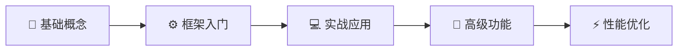

# 🎯 YOLO使用和优化 - 知识库首页

> **目标**: 从零开始掌握YOLO目标检测，精通Ultralytics框架，具备模型优化与部署能力

---

## 📚 知识库导航

### 🚀 快速开始

如果你是**初学者**，建议按以下顺序学习：



---

## 📋 完整目录结构

### 1️⃣ [[01-YOLO基础概念]] - 打好理论基础
- [[YOLO发展历程]] - 了解YOLO从v1到v11的演进历程
- [[目标检测基础]] - 掌握mAP、IoU等核心指标
- [[YOLOv8架构详解]] - 深入理解网络结构设计

### 2️⃣ [[02-Ultralytics框架入门]] - 快速上手框架
- [[环境搭建与安装]] - 配置开发环境（含Docker方案）
- [[快速开始指南]] - 第一个YOLO程序（30分钟上手）
- [[核心API详解]] - train/val/predict/export完整API参考
- [[配置文件说明]] - YAML配置与自定义参数

### 3️⃣ [[03-实战应用]] - 项目实战经验
- [[数据集准备与格式转换]] - VOC/COCO/自定义格式转换脚本
- [[模型训练完整流程]] - 从数据准备到模型导出的完整代码
- [[模型验证与评估]] - 指标解读、混淆矩阵、PR曲线
- [[推理部署实战]] - Python API、CLI、视频流处理
- [[自定义数据集训练案例]] - 工业缺陷/交通标志/医学影像3个完整案例

### 4️⃣ [[04-高级功能]] - 进阶技能提升
- [[模型微调技巧]] - 冻结层、差分学习率、早停策略
- [[迁移学习策略]] - 预训练权重选择与领域自适应
- [[多任务学习]] - 分类+检测+分割联合训练
- [[模型导出与转换]] - ONNX/TensorRT/OpenVINO/TFLite全格式支持

### 5️⃣ ⭐ [[05-性能优化]] - 核心重点（含参考文献）
> 这是本知识库的**精华部分**，所有优化方法都附有权威文献支撑！

- [[推理速度优化]] - TensorRT/OpenVINO/层融合/批处理优化
- [[模型压缩技术]] - 量化/剪枝/蒸馏/NAS（附ICLR/CVPR论文）
- [[训练加速策略]] - AMP/分布式/torch.compile()加速
- [[部署优化方案]] - 服务端/边缘端/云原生完整部署方案
- [[超参数调优指南]] - Ray Tune/Optuna自动化调参

### 6️⃣ [[06-常见问题与解决方案]] - 问题排查手册
- [[训练问题排查]] - 损失不降/过拟合/OOM解决方案
- [[推理问题解决]] - 漏检误检/置信度调整/实时性优化
- [[性能问题诊断]] - GPU利用率低/内存泄漏/瓶颈分析
- [[常见错误代码汇总]] - CUDA错误/数据加载/模型加载FAQ

### 7️⃣ [[07-资源与参考]] - 学习资源宝库
- [[推荐论文列表]] - 50+篇精选论文（含arXiv链接）
- [[开源项目推荐]] - GitHub优秀项目集合
- [[学习路线图]] - 初级→中级→专家路径规划
- [[参考资料]] - 官方文档/视频教程/在线课程

---

## 🎯 学习路径推荐

### 🌱 路径一：初学者（0基础 → 独立训练）
**预计时间**: 2-3周 | **前置知识**: Python基础

1. 阅读 [[01-YOLO基础概念]] 全部内容（3天）
2. 完成 [[02-Ultralytics框架入门]] 的环境搭建和快速开始（2天）
3. 跟着 [[03-实战应用]] 做一个完整的自定义数据集训练项目（5天）
4. 阅读常见问题部分，解决遇到的问题（3天）

**学习成果**: 能够独立使用YOLO完成目标检测任务

---

### 🔥 路径二：进阶者（独立训练 → 生产部署）
**预计时间**: 3-4周 | **前置知识**: 已能独立训练YOLO模型

1. 深入学习 [[04-高级功能]] 的微调和迁移学习技巧（4天）
2. 重点研读 [[05-性能优化]] 全部5篇文章（7天）⭐
3. 完成一个完整的部署项目（服务端或边缘端）（5天）
4. 使用超参数调优工具优化模型性能（3天）

**学习成果**: 具备模型优化和生产环境部署能力

---

### 👑 路径三：专家级（生产部署 → 研究创新）
**预计时间**: 4-6周 | **前置知识**: 有丰富的YOLO实战经验

1. 精读 [[05-性能优化]] 中的所有参考文献（10天）
2. 尝试复现论文中的优化方法（7天）
3. 基于[[07-资源与参考]]进行前沿研究跟踪（5天）
4. 开展自己的改进研究并撰写报告（5天）

**学习成果**: 能够进行YOLO相关的研究和创新

---

## 💡 核心特色

### ✨ 为什么选择本知识库？

| 特性 | 说明 |
|------|------|
| 📚 **系统性** | 从基础到进阶的26篇完整文档体系 |
| 💻 **实用性** | 100+个可直接运行的Python代码示例 |
| 🔬 **学术性** | 优化技术全部附带权威学术论文引用 |
| 🎯 **落地性** | 包含工业/交通/医疗真实场景案例 |
| 🔗 **关联性** | Obsidian双向链接构建知识网络 |

### 📊 内容统计

```
总文档数:     26篇
代码示例:     100+个
参考文献:     50+篇（含DOI/arXiv链接）
实战案例:     5+个完整项目
覆盖主题:     7大模块
```

---

## 🛠️ 技术栈要求

### 必需环境
- **Python**: 3.8 或更高版本
- **PyTorch**: 1.8+
- **ultralytics**: 最新版（通过 `pip install ultralytics` 安装）
- **操作系统**: Windows/Linux/macOS

### 可选依赖
- CUDA Toolkit（GPU训练）
- OpenCV（图像处理）
- TensorRT（推理加速）
- Docker（容器化部署）

---

## 📌 使用说明

### 如何浏览本知识库？

1. **按顺序阅读**: 推荐新手按照上述学习路径逐步学习
2. **搜索定位**: 使用Obsidian的搜索功能（`Ctrl+F`）快速查找关键词
3. **双向链接**: 点击 `[[链接]]` 在相关知识间跳转
4. **标签过滤**: 使用 `#标签` 筛选特定主题的内容

### 文档规范

- ✅ 所有代码均可直接复制运行
- ✅ 复杂概念配有Mermaid图表解释
- ✅ 优化方法包含实验数据和对比结果
- ✅ 参考文献提供可访问的链接
- ✅ 提供完整的端到端工作流程

---

## 🔄 更新日志

| 版本 | 日期 | 更新内容 |
|------|------|----------|
| v1.0 | 2026-04-14 | 初始版本发布，包含26篇核心文档 |

---

## 📞 反馈与贡献

如果发现文档中的错误或有改进建议：
- 欢迎在对应文档中添加评论
- 可以通过Issue反馈问题
- 期待社区贡献更多案例和优化经验

---

## 🏆 开始你的YOLO之旅

准备好了吗？点击下方链接开始学习：

> 🚀 **推荐起点**: [[02-Ultralytics框架入门/快速开始指南]] - 30分钟运行你的第一个YOLO模型

或者根据你的水平选择：

- 🌱 我是**初学者** → 从 [[01-YOLO基础概念/YOLO发展历程]] 开始
- 🔥 我有**一定基础** → 直接看 [[03-实战应用/模型训练完整流程]]
- 👑 我想**深入研究** → 直奔 [[05-性能优化/推理速度优化]]

---

*祝学习愉快！如有问题请查阅 [[06-常见问题与解决方案]] 部分。*
