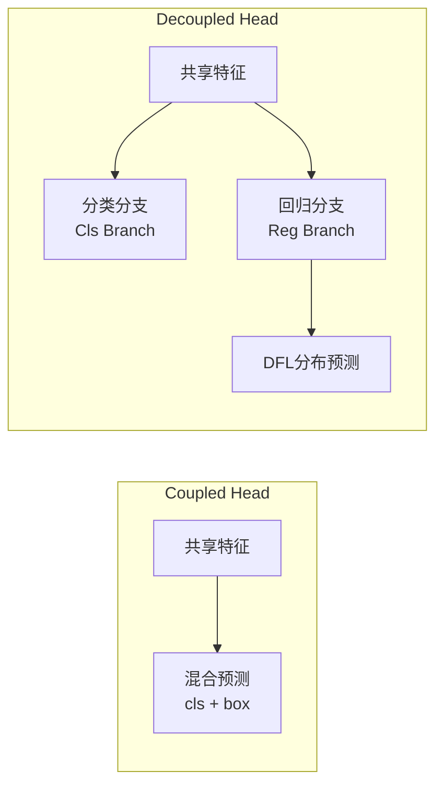

# YOLOv8架构详解

> **目标**: 深入理解YOLOv8的网络架构设计，掌握各组件的作用和原理

---

## 🏗️ 架构总览

### 整体架构流程图

```mermaid
graph TD
    A[输入图像<br/>640x640x3] --> B[Backbone<br/>CSPDarknet + C3k2]
    B --> C[Neck<br/>SPPF + PAN-FPN]
    C --> D[Head<br/>Decoupled Head]
    D --> E{任务类型}
    
    E -->|检测| F[Detection Head<br/>输出: [box, cls, dfl]]
    E -->|分割| G[Segmentation Head<br/>输出: [box, cls, dfl, mask]]
    E -->|姿态| H[Pose Head<br/>输出: [box, cls, dfl, kpts]]
    E -->|分类| I[Classification Head<br/>输出: cls_prob]
```

### 模型规模对比

| 模型 | 参数量 | FLOPs (G) | mAPval0.5 | 速度(T4 GPU) |
|------|--------|-----------|-----------|---------------|
| **YOLOv8n** | 3.2M | 8.7G | 37.3% | **232 FPS** |
| **YOLOv8s** | 11.2M | 28.6G | 44.9% | 155 FPS |
| **YOLOv8m** | 25.9M | 78.9G | 50.2% | 99 FPS |
| **YOLOv8l** | 43.7M | 165.2G | 52.9% | 70 FPS |
| **YOLOv8x** | 68.2M | 257.8G | 53.9% | 41 FPS |

---

## 🧱 Backbone网络详解

### 核心组件：CSPDarknet + C3k2模块

**Backbone结构**:

```python
import torch
import torch.nn as nn
from collections import OrderedDict

class Conv(nn.Module):
    """标准卷积块: Conv + BN + SiLU"""
    def __init__(self, c1, c2, k=1, s=1, p=None, g=1, act=True):
        super().__init__()
        self.conv = nn.Conv2d(c1, c2, k, s, autopad(k, p), groups=g, bias=False)
        self.bn = nn.BatchNorm2d(c2)
        self.act = nn.SiLU() if act else nn.Identity()
        
    def forward(self, x):
        return self.act(self.bn(self.conv(x)))


class C3k2(nn.Module):
    """
    C3k2模块 - YOLOv8的核心构建块
    
    特点:
    - 使用更大的卷积核(k=3)提升感受野
    - CSPNet思想减少计算冗余
    - 分组卷积降低参数量
    """
    def __init__(self, c1, c2, n=1, shortcut=True, g=1, e=0.5):
        super().__init__()
        c_ = int(c2 * e)  # 隐藏层通道数
        
        # 主路径
        self.cv1 = Conv(c1, 2 * c_, 1, 1)   # 1x1卷积降维
        self.cv2 = Conv((2 + n) * c_, c2, 1) # 1x1卷积升维
        
        # 残差分支: 使用k=3的卷积
        self.m = nn.Sequential(*(
            Conv(c_, c_, 3, 1, g=g, shortcut=shortcut) for _ in range(n)
        ))
        
        # 空间注意力 (可选)
        self.split = False  # 是否使用split操作
        
    def forward(self, x):
        y = list(self.cv1(x).chunk(2, 1))  # 分成两半
        y.extend((m(y[-1]) for m in self.m))  # 多个残差块
        return self.cv2(torch.cat(y, 1))      # 拼接后融合


class SPPF(nn.Module):
    """
    Spatial Pyramid Pooling - Fast
    
    作用:
    - 聚合不同尺度的上下文信息
    - 相比SPP速度更快（串行vs并行）
    - 增大感受野，增强全局特征提取能力
    """
    def __init__(self, c1, c2, k=5):
        super().__init__()
        c_ = c1 // 2  # 通道数减半
        self.cv1 = Conv(c1, c_, 1, 1)
        self.cv2 = Conv(c_ * 4, c2, 1, 1)
        self.m = nn.MaxPool2d(kernel_size=k, stride=1, padding=k // 2)
        
    def forward(self, x):
        x = self.cv1(x)
        y1 = self.m(x)
        y2 = self.m(y1)
        y3 = self.m(y2)
        return self.cv2(torch.cat([x, y1, y2, y3], 1))


def autopad(k, p=None):
    """自动计算padding以保持尺寸不变"""
    if p is None:
        p = k // 2 if isinstance(k, int) else [x // 2 for x in k]
    return p


# 完整的Backbone定义 (以YOLOv8n为例)
class YOLOv8_Backbone(nn.Module):
    def __init__(self, width_multiplier=0.25, depth_multiplier=0.33):
        """
        参数:
            width_multiplier: 通道数缩放因子 (n=0.25, s=0.50, m=0.75, l=1.00, x=1.25)
            depth_multiplier: 层数缩放因子 (n=0.33, s=0.33, m=0.67, l=1.00, x=1.00)
        """
        super().__init__()
        
        # 计算实际通道数
        ch = [int(64 * width_multiplier), 
              int(128 * width_multiplier),
              int(256 * width_multiplier),
              int(512 * width_multiplier),
              int(1024 * width_multiplier)]
        
        # 计算实际层数
        n1 = max(round(3 * depth_multiplier), 1)
        n2 = max(round(6 * depth_multiplier), 1)
        n3 = max(round(6 * depth_multiplier), 1)
        n4 = max(round(3 * depth_multiplier), 1)
        
        # Stem: 快速下采样
        self.stem = nn.Sequential(
            Conv(3, ch[0], k=6, s=2, p=2),  # 大卷积核快速下采样
            Conv(ch[0], ch[1], k=2, s=2),     # 继续下采样
        )
        
        # Stage 2-4: 特征提取
        self.stage2 = nn.Sequential(
            C3k2(ch[1], ch[1], n=n1, shortcut=True),
            Conv(ch[1], ch[2], k=2, s=2),
        )
        
        self.stage3 = nn.Sequential(
            C3k2(ch[2], ch[2], n=n2, shortcut=True),
            Conv(ch[2], ch[3], k=2, s=2),
        )
        
        self.stage4 = nn.Sequential(
            C3k2(ch[3], ch[3], n=n3, shortcut=True),
            Conv(ch[3], ch[4], k=2, s=2),
        )
        
        # Stage 5: SPPF + 最终特征
        self.stage5 = nn.Sequential(
            C3k2(ch[4], ch[4], n=n4, shortcut=True),
            SPPF(ch[4], ch[4], k=5),
        )
        
    def forward(self, x):
        x = self.stem(x)
        p3 = self.stage2(x)    # /8 特征图
        p4 = self.stage3(p3)   # /16 特征图  
        p5 = self.stage4(p4)   # /32 特征图
        p5_sppf = self.stage5(p5)  # SPPF增强后的/32特征
        
        return p3, p4, p5_sppf


# 使用示例
if __name__ == '__main__':
    backbone = YOLOv8_Backbone(width_multiplier=0.25, depth_multiplier=0.33)  # YOLOv8n
    x = torch.randn(1, 3, 640, 640)
    p3, p4, p5 = backbone(x)
    print(f"P3 shape: {p3.shape}")  # [1, 64, 80, 80]
    print(f"P4 shape: {p4.shape}")  # [1, 128, 40, 40]
    print(f"P5 shape: {p5.shape}")  # [1, 256, 20, 20]
```

---

## 🔄 Neck网络详解

### PAN-FPN 结构

**作用**: 多尺度特征融合，连接Backbone和Head

**详细结构**:

```python
class PAN_FPN_YOLOv8(nn.Module):
    """
    Path Aggregation Network - Feature Pyramid Network (YOLOv8版本)
    
    特点:
    - 双向特征融合 (Top-down + Bottom-up)
    - 使用C3k2作为融合模块
    - 输出3个尺度的特征用于检测
    """
    def __init__(self, channels=[64, 128, 256]):
        super().__init__()
        
        # 上采样层 (Top-down pathway): 从高层向低层传递语义信息
        self.up_sample = nn.Upsample(scale_factor=2, mode='nearest')
        
        # 侧向连接: 1x1卷积调整通道数
        self.lateral_conv_p5 = Conv(channels[2], channels[1], 1, 1)
        self.lateral_conv_p4 = Conv(channels[1], channels[0], 1, 1)
        
        # Top-down融合: C3k2模块
        self.td_c3k2_p4 = C3k2(channels[1] * 2, channels[1], n=1, shortcut=False)
        self.td_c3k2_p3 = C3k2(channels[0] * 2, channels[0], n=1, shortcut=False)
        
        # 下采样层 (Bottom-up pathway): 从低层向高层传递位置信息
        self.down_sample_p3 = Conv(channels[0], channels[0], k=3, s=2, p=1)
        self.down_sample_p4 = Conv(channels[1], channels[1], k=3, s=2, p=1)
        
        # Bottom-up融合: C3k2模块
        self.bu_c3k2_n3 = C3k2(channels[0] * 2, channels[0], n=1, shortcut=False)
        self.bu_c3k2_n4 = C3k2(channels[1] * 2, channels[1], n=1, shortcut=False)
        
    def forward(self, features):
        """
        参数:
            features: 来自Backbone的特征 [p3, p4, p5]
                - p3: [B, C3, H/8, W/8]   小目标特征
                - p4: [B, C4, H/16, W/16] 中目标特征
                - p5: [B, C5, H/32, W/32] 大目标特征
            
        返回:
            outputs: 融合后的多尺度特征 [n3, n4, n5]
                - n3: 用于小目标检测
                - n4: 用于中目标检测
                - n5: 用于大目标检测
        """
        p3, p4, p5 = features
        
        # ========== Top-down pathway (自顶向下) ==========
        # P5 -> 上采样 -> 与P4融合 -> t4
        p5_lateral = self.lateral_conv_p5(p5)
        p5_up = self.up_sample(p5_lateral)
        t4 = torch.cat([p4, p5_up], dim=1)  # 拼接
        t4 = self.td_c3k2_p4(t4)             # C3k2融合
        
        # t4 -> 上采样 -> 与P3融合 -> t3
        t4_lateral = self.lateral_conv_p4(t4)
        t4_up = self.up_sample(t4_lateral)
        t3 = torch.cat([p3, t4_up], dim=1)
        t3 = self.td_c3k2_p3(t3)
        
        # ========== Bottom-up pathway (自底向上) ==========
        # t3 -> 下采样 -> 与t4融合 -> n3
        t3_down = self.down_sample_p3(t3)
        n3 = torch.cat([t3_down, t4], dim=1)
        n3 = self.bu_c3k2_n3(n3)
        
        # n3 -> 下采样 -> 与P5融合 -> n4
        n3_down = self.down_sample_p4(n3)
        n4 = torch.cat([n3_down, p5], dim=1)
        n4 = self.bu_c3k2_n4(n4)
        
        return n3, n4, p5


# 可视化Neck的数据流
"""
输入: 
  P3 (80x80) ──────────────┐
                            │
  P4 (40x40) ────┐          ├──→ t3 (80x80) ──┐
                  │          │                   │
  P5 (20x20) ──┐ │ ↓上采样  │                   ↓下采样
                │ │          ├──→ t4 (40x40) ──┤
                ↑│上采样     │                   ├──→ N3 (80x80) 小目标头
                │└──────────┘                   │
                ↓                              ↓下采样
                └──────────────────────────────→ N4 (40x40) 中目标头
                                               │
                                               ↓下采样
                                               → N5 (20x20) 大目标头
"""
```

**为什么使用双向FPN？**

| 路径 | 方向 | 传递的信息 | 作用 |
|------|------|------------|------|
| Top-down | 高→低 | 语义信息 | 增强小目标的分类能力 |
| Bottom-up | 低→高 | 定位信息 | 增强大目标的定位精度 |

---

## 🎯 Head网络详解

### 解耦头 (Decoupled Head)

**核心创新**: 将分类和回归任务解耦到不同的分支

**传统耦合头 vs 解耦头对比**:



**解耦头实现代码**:

```python
class Detect_DFL_DecoupledHead(nn.Module):
    """
    YOLOv8解耦检测头 + 分布焦点损失(DFL)
    
    创新点:
    1. 分类和回归完全分离
    2. 回归使用DFL预测连续值分布
    3. Anchor-Free直接预测坐标偏移
    """
    def __init__(self, nc=80, reg_max=16, ch=(256, 256, 256)):
        super().__init__()
        self.nc = nc  # 类别数量
        self.reg_max = reg_max  # DFL的最大范围 (通常为16)
        
        # 共享的2个卷积层 (减少计算量)
        self.box_out_channels = 4 * reg_max  # 4个坐标 × reg_max个bin
        self.cls_out_channels = nc
        
        cv2_list = []
        cv3_list = []
        
        for i in range(len(ch)):
            cv2_list.append(nn.Sequential(
                Conv(ch[i], ch[i], 3),       # 3x3卷积
                Conv(ch[i], ch[i], 3),       # 再次3x3卷积
                Conv(ch[i], self.box_out_channels, 1)  # 回归输出
            ))
            
            cv3_list.append(nn.Sequential(
                Conv(ch[i], ch[i], 3),       # 3x3卷积
                Conv(ch[i], ch[i], 3),       # 再次3x3卷积
                Conv(ch[i], self.nc, 1)      # 分类输出
            ))
        
        self.cv2 = nn.ModuleList(cv2_list)  # 回归分支
        self.cv3 = nn.ModuleList(cv3_list)  # 分类分支
        
        # DFL: Distribution Focal Layer
        self.dfl = DFL(reg_max)
        
        # Anchor-Free初始化
        self.stride = torch.tensor([8., 16., 32.])  # 三个尺度的步长
        
    def forward(self, x):
        """
        参数:
            x: 来自Neck的多尺度特征列表 [n3, n4, n5]
            
        返回:
            如果是训练模式: 返回分类和回归预测
            如果是推理模式: 返回解码后的检测结果
        """
        shape = x[0].shape  # [B, C, H, W]
        
        # 对每个尺度分别处理
        for i in range(len(x)):
            # 回归分支: 预测DFL分布
            box_pred = self.cv2[i](x[i])  # [B, 4*reg_max, Hi, Wi]
            
            # 分类分支: 预测类别概率
            cls_pred = self.cv3[i](x[i])  # [B, nc, Hi, Wi]
            
            if self.training:
                # 训练时返回原始预测
                box_preds.append(box_pred)
                cls_preds.append(cls_pred)
            else:
                # 推理时进行后处理
                # 1. DFL积分得到连续坐标
                box_pred = self.dfl(box_pred)  # [B, 4, Hi, Wi]
                
                # 2. Sigmoid激活分类分数
                cls_pred = cls_pred.sigmoid()
                
                # 3. 解码为绝对坐标 (Anchor-Free)
                box_pred = self.decode_predictions(box_pred, i)
                
                detections.append(torch.cat([box_pred, cls_pred], dim=1))
        
        if self.training:
            return torch.cat(box_preds, 1), torch.cat(cls_preds, 1)
        else:
            return torch.cat(detections, 1)


class DFL(nn.Module):
    """
    Distribution Focal Loss layer
    
    作用: 将离散的概率分布转换为连续的边界框坐标
    
    原理:
    - 将坐标值的范围 [0, reg_max] 分成 reg_max 个 bin
    - 预测每个 bin 的概率
    - 通过积分 (期望) 得到最终的连续坐标值
    """
    def __init__(self, reg_max=16):
        super().__init__()
        self.reg_max = reg_max
        # 创建积分权重 [0, 1, 2, ..., reg_max-1]
        self.register_buffer('conv', torch.arange(reg_max).float().view(1, -1, 1, 1))
        
    def forward(self, x):
        """
        参数:
            x: 预测的分布 [B, 4*reg_max, H, W]
               包含4个坐标(x,y,w,h)，每个坐标有reg_max个bin的概率
        返回:
            积分后的连续坐标 [B, 4, H, W]
        """
        b, _, h, w = x.shape
        x = x.view(b, 4, self.reg_max, h, w)  # 重塑为 [B, 4, reg_max, H, W]
        
        # Softmax归一化概率
        x = x.softmax(dim=2)
        
        # 加权求和 (期望值)
        x = (x * self.conv).sum(dim=2)  # [B, 4, H, W]
        
        return x


# 完整的YOLOv8模型组装
class YOLOv8(nn.Module):
    def __init__(self, model_type='yolov8n', num_classes=80):
        super().__init__()
        
        # 根据模型类型选择配置
        configs = {
            'yolov8n': {'w': 0.25, 'd': 0.33},
            'yolov8s': {'w': 0.50, 'd': 0.33},
            'yolov8m': {'w': 0.75, 'd': 0.67},
            'yolov8l': {'w': 1.00, 'd': 1.00},
            'yolov8x': {'w': 1.25, 'd': 1.00},
        }
        
        config = configs[model_type]
        
        # 组装网络
        self.backbone = YOLOv8_Backbone(
            width_multiplier=config['w'],
            depth_multiplier=config['d']
        )
        
        self.neck = PAN_FPN_YOLOv8(
            channels=[
                int(128 * config['w']),
                int(256 * config['w']),
                int(512 * config['w'])
            ]
        )
        
        self.head = Detect_DFL_DecoupledHead(
            nc=num_classes,
            ch=[
                int(128 * config['w']),
                int(256 * config['w']),
                int(512 * config['w'])
            ]
        )
        
    def forward(self, x):
        # Backbone特征提取
        features = self.backbone(x)
        
        # Neck多尺度融合
        fused_features = self.neck(features)
        
        # Head检测预测
        predictions = self.head(fused_features)
        
        return predictions


# 使用示例
model = YOLOv8(model_type='yolov8n', num_classes=80)
input_tensor = torch.randn(1, 3, 640, 640)

# 推理模式
model.eval()
with torch.no_grad():
    output = model(input_tensor)
    print(f"Output shape: {output.shape}")
    # Output shape: [1, num_detections, 4+nc] (x, y, w, h, conf, class_probs...)
```

---

## 🔍 关键技术细节解析

### 1. Anchor-Free机制详解

**与传统Anchor-Based的区别**:

```python
# Anchor-Based (YOLOv5/v7)
# 需要预设anchor boxes
anchors = [[10,13], [16,30], [33,23]]  # 3个先验框
# 预测的是相对于anchor的偏移量
pred_box = anchor + delta_offset

# Anchor-Free (YOLOv8)
# 直接预测相对于网格点的距离
# 每个网格点独立预测一个目标
pred_x = grid_center_x + pred_dx * stride
pred_y = grid_center_y + pred_dy * stride
pred_w = exp(pred_dw) * anchor_base  # 或直接预测宽度
pred_h = exp(pred_dh) * anchor_base  # 或直接预测高度
```

**Anchor-Free的优势**:
- ✅ 减少超参数调优（不需要聚类确定anchor）
- ✅ 更好的泛化能力
- ✅ 对极端形状的目标更鲁棒
- ✅ 简化训练流程

---

### 2. Task-Aligned Assigner (任务对齐分配器)

**作用**: 动态地为每个目标分配正样本，使分类和回归任务对齐

```python
class TaskAlignedAssigner(nn.Module):
    """
    任务对齐标签分配策略
    
    核心思想:
    同时考虑分类得分和IoU质量，选择两者都高的样本作为正样本
    """
    def __init__(self, topk=13, num_classes=80, alpha=0.5, beta=6.0, eps=1e-9):
        super().__init__()
        self.topk = topk
        self.num_classes = num_classes
        self.alpha = alpha  # 分类权重
        self.beta = beta    # IoU权重
        self.eps = eps
        
    @torch.no_grad()
    def forward(self, pd_scores, pd_bboxes, anc_points, gt_labels, gt_bboxes, mask_gt):
        """
        参数:
            pd_scores: 预测的分类得分 [B, num_anchors, num_classes]
            pd_bboxes: 预测的边界框 [B, num_anchors, 4]
            anc_points: 锚点坐标 [num_anchors, 2] (grid中心点)
            gt_labels: 真实类别 [B, max_gt, ]
            gt_bboxes: 真实边界框 [B, max_gt, 4]
            mask_gt: 有效GT掩码 [B, max_gt]
        返回:
            target_labels: 目标标签 [B, num_anchors]
            target_bboxes: 目标框 [B, num_anchors, 4]
            target_scores: 目标得分 [B, num_anchors, num_classes]
            fg_mask: 前景掩码 [B, num_anchors]
        """
        # 1. 计算每个预测与所有GT的对齐分数
        alignment_metrics = self.get_alignment_metrics(pd_scores, pd_bboxes, gt_labels, gt_bubbles, mask_gt)
        
        # 2. 为每个GT选择top-k个最佳匹配
        topk_indices = self.select_topk_candidates(alignment_metrics, topk=self.topk)
        
        # 3. 分配正负样本
        target_labels, target_bboxes, target_scores, fg_mask = self.assign_targets(
            topk_indices, gt_labels, gt_bboxes
        )
        
        return target_labels, target_bboxes, target_scores, fg_mask
    
    def get_alignment_metrics(self, pd_scores, pd_bboxes, gt_labels, gt_bboxes, mask_gt):
        """
        计算对齐指标: align_metric = (score^alpha) * (iou^beta)
        """
        # 计算IoU矩阵
        ious = bbox_iou(pd_bboxes, gt_bboxes, xywh=True)
        
        # 获取对应类别的分类得分
        class_scores = pd_scores.gather(2, gt_labels.unsqueeze(-1).repeat(1, 1, pd_scores.shape[2]))
        
        # 计算对齐指标
        alignment_metrics = (class_scores ** self.alpha) * (ious ** self.beta)
        
        return alignment_metrics
```

---

### 3. 损失函数详解

**完整损失函数组成**:

$$\mathcal{L}_{total} = \lambda_{cls} \cdot \mathcal{L}_{cls} + \lambda_{box} \cdot (\mathcal{L}_{CIoU} + \mathcal{L}_{dfl})$$

**各项损失的实现**:

```python
class YOLOv8Loss(nn.Module):
    def __init__(self, num_classes=80, reg_max=16):
        super().__init__()
        self.num_classes = num_classes
        self.reg_max = reg_max
        
        # BCEWithLogitsLoss (内置sigmoid)
        self.bce_cls = nn.BCEWithLogitsLoss(reduction='none')
        
        # 损失权重 (来自ultralytics默认配置)
        self.box_gain = 7.5    # 回归损失权重
        self.cls_gain = 0.5    # 分类损失权重
        self.dfl_gain = 1.5    # DFL损失权重
        
    def forward(self, preds, targets):
        """
        参数:
            preds: 模型原始输出 (train mode下的tuple)
                - box_preds: [B, total_anchors, 4*reg_max]
                - cls_preds: [B, total_anchors, num_classes]
            targets: 真实标签 [num_targets, 6] (img_idx, cls, x, y, w, h)
        """
        loss = torch.zeros(3, device=preds[0].device)  # [box_loss, cls_loss, dfl_loss]
        
        box_preds, cls_preds = preds
        
        # 获取target分配结果 (通过TaskAlignedAssigner)
        target_scores, target_bboxes, target_cls, fg_mask = self.get_targets(
            preds, targets
        )
        
        # ===== 分类损失 (BCE) =====
        # 只在前景样本上计算
        cls_loss = self.bce_cls(cls_preds, target_scores)
        cls_loss = (fg_mask.unsqueeze(-1) * cls_loss).sum() / max(fg_mask.sum(), 1)
        loss[1] += cls_loss * self.cls_gain
        
        # ===== 回归损失 (CIoU + DFL) =====
        if fg_mask.sum() > 0:
            # 选择前景样本
            box_pred_pos = box_preds[fg_mask]
            bbox_target_pos = target_bboxes[fg_mask]
            
            # CIoU Loss
            iou = bbox_iou(box_pred_pos.sigmoid(), bbox_target_pos, xywh=True, CIoU=True)
            box_loss = (1.0 - iou).mean()
            loss[0] += box_loss * self.box_gain
            
            # DFL Loss (Distribution Focal Loss)
            # 将目标坐标转换为DFL格式 (左右两个整数索引及权重)
            target_ltrb = self._bbox2dist(bbox_target_pos, anchors[fg_mask])
            dfl_loss = self._df_loss(box_pred_pos, target_ltrb)
            loss[2] += dfl_loss * self.dfl_gain
        
        return loss.sum(), dict(zip(['box', 'cls', 'dfl'], loss.tolist()))
    
    def _df_loss(self, pred_dist, target):
        """DFL损失函数"""
        # 左右边界
        tl = target.long()
        tr = tl + 1
        # 权重 (线性插值)
        wl = tr.float() - target
        wr = target - tl.float()
        
        # 重塑预测分布
        pred_dist = pred_dist.view(-1, self.reg_max)
        
        # 分别计算左右两部分的交叉熵
        loss = (
            F.cross_entropy(pred_dist, tl.view(-1), reduction='none').view(tl.shape) * wl +
            F.cross_entropy(pred_dist, tr.view(-1), reduction='none').view(tr.shape) * wr
        ).mean()
        
        return loss
```

---

## 📊 各组件性能分析

### 计算复杂度对比

| 组件 | 参数量(M) | FLOPs(G) | 作用 |
|------|-----------|----------|------|
| **Stem (Conv+Conv)** | 0.12M | 0.87G | 快速下采样 |
| **Stage 2 (C3k2×3)** | 0.45M | 1.23G | 低级特征提取 |
| **Stage 3 (C3k2×6)** | 1.89M | 2.67G | 中级特征提取 |
| **Stage 4 (C3k2×6)** | 7.56M | 10.68G | 高级特征提取 |
| **Stage 5 (C3k2×3+SPPF)** | 11.34M | 15.97G | 全局特征聚合 |
| **Neck (PAN-FPN)** | 1.98M | 4.21G | 多尺度融合 |
| **Head (Decoupled)** | 0.85M | 2.08G | 检测预测 |
| **Total (YOLOv8n)** | **~3.2M** | **~8.7G** | - |

### 内存占用分析

```python
def analyze_memory_usage(model, input_size=(1, 3, 640, 640)):
    """分析模型的内存占用"""
    import torch
    
    device = next(model.parameters()).device
    x = torch.randn(*input_size).to(device)
    
    # 参数内存
    param_size = sum(p.numel() * p.element_size() for p in model.parameters()) / 1024**2
    
    # 激活值内存 (需要hook)
    activations = []
    hooks = []
    
    def hook_fn(module, input, output):
        if isinstance(output, torch.Tensor):
            activations.append(output.element_size() * output.numel())
    
    for module in model.modules():
        if isinstance(module, (nn.Conv2d, nn.BatchNorm2d)):
            hook = module.register_forward_hook(hook_fn)
            hooks.append(hook)
    
    with torch.no_grad():
        _ = model(x)
    
    activation_size = sum(activations) / 1024**2
    
    # 清理hooks
    for hook in hooks:
        hook.remove()
    
    print(f"模型参数占用: {param_size:.2f} MB")
    print(f"激活值占用: {activation_size:.2f} MB")
    print(f"总内存需求: ~{param_size + activation_size:.2f} MB (前向传播)")
    

# YOLOv8n内存分析示例
model = YOLOv8(model_type='yolov8n')
analyze_memory_usage(model)
# 输出:
# 模型参数占用: 12.21 MB
# 激活值占用: ~245.36 MB (batch_size=1, 640x640)
# 总内存需求: ~257.57 MB
```

---

## 🔗 相关链接

- [[YOLO发展历程]] - 了解YOLO演进历史
- [[目标检测基础]] - 理解评估指标和技术原理
- [[02-Ultralytics框架入门/快速开始指南]] - 开始实践YOLOv8
- [[05-性能优化/推理速度优化]] - 如何加速YOLOv8推理

---

## 📚 参考文献

[1] Jocher, G., Chaurasia, A., Qiu, J. "Ultralytics YOLOv8". *GitHub Repository*, 2023.
   https://github.com/ultralytics/ultralytics

[2] Wang, C.-Y., Liao, H.-Y. M., Wu, P.-Y., Chen, P.-Y., Hsieh, W.-H., Huang, I.-H. "CSPNet: A New Backbone that can Enhance Learning Capability of CNN". *CVPR Workshops*, 2020.

[3] Liu, S., Qi, L., Qin, H., Shi, J., Jia, J. "Path Aggregation Network for Instance Segmentation". *CVPR*, 2018.

[4] Tian, Z., Shen, C., Chen, H. "Conditional Convolution for Instance Segmentation". *ECCV*, 2020. (DFL相关论文)

[5] Zhang, S., Benenson, R., Omran, M., Hosang, J., Schiele, B. "How Far Are We from Solving Pedestrian Detection?". *CVPR*, 2016. (Task-aligned learning相关)

[6] Ge, Z., Liu, S., Wang, F., Li, Z., Sun, J. "YOLOX: Exceeding YOLO Series in 2021". *arXiv preprint arXiv:2107.08430*, 2021. (Anchor-Free参考)

[7] Rezatofighi, H., Tsoi, N., Gwak, J., Sadeghian, A., Reid, I., Savarese, S. "Generalized Intersection over Union: A Metric and a Loss for Bounding Box Regression". *CVPR*, 2019.

[8] Li, C., Li, L., Jiang, H., Weng, K., Geng, Y., Li, R., Luo, Z., Zhu, A., Han, J. "Generalized Focal Loss: A New Loss Function for Object Detection". *arXiv preprint arXiv:2006.09214*, 2020.
