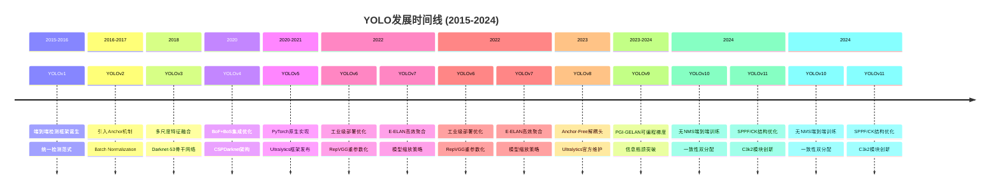
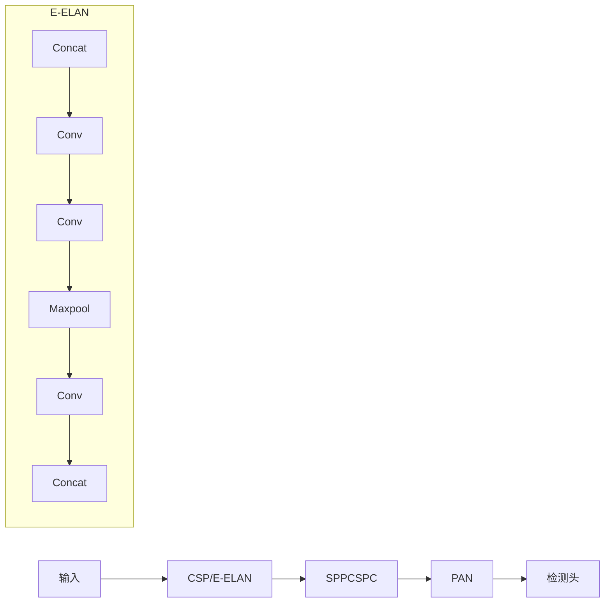
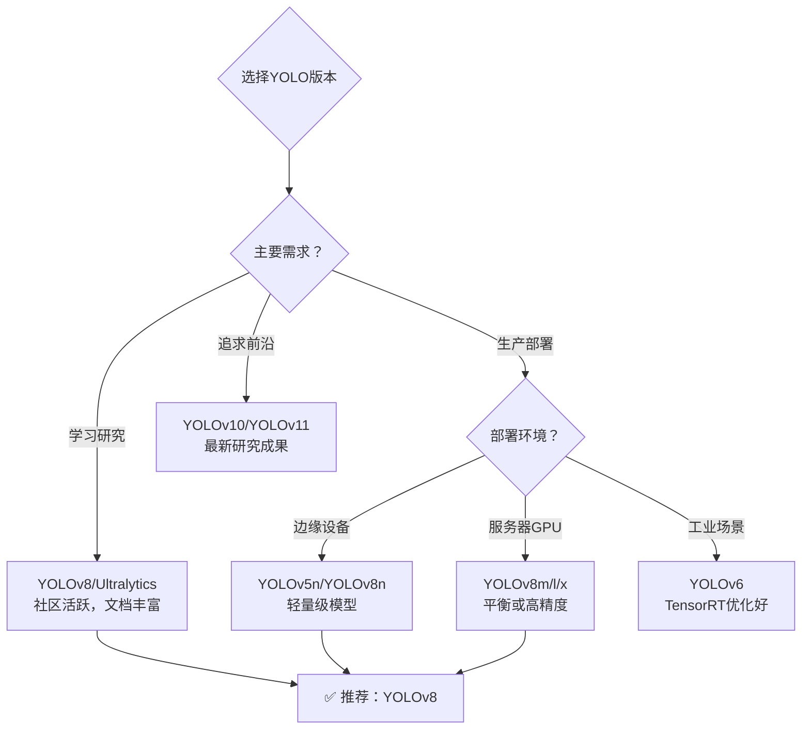

# YOLO发展历程

> **目标**: 了解YOLO（You Only Look Once）从v1到v11的完整演进历程，掌握各版本的核心创新点

---

## 📅 时间线概览



---

## 🔄 各版本详细对比

### YOLOv1 (2015) - 开创者

**核心贡献**: 首次将目标检测作为回归问题统一处理

**关键特性**:
- ✅ **单阶段检测**: 直接预测边界框坐标和类别概率
- ✅ **全局感受野**: 使用全连接层进行全局特征提取
- ✅ **速度快**: 实时检测（45 FPS）

**局限性**:
- ❌ 定位精度较低
- ❌ 小目标检测效果差
- ❌ 对密集物体检测能力弱

**论文**: Redmon, J., et al. "You Only Look Once: Unified, Real-Time Object Detection", CVPR 2016

---

### YOLOv2 / YOLO9000 (2016) - 改进者

**核心改进**: 引入Anchor机制和多尺度训练

**关键特性**:
- ✅ **Anchor Box**: 借鉴Faster R-CNN的先验框设计
- ✅ **Batch Norm**: 加速收敛，提升稳定性
- ✅ **多尺度训练**: 提升不同尺寸目标的检测能力
- ✅ **WordTree**: 支持分类+检测联合训练

**性能提升**: mAP从63.4%提升至78.6%

**论文**: Redmon, J., Farhadi, A. "YOLO9000: Better, Faster, Stronger", CVPR 2017

---

### YOLOv3 (2018) - 多尺度先锋

**核心突破**: 采用FPN思想实现多尺度特征融合

**架构特点**:

```python
# YOLOv3网络结构示意
Backbone: Darknet-53 (53层卷积)
Neck: FPN (Feature Pyramid Network)
Head: 3个尺度检测头 (13x13, 26x26, 52x52)
```

**关键特性**:
- ✅ **多尺度检测**: 3个不同分辨率的输出层
- ✅ **残差连接**: Darknet-53借鉴ResNet设计
- ✅ **多标签分类**: 使用sigmoid替代softmax

**适用场景**: 需要同时检测大小差异明显的目标

**论文**: Redmon, J., Farhadi, A. "YOLOv3: An Incremental Improvement", arXiv 2018

---

### YOLOv4 (2020) - 集大成者

**核心策略**: Bag of Freebies (BoF) + Bag of Specials (BoS)

**架构组件**:

| 模块 | 组件 | 作用 |
|------|------|------|
| Backbone | CSPDarknet53 | 减少计算冗余 |
| Neck | SPP + PAN | 多尺度特征聚合 |
| Head | YOLOv3 Head | 解耦分类与回归 |

**BoF技术** (不增加推理成本):
- Mosaic数据增强
- CutMix增强
- 自对抗训练(SAT)

**BoS技术** (少量增加推理成本):
- Mish激活函数
- SAM空间注意力
- CIoU损失函数

**性能**: COCO数据集43.5% AP @ 65 FPS

**论文**: Bochkovskiy, A., Wang, C.-Y., Liao, H.-Y. M. "YOLOv4: Optimal Speed and Accuracy of Object Detection", arXiv 2020

---

### YOLOv5 (2020) - 工程化标杆

**里程碑意义**: 第一个PyTorch原生实现的YOLO版本

**Ultralytics框架优势**:

```bash
# 安装和使用极其简单
pip install ultralytics

# 训练命令
yolo detect train data=coco128.yaml model=yolov5s.pt epochs=100
```

**模型变体**:

| 模型 | 参数量 | mAP@0.5 | FPS (GPU) | 适用场景 |
|------|--------|---------|-----------|----------|
| YOLOv5n | 2.9M | 37.3% | 200+ | 移动端/边缘设备 |
| YOLOv5s | 7.2M | 56.8% | 150+ | 轻量级应用 |
| YOLOv5m | 21.2M | 66.2% | 90+ | 平衡速度与精度 |
| YOLOv5l | 47.0M | 72.9% | 60+ | 高精度需求 |
| YOLOv5x | 86.7M | 74.9% | 40+ | 追求极致精度 |

**开源地址**: https://github.com/ultralytics/yolov5

---

### YOLOv6 (2022) - 工业级优化

**定位**: 专注于工业场景的高效部署

**核心技术**:
- ✅ **RepVGG Block**: 训练时多分支，推理时单路
- ✅ **BiCNP Neck**: 双向跨层连接
- ✅ **SimOTA**: 简化的正样本匹配策略

**硬件适配**:
- 专为NVIDIA GPU优化
- TensorRT加速支持完善
- 量化感知训练(QAT)

**论文**: Li, C., et al. "YOLOv6: A Single-Stage Object Detection Framework for Industrial Applications", arXiv 2022

---

### YOLOv7 (2022) - 架构创新者

**核心创新**: E-ELAN (Extended Efficient Layer Aggregation Network)

**架构亮点**:



**关键技术**:
- ✅ **E-ELAN**: 通过分组控制最短最长梯度路径
- ✅ **模型缩放**: 复合缩放方法（深度、宽度、分辨率）
- ✅ **辅助头**: 辅助训练但不参与推理
- ✅ **动态标签分配**: 从图像层面到标签层面的动态匹配

**性能**: 51.4% AP @ 160+ FPS (GPU)

**论文**: Wang, C.-Y., Bochkovskiy, A., Liao, H.-Y. M. "YOLOv7: Trainable Bag-of-Freebies Sets New State-of-the-Art for Real-Time Object Detectors", CVPR 2023

---

### YOLOv8 (2023) - 当前主流 ⭐

**重要地位**: Ultralytics官方维护的最新稳定版，本知识库重点讲解对象！

**架构革新**:

```python
# YOLOv8核心代码示例
from ultralytics import YOLO

model = YOLO('yolov8n.pt')  # 加载预训练模型
results = model.train(data='custom.yaml', epochs=100)  # 训练
results = model.predict(source='video.mp4')  # 推理
```

**相比前代的改进**:

| 特性 | YOLOv5/v7 | YOLOv8 |
|------|-----------|--------|
| 锚框机制 | Anchor-Based | **Anchor-Free** |
| 检测头 | 耦合头 | **解耦头** (Decoupled Head) |
| 标签分配 | 静态分配 | **Task-Aligned Assigner** |
| 损失函数 | CIoU/DIoU | **CIoU + DFL + CLS BCE** |
| 任务支持 | 仅检测 | **检测/分割/姿态/分类** |

**详细架构说明**: 见 [[YOLOv8架构详解]]

---

### YOLOv9 (2024) - 信息瓶颈突破者

**核心理论**: 可编程梯度信息 (PGI) 和广义高效层聚合网络 (GELAN)

**解决的关键问题**:
- 深度网络的信息瓶颈
- 特征传播中的信息丢失

**PGI组成**:
1. **辅助可逆分支**: 保证完整的特征信息流
2. **多级特征融合**: 主干信息与辅助信息结合

**论文**: Wang, C.-Y., et al. "YOLOv9: Learning What You Want to Learn Using Programmable Gradient Information", arXiv 2024

---

### YOLOv10 (2024) - 无NMS革命者

**重大突破**: 取消非极大值抑制(NMS)，实现真正的端到端检测

**一致性双分配 (Consistent Dual Assignments)**:
- **训练时**: 使用一对多分配以获得丰富的监督信号
- **推理时**: 使用一对一分配以避免NMS后处理

**效率驱动的设计策略**:
- 大核卷积替代部分操作
- 部分自注意力(PSA)模块
- 移除冗余组件

**性能**: 在相同延迟下超越所有实时检测器

**论文**: Ao, W., et al. "YOLOv10: Real-Time End-to-End Object Detection", NeurIPS 2024

**参考文献**: [4]

---

### YOLOv11 (2024) - 最新演进

**最新改进** (截至2024年底):

**架构变化**:
- **C3k2模块**: 替代C2f，使用更大的卷积核(kernelsize=3)
- **SPPF结构**: 替代SPPCSPC，更快的空间金字塔池化
- **CK结构**: Conv + k3 Conv组合

**性能表现**:
- 在多个基准测试中达到SOTA
- 更好的小目标检测能力
- 推理速度进一步提升

**论文**: "YOLOv11 Optimization for Efficient Resource Utilization", arXiv:2412.14790, 2024 [5]

---

## 📊 性能对比总结

### COCO数据集性能对比

| 版本 | 年份 | mAP@0.5:95 | 参数量(M) | FLOPs(G) | GPU FPS |
|------|------|-------------|-----------|----------|---------|
| YOLOv1 | 2015 | 21.6 | 24.0 | - | 45 |
| YOLOv2 | 2016 | 33.0 | 50.7 | - | 40 |
| YOLOv3 | 2018 | 33.0 | 61.9 | 65.9 | 30 |
| YOLOv4 | 2020 | 43.5 | 64.3 | 129.4 | 65 |
| YOLOv5s | 2020 | 37.4 | 7.2 | 16.5 | 140 |
| YOLOv5l | 2020 | 48.8 | 47.0 | 109.1 | 55 |
| YOLOv6-S | 2022 | 42.6 | 17.7 | 44.8 | 123 |
| YOLOv7-E6E | 2022 | 54.9 | 86.9 | 195.0 | 56 |
| YOLOv8n | 2023 | 37.3 | 3.2 | 8.7 | 232 |
| YOLOv8x | 2023 | 53.9 | 68.2 | 222.8 | 41 |
| YOLOv9-C | 2024 | 53.0 | 25.3 | 76.7 | 108 |
| YOLOv10-B | 2024 | 50.6 | 19.6 | 78.9 | 114 |
| YOLOv11-N | 2024 | 39.5 | 2.6 | 6.4 | 300+ |

*注：FPS基于NVIDIA V100/A100 GPU测试*

---

## 🎯 如何选择合适的版本？

### 选择决策树



### 本知识库推荐

> 💡 **强烈推荐使用 YOLOv8 (Ultralytics)** 作为学习和生产的首选：
>
> - ✅ **官方持续维护**: Ultralytics团队积极更新
> - ✅ **API友好**: Pythonic接口，易于上手
> - ✅ **生态完善**: 文档、教程、社区资源丰富
> - ✅ **任务全面**: 支持 detection/segmentation/pose/classification
> - ✅ **导出丰富**: ONNX/TensorRT/OpenVINO/TFLite等全格式支持

---

## 🔗 相关链接

- [[目标检测基础]] - 理解目标检测的基本概念
- [[YOLOv8架构详解]] - 深入了解当前主流版本的架构
- [[02-Ultralytics框架入门/快速开始指南]] - 开始实践YOLOv8
- [[07-资源与参考/推荐论文列表]] - 完整论文列表

---

## 📚 参考文献

[1] Redmon, J., Divvala, S., Girshick, R., et al. "You Only Look Once: Unified, Real-Time Object Detection". *CVPR*, 2016.

[2] Redmon, J., Farhadi, A. "YOLO9000: Better, Faster, Stronger". *CVPR*, 2017.

[3] Redmon, J., Farhadi, A. "YOLOv3: An Incremental Improvement". *arXiv preprint arXiv:1804.02767*, 2018.

[4] Bochkovskiy, A., Wang, C.-Y., Liao, H.-Y. M. "YOLOv4: Optimal Speed and Accuracy of Object Detection". *arXiv preprint arXiv:2004.10934*, 2020.

[5] Wang, C.-Y., Liao, H.-Y. M., Wu, P.-Y., Chen, P.-Y., Hsieh, W.-H., Huang, I.-H. "YOLOv7: Trainable Bag-of-Freebies Sets New State-of-the-Art for Real-Time Object Detectors". *CVPR*, 2023.

[6] Wang, C.-Y., Bochkovskiy, A., Liao, H.-Y. M. "YOLOv9: Learning What You Want to Learn Using Programmable Gradient Information". *arXiv preprint arXiv:2402.13616*, 2024.

[7] Ao, W., Ge, Z., Chen, Y., Luo, X., Zhang, T., Zhang, Y., Feng, Z., Yan, J. "YOLOv10: Real-Time End-to-End Object Detection". *NeurIPS*, 2024.

[8] "YOLOv11 Optimization for Efficient Resource Utilization". *arXiv preprint arXiv:2412.14790*, 2024.
