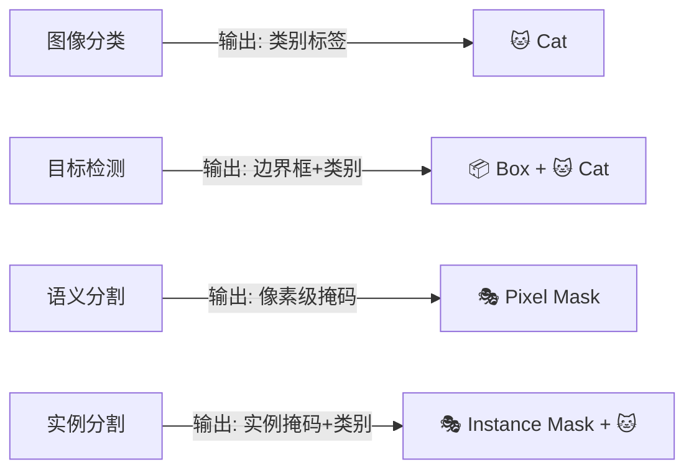
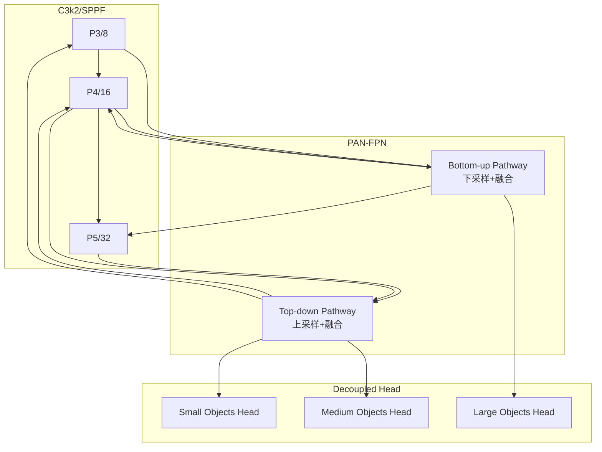

# 目标检测基础

> **目标**: 掌握目标检测的核心概念、评估指标和关键技术原理

---

## 🎯 什么是目标检测？

**定义**: 目标检测（Object Detection）是计算机视觉的核心任务之一，旨在从图像中定位并识别所有感兴趣的目标类别。

### 与其他任务的区别



**目标检测的输出**:
- 每个目标的 **边界框 (Bounding Box)**: `[x_center, y_center, width, height]` 或 `[x1, y1, x2, y2]`
- 每个目标的 **类别概率 (Class Probability)**
- 每个目标的 **置信度分数 (Confidence Score)**

---

## 📊 核心评估指标

### 1. IoU (Intersection over Union)

**定义**: 预测框与真实框的交并比，衡量定位精度

$$IoU = \frac{Area_{intersection}}{Area_{union}}$$

**计算示例**:

```python
import numpy as np

def calculate_iou(box1, box2):
    """
    计算两个边界框的IoU
    
    参数:
        box1: [x1, y1, x2, y2] - 第一个框
        box2: [x1, y1, x2, y2] - 第二个框
    
    返回:
        iou: IoU值 (0.0 - 1.0)
    """
    # 计算交集坐标
    x1 = max(box1[0], box2[0])
    y1 = max(box1[1], box2[1])
    x2 = min(box1[2], box2[2])
    y2 = min(box1[3], box2[3])
    
    # 计算交集面积
    intersection = max(0, x2 - x1) * max(0, y2 - y1)
    
    # 计算两个框的面积
    area1 = (box1[2] - box1[0]) * (box1[3] - box1[1])
    area2 = (box2[2] - box2[0]) * (box2[3] - box2[1])
    
    # 计算并集面积
    union = area1 + area2 - intersection
    
    # 计算IoU
    iou = intersection / union if union > 0 else 0
    
    return iou


# 示例使用
box_pred = [100, 100, 200, 200]  # 预测框
box_gt = [120, 110, 210, 220]    # 真实框

iou_value = calculate_iou(box_pred, box_gt)
print(f"IoU值: {iou_value:.4f}")  # 输出: IoU值: 0.5278
```

**IoU阈值判断**:
- `IoU >= 0.5`: 通常认为是正确检测
- `IoU >= 0.75`: 高质量检测
- 不同数据集可能使用不同阈值（COCO使用0.5:0.95）

---

### 2. Precision (精确率) 和 Recall (召回率)

**Precision**: 预测为正样本中真正正样本的比例
$$Precision = \frac{TP}{TP + FP}$$

**Recall**: 真实正样本中被正确预测的比例
$$Recall = \frac{TP}{TP + FN}$$

其中：
- **TP (True Positive)**: 正确检测的正样本
- **FP (False Positive)**: 误检（将负样本预测为正）
- **FN (False Negative)**: 漏检（未检测到的正样本）

**Python实现**:

```python
def calculate_precision_recall(predictions, ground_truths, iou_threshold=0.5):
    """
    计算Precision和Recall
    
    参数:
        predictions: 预测结果列表 [(box, confidence, class_id), ...]
        ground_truths: 真实标注列表 [(box, class_id), ...]
        iou_threshold: IoU阈值
    
    返回:
        precision, recall
    """
    tp = 0
    fp = 0
    fn = len(ground_truths)
    
    for pred_box, pred_conf, pred_class in predictions:
        matched = False
        for gt_box, gt_class in ground_truths:
            if pred_class == gt_class:
                iou = calculate_iou(pred_box, gt_box)
                if iou >= iou_threshold:
                    tp += 1
                    fn -= 1
                    matched = True
                    break
        
        if not matched:
            fp += 1
    
    precision = tp / (tp + fp) if (tp + fp) > 0 else 0
    recall = tp / (tp + fn) if (tp + fn) > 0 else 0
    
    return precision, recall


# 示例
preds = [
    ([100, 100, 200, 200], 0.9, 1),  # 猫，置信度0.9
    ([300, 300, 400, 400], 0.8, 2),  # 狗，置信度0.8
    ([500, 500, 600, 600], 0.7, 1),   # 猫（误检）
]

gts = [
    ([110, 105, 205, 210], 1),  # 猫
    ([310, 305, 405, 410], 2),  # 狗
]

prec, rec = calculate_precision_recall(preds, gts)
print(f"Precision: {prec:.4f}, Recall: {rec:.4f}")
# 输出: Precision: 0.6667, Recall: 1.0000
```

---

### 3. mAP (mean Average Precision)

**定义**: 所有类别的平均精度均值，是目标检测最重要的综合指标

**AP (Average Precision) 计算**:

$$AP = \int_0^1 P(R) dR$$

实际计算中通过PR曲线下面积近似：

```python
import numpy as np

def calculate_ap(recalls, precisions):
    """
    计算Average Precision (11点插值法或全点法)
    
    参数:
        recalls: 召回率列表
        precisions: 精确率列表
    
    返回:
        ap: AP值
    """
    # 按recall排序
    sorted_indices = np.argsort(recalls)
    recalls = np.array(recalls)[sorted_indices]
    precisions = np.array(precisions)[sorted_indices]
    
    # 使用全点插值计算AP
    ap = 0
    for i in range(1, len(recalls)):
        ap += (recalls[i] - recalls[i-1]) * precisions[i]
    
    return ap


# COCO风格的mAP计算
def calculate_coco_map(detections, ground_truths, iou_thresholds=None):
    """
    计算COCO风格的mAP (mAP@0.5:0.95)
    
    参数:
        detections: 所有检测结果
        ground_truths: 所有真实标注
        iou_thresholds: IoU阈值列表，默认COCO标准 [0.5, 0.55, ..., 0.95]
    
    返回:
        mAP: 平均精度
    """
    if iou_thresholds is None:
        iou_thresholds = np.arange(0.5, 1.0, 0.05)
    
    aps = []
    for iou_thresh in iou_thresholds:
        # 对每个IoU阈值计算AP
        prec, rec = calculate_precision_recall(
            detections, ground_truths, 
            iou_threshold=iou_thresh
        )
        ap = calculate_ap([rec], [prec])
        aps.append(ap)
    
    mAP = np.mean(aps)
    return mAP
```

**常用mAP指标**:

| 指标 | 含义 | 说明 |
|------|------|------|
| mAP@0.5 | IoU=0.5时的mAP | PASCAL VOC标准 |
| mAP@0.75 | IoU=0.75时的mAP | 更严格的评估 |
| mAP@0.5:0.95 | IoU从0.5到0.95的mAP均值 | **COCO主指标** |
| AP_small | 小目标AP | 目标面积 < 32² |
| AP_medium | 中等目标AP | 32² ≤ 面积 < 96² |
| AP_large | 大目标AP | 面积 ≥ 96² |

---

## ⚙️ 关键技术组件

### 1. 锚框机制 (Anchor Boxes)

**作用**: 为不同形状和尺寸的目标提供先验框参考

**传统Anchor-Based方法** (YOLOv2-v7):

```python
# YOLOv5/v7的Anchor配置示例
# 格式: [width, height] 相对于特征图尺寸
anchors = {
    'P3/8': [[10, 13], [16, 30], [33, 23]],      # 小目标检测
    'P4/16': [[30, 61], [62, 45], [59, 119]],     # 中目标检测
    'P5/32': [[116, 90], [156, 198], [373, 326]]   # 大目标检测
}
```

**Anchor-Free方法** (YOLOv8+):

```python
# YOLOv8的Anchor-Free设计
# 直接预测相对于网格点的偏移量
class AnchorFreeHead(nn.Module):
    def __init__(self, num_classes=80):
        super().__init__()
        # 分类分支
        self.cls_conv = nn.Conv2d(channels, num_classes, 1)
        # 回归分支
        self.reg_conv = nn.Conv2d(channels, 4, 1)  # 直接回归 [dx, dy, dw, dh]
    
    def forward(self, features):
        cls_pred = self.cls_conv(features)
        reg_pred = self.reg_conv(features)
        return cls_pred, reg_pred
```

**对比**:

| 特性 | Anchor-Based | Anchor-Free |
|------|--------------|-------------|
| 设计复杂度 | 需要聚类确定Anchor | 无需预设 |
| 泛化能力 | 受限于Anchor尺寸 | 更好 |
| 小目标检测 | 依赖小Anchor | 可能较弱 |
| 训练稳定性 | 成熟稳定 | 需要精心调优 |
| 代表模型 | YOLOv2-v7 | YOLOv8, YOLOX |

---

### 2. NMS (Non-Maximum Suppression)

**作用**: 去除重叠的重复检测结果

**算法流程**:

```python
def nms(boxes, scores, iou_threshold=0.5):
    """
    非极大值抑制算法
    
    参数:
        boxes: 边界框列表 [N, 4] - [x1, y1, x2, y2]
        scores: 置信度分数 [N]
        iou_threshold: IoU阈值
    
    返回:
        keep_indices: 保留的框索引
    """
    # 按置信度降序排列
    order = scores.argsort()[::-1]
    keep = []
    
    while len(order) > 0:
        if len(order) == 1:
            keep.append(order[0])
            break
        
        # 保留当前最高置信度的框
        current = order[0]
        keep.append(current)
        
        # 计算当前框与剩余框的IoU
        remaining = order[1:]
        suppressed = []
        
        for idx in remaining:
            iou_val = calculate_iou(boxes[current], boxes[idx])
            if iou_val < iou_threshold:
                suppressed.append(idx)
        
        order = np.array(suppressed)
    
    return keep


# 使用示例
boxes = np.array([
    [100, 100, 200, 200],
    [105, 105, 205, 205],  # 与第一个高度重叠
    [300, 300, 400, 400],
])

scores = np.array([0.95, 0.85, 0.90])

keep_indices = nms(boxes, scores, iou_threshold=0.5)
print(f"NMS后保留的框索引: {keep_indices}")
# 输出: NMS后保留的框索引: [0, 2] (移除了索引1的重叠框)
```

**改进版本**:

1. **Soft-NMS**: 不直接抑制，而是降低置信度
2. **DIoU-NMS**: 考虑中心点距离和长宽比
3. **无NMS方案**: YOLOv10采用端到端训练避免NMS

---

### 3. 特征金字塔网络 (FPN)

**作用**: 多尺度特征融合，提升不同大小目标的检测能力

**结构示意**:



**代码实现** (简化版):

```python
import torch.nn as nn

class PAN_FPN(nn.Module):
    """PANet-FPN特征金字塔"""
    
    def __init__(self, channels=[256, 512, 1024]):
        super().__init__()
        
        # 上采样层 (Top-down pathway)
        self.upsample = nn.Upsample(scale_factor=2, mode='nearest')
        self.lateral_convs = nn.ModuleList([
            nn.Conv2d(c, channels[0], 1) for c in channels
        ])
        
        # 下采样层 (Bottom-up pathway)
        self.downsample_convs = nn.ModuleList([
            nn.Conv2d(channels[0], c, 3, stride=2, padding=1) 
            for c in channels[1:]
        ])
        
    def forward(self, features):
        """
        参数:
            features: [P3, P4, P5] 从Backbone提取的特征
        返回:
            fused_features: 融合后的多尺度特征
        """
        p3, p4, p5 = features
        
        # Top-down pathway (自顶向下)
        t5 = self.lateral_convs[2](p5)
        t4 = self.lateral_convs[1](p4) + self.upsample(t5)
        t3 = self.lateral_convs[0](p3) + self.upsample(t4)
        
        # Bottom-up pathway (自底向上)
        b3 = t3
        b4 = self.downsample_convs[0](b3) + t4
        b5 = self.downsample_convs[1](b4) + t5
        
        return [b3, b4, b5]
```

---

## 🎨 数据增强技术

### 常用增强方法

```python
import albumentations as A
from albumentations.pytorch import ToTensorV2

# YOLO常用的数据增强管道
def get_train_transforms(img_size=640):
    """
    训练时数据增强配置
    """
    transform = A.Compose([
        # 几何变换
        A.RandomResizedCrop(img_size, img_size, scale=(0.8, 1.0)),
        A.HorizontalFlip(p=0.5),
        A.VerticalFlip(p=0.1),
        A.RandomRotate90(p=0.1),
        A.ShiftScaleRotate(shift_limit=0.0625, scale_limit=0.1, rotate_limit=15, p=0.3),
        
        # 颜色增强
        A.OneOf([
            A.RandomBrightnessContrast(brightness_limit=0.2, contrast_limit=0.2),
            A.CLAHE(clip_limit=2),
            A.HueSaturationValue(hue_shift_limit=20, sat_shift_limit=30, val_shift_limit=20),
        ], p=0.3),
        
        # 噪声和模糊
        A.OneOf([
            A.GaussNoise(var_limit=(10, 50)),
            A.GaussianBlur(blur_limit=(3, 7)),
            A.MotionBlur(blur_limit=(3, 7)),
        ], p=0.2),
        
        # Mosaic增强 (Ultralytics内置)
        # A.Mosaic(p=0.5),  # 在ultralytics中自动应用
        
        # MixUp增强
        # A.MixUp(p=0.1),  # 在ultralytics中可配置
        
        # 归一化
        A.Normalize(mean=[0.485, 0.456, 0.406], std=[0.229, 0.224, 0.225]),
        ToTensorV2(),
    ],
    bbox_params=A.BboxParams(format='yolo', label_fields=['class_labels']))
    
    return transform


# 使用示例
transform = get_train_transforms()
augmented = transform(image=image, bboxes=bboxes, class_labels=labels)
image_aug = augmented['image']
bboxes_aug = augmented['bboxes']
```

**Ultralytics内置增强**:

```yaml
# ultralytics/cfg/default.yaml 中的增强参数
hsv_h: 0.015           # HSV色调增强
hsv_s: 0.7             # HSV饱和度增强  
hsv_v: 0.4             # HSV明度增强
degrees: 0.0           # 旋转角度 (+/- deg)
translate: 0.1         # 平移比例
scale: 0.5             # 缩放比例
shear: 0.0             # 剪切角度
perspective: 0.0       # 透视变换
flipud: 0.0            # 上下翻转概率
fliplr: 0.5            # 左右翻转概率
mosaic: 1.0            # Mosaic增强概率
mixup: 0.0             # MixUp增强概率
copy_paste: 0.0        # Copy-Paste增强概率
```

---

## 🔍 损失函数

### YOLOv8损失函数组成

$$\mathcal{L}_{total} = \lambda_{cls} \mathcal{L}_{cls} + \lambda_{box} \mathcal{L}_{box} + \lambda_{dfl} \mathcal{L}_{dfl}$$

**各部分说明**:

#### 1. 分类损失 $\mathcal{L}_{cls}$ (BCE Loss)

$$\mathcal{L}_{cls} = BCE( pred\_cls, target\_cls )$$

#### 2. 回归损失 $\mathcal{L}_{box}$ (CIoU Loss + DFL)

**CIoU (Complete IoU) Loss**:

$$\mathcal{L}_{CIoU} = 1 - IoU + \frac{\rho^2(b,b^{gt})}{c^2} + \alpha v$$

其中：
- $\rho$: 欧氏距离
- $c$: 包围框对角线长度
- $v$: 长宽比一致性项
- $\alpha$: 权重参数

#### 3. 分布焦点损失 $\mathcal{L}_{dfl}$ (Distribution Focal Loss)

用于优化边界框分布的积分形式：

$$\mathcal{L}_{dfl} = -((y_{l+1} - y)\log(p_l) + (y - y_l)\log(p_{l+1}))$$

**代码实现**:

```python
import torch
import torch.nn as nn
import torch.nn.functional as F

class YOLOv8Loss(nn.Module):
    """YOLOv8完整损失函数"""
    
    def __init__(self, num_classes=80, reg_max=16):
        super().__init__()
        self.num_classes = num_classes
        self.reg_max = reg_max
        
        # 分类损失 (BCE)
        self.bce_cls = nn.BCEWithLogitsLoss(reduction='none')
        
        # DFL损失
        self.dfl_loss = DistributionFocalLoss(reg_max)
        
    def forward(self, predictions, targets):
        """
        参数:
            predictions: 模型输出 [batch, anchors, 4+num_classes]
            targets: 真实标签 [batch, max_objects, 6] (img_idx, class, x, y, w, h)
        """
        loss_cls = self.classification_loss(predictions, targets)
        loss_box = self.box_regression_loss(predictions, targets)
        loss_dfl = self.dfl_loss(predictions, targets)
        
        total_loss = 7.5 * loss_cls + loss_box + 1.5 * loss_dfl
        
        return total_loss, {
            'loss_cls': loss_cls.item(),
            'loss_box': loss_box.item(),
            'loss_dfl': loss_dfl.item()
        }
    
    def classification_loss(self, preds, targets):
        """BCE分类损失"""
        # 提取分类预测
        cls_preds = preds[..., 4:]  # [B, A, C]
        # 计算BCE损失
        loss = self.bce_cls(cls_preds, target_cls)
        return loss.mean()
    
    def box_regression_loss(self, preds, targets):
        """CIoU回归损失"""
        box_preds = preds[..., :4]  # [B, A, 4]
        # 计算CIoU损失
        loss = bbox_iou(box_preds, target_boxes, CIoU=True)
        return (1 - loss).mean()


class DistributionFocalLoss(nn.Module):
    """分布焦点损失"""
    
    def __init__(self, reg_max=16):
        super().__init__()
        self.reg_max = reg_max
        
    def forward(self, preds, targets):
        """
        参数:
            preds: 分布预测 [B, A, reg_max*4]
            targets: 连续目标值
        """
        # 将连续值转换为左右整数索引
        tl = targets.long()
        tr = tl + 1
        wl = tr.float() - targets  # 右侧权重
        wr = targets - tl.float()  # 左侧权重
        
        # 计算交叉熵损失
        loss = (
            F.cross_entropy(preds.view(-1, self.reg_max), tl.view(-1), reduction='none').view(tl.shape) * wl +
            F.cross_entropy(preds.view(-1, self.reg_max), tr.view(-1), reduction='none').view(tr.shape) * wr
        )
        
        return loss.mean()
```

---

## 📈 性能分析工具

### 混淆矩阵可视化

```python
import matplotlib.pyplot as plt
import seaborn as sns
import numpy as np

def plot_confusion_matrix(conf_matrix, classes, save_path='confusion_matrix.png'):
    """
    绘制混淆矩阵热力图
    
    参数:
        conf_matrix: 混淆矩阵 [num_classes, num_classes]
        classes: 类别名称列表
        save_path: 保存路径
    """
    plt.figure(figsize=(12, 10))
    
    # 归一化
    conf_matrix_norm = conf_matrix.astype('float') / conf_matrix.sum(axis=1)[:, np.newaxis]
    
    # 绘制热力图
    sns.heatmap(conf_matrix_norm, annot=True, fmt='.2f', cmap='Blues',
                xticklabels=classes, yticklabels=classes,
                vmin=0, vmax=1)
    
    plt.title('Normalized Confusion Matrix', fontsize=16)
    plt.xlabel('Predicted Label', fontsize=14)
    plt.ylabel('True Label', fontsize=14)
    plt.xticks(rotation=45, ha='right')
    plt.yticks(rotation=0)
    plt.tight_layout()
    plt.savefig(save_path, dpi=150, bbox_inches='tight')
    plt.show()


# Ultralytics自动生成混淆矩阵
from ultralytics import YOLO

model = YOLO('yolov8n.pt')
results = model.val(data='coco128.yaml', conf=0.25, iou=0.5)
# 自动保存混淆矩阵到 runs/detect/val/confusion_matrix.png
```

### PR曲线绘制

```python
def plot_pr_curve(precisions, recalls, ap=None, save_path='pr_curve.png'):
    """
    绘制Precision-Recall曲线
    
    参数:
        precisions: 精确率列表
        recalls: 召回率列表
        ap: Average Precision值
        save_path: 保存路径
    """
    plt.figure(figsize=(8, 6))
    
    # 绘制PR曲线
    plt.plot(recalls, precisions, 'b-', linewidth=2, label=f'PR Curve')
    
    # 标注AP值
    if ap is not None:
        plt.fill_between(recalls, precisions, alpha=0.2, color='blue')
        plt.text(0.5, 0.3, f'AP = {ap:.4f}', fontsize=14, 
                bbox=dict(boxstyle='round', facecolor='wheat', alpha=0.5))
    
    plt.xlabel('Recall', fontsize=14)
    plt.ylabel('Precision', fontsize=14)
    plt.title('Precision-Recall Curve', fontsize=16)
    plt.grid(True, linestyle='--', alpha=0.7)
    plt.legend(loc='upper right')
    plt.xlim([0, 1])
    plt.ylim([0, 1.05])
    plt.tight_layout()
    plt.savefig(save_path, dpi=150, bbox_inches='tight')
    plt.show()


# Ultralytics自动生成PR曲线
results = model.val(data='coco128.yaml')
# 自动保存到 runs/detect/val/PR_curve.png 和 F1_curve.png
```

---

## 💡 最佳实践总结

### 1. 指标选择建议

| 场景 | 推荐指标 | 说明 |
|------|----------|------|
| 学术研究 | mAP@0.5:0.95 | COCO标准，最全面 |
| 工业部署 | mAP@0.5 + FPS | 平衡精度和速度 |
| 小目标检测 | AP_small | 关注小目标性能 |
| 实时应用 | 延迟(P99) | 关注尾部延迟 |
| 类别不平衡 | per-class AP | 检查各类别表现 |

### 2. 常见问题诊断

| 问题现象 | 可能原因 | 解决方案 |
|----------|----------|----------|
| Precision高但Recall低 | 置信度阈值过高 | 降低conf_thres |
| Recall高但Precision低 | 误检过多 | 提升conf_thres或优化模型 |
| 小目标AP很低 | 分辨率不足 | 增加输入尺寸或多尺度训练 |
| 某类AP特别低 | 类别不平衡 | 增加该类样本或调整loss权重 |

---

## 🔗 相关链接

- [[YOLO发展历程]] - 了解YOLO演进历史
- [[YOLOv8架构详解]] - 深入理解当前主流架构
- [[03-实战应用/模型验证与评估]] - 完整的评估实战指南

---

## 📚 参考文献

[1] Lin, T.-Y., Dollár, P., Girshick, R., He, K., Hariharan, Belongie, S. J. "Feature Pyramid Networks for Object Detection". *CVPR*, 2017.

[2] Rezatofighi, H., Tsoi, N., Gwak, J., Sadeghian, A., Reid, I., Savarese, S. "Generalized Intersection over Union: A Metric and a Loss for Bounding Box Regression". *CVPR*, 2019.

[3] Bodla, N., Singh, B., Chellappa, R., Davis, L. S. "Soft-NMS -- Improving Object Detection With One Line of Code". *ICCV*, 2017.

[4] Tian, Z., Shen, C., Chen, H. "Conditional Convolution for Instance Segmentation". *ECCV*, 2020. (DFL相关)

[5] Liu, S., Qi, L., Qin, H., Shi, J., Jia, J. "Path Aggregation Network for Instance Segmentation". *CVPR*, 2018.
