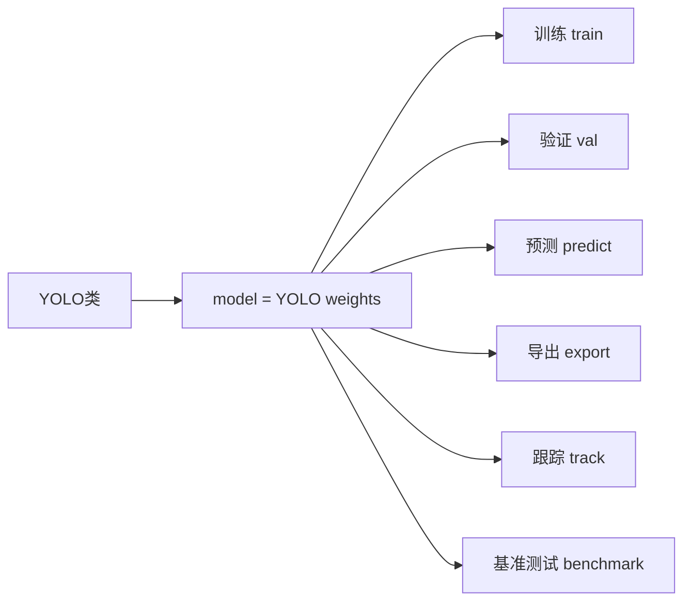

# 核心API详解

> **目标**: 全面掌握Ultralytics YOLO的Python API，包括训练、验证、预测和导出的完整用法

---

## 📚 API 总览

### YOLO 类核心方法



---

## 🔧 1. 模型加载与初始化

### 基本用法

```python
from ultralytics import YOLO


def model_loading_examples():
    """模型加载的各种方式"""
    
    # ===== 方式1: 加载预训练模型 (最常用) =====
    # 自动从Ultralytics Hub下载 (首次使用时)
    model = YOLO('yolov8n.pt')          # COCO预训练 - 检测
    model_seg = YOLO('yolov8n-seg.pt')   # COCO预训练 - 分割
    model_pose = YOLO('yolovn8-pose.pt') # COCO预训练 - 姿态估计
    model_cls = YOLO('yolov8n-cls.pt')   # ImageNet预训练 - 分类
    
    # ===== 方式2: 加载自定义训练模型 =====
    custom_model = YOLO('runs/detect/train/weights/best.pt')
    
    # ===== 方式3: 从配置文件创建新模型 =====
    new_model = YOLO('yolov8n.yaml')  # 创建新的未训练模型
    
    # ===== 方式4: 加载ONNX/TensorRT等导出格式 =====
    onnx_model = YOLO('yolov8n.onnx')
    engine_model = YOLO('yolov8n.engine')  # TensorRT
    openvino_model = YOLO('yolov8n_openvino_model/')  # OpenVINO IR
    
    return model
```

---

## 🎓 2. 训练 API (`train()`)

### 完整参数说明

```python
model.train(
    # ========== 数据相关 ==========
    data='coco128.yaml',           # 数据集配置文件路径 (必需)
    
    # ========== 模型相关 ==========
    model=None,                    # 模型文件路径 (可选，已加载模型时不需要)
    task='detect',                 # 任务类型: detect, segment, pose, classify
    
    # ========== 训练超参数 ==========
    epochs=100,                    # 训练轮数
    patience=50,                   # 早停耐心值 (无改善时等待的轮数)
    batch=16,                      # 批量大小 (-1表示自动选择)
    imgsz=640,                     # 输入图像尺寸 (整数或列表 [h, w])
    rect=False,                    # 矩形训练 (不同图像不同尺寸)
    cos_lr=False,                  # 余弦学习率调度
    close_mosaic=10,               # 最后N轮关闭Mosaic增强
    
    # ========== 优化器设置 ==========
    optimizer='auto',              # 优化器: SGD, Adam, AdamW, RMSProp, auto
    lr0=0.01,                      # 初始学习率
    lrf=0.01,                      # 最终学习率因子 (lr0 * lrf)
    momentum=0.937,                # SGD动量
    weight_decay=0.0005,           # 权重衰减 (L2正则化)
    warmup_epochs=3.0,             # 预热轮数
    warmup_momentum=0.8,           # 预热动量
    warmup_bias_lr=0.1,            # 预热偏置学习率
    
    # ========== 数据增强 ==========
    hsv_h=0.015,                   # HSV色调增强范围
    hsv_s=0.7,                     # HSV饱和度增强范围
    hsv_v=0.4,                     # HSV明度增强范围
    degrees=0.0,                   # 旋转角度 (+/- 度)
    translate=0.1,                 # 平移比例
    scale=0.5,                     # 缩放比例
    shear=0.0,                     # 剪切角度
    perspective=0.0,               # 透视变换强度
    flipud=0.0,                    # 上下翻转概率
    fliplr=0.5,                    # 左右翻转概率
    mosaic=1.0,                    # Mosaic增强概率
    mixup=0.0,                     # MixUp增强概率
    copy_paste=0.0,                # Copy-Paste增强概率
    
    # ========== 损失函数权重 ==========
    box=7.5,                       # 边界框损失权重
    cls=0.5,                       # 分类损失权重
    dfl=1.5,                       # DFL损失权重
    pos_weight=1.0,                # 正样本权重 (用于类别不平衡)
    
    # ========== 硬件与性能 ==========
    device='cpu',                  # 设备: cpu, 0, 1, 2, 3, [0,1] (多GPU)
    workers=8,                     # 数据加载工作线程数
    amp=True,                      # 自动混合精度训练 (节省显存)
    cache=False,                   # True/ram/disk 缓存数据集
    
    # ========== 输出与日志 ==========
    project='runs/train',          # 项目根目录
    name='exp',                    # 实验名称
    exist_ok=False,                # 是否覆盖已有实验
    pretrained=True,               # 是否使用预训练权重
    verbose=True,                  # 是否打印详细日志
    seed=0,                        # 随机种子 (可复现)
    deterministic=True,            # 确定性模式
    single_cls=False,              # 将多类别数据集作为单类别处理
    
    # ========== 回调函数 ==========
    callbacks=None,                # 自定义回调函数列表
)
```

---

### 完整训练示例

```python
from ultralytics import YOLO
import torch


def complete_training_example():
    """
    完整的训练流程示例
    
    包含:
    - 数据准备检查
    - 模型加载
    - 参数配置
    - 训练执行
    - 结果分析
    """
    
    print("=" * 70)
    print("🎓 YOLOv8 完整训练示例")
    print("=" * 70)
    
    # ===== 步骤1: 检查GPU环境 =====
    if torch.cuda.is_available():
        device = 0  # 使用第一个GPU
        gpu_name = torch.cuda.get_device_name(0)
        print(f"✅ 使用 GPU: {gpu_name}")
    else:
        device = 'cpu'
        print("⚠️  未检测到GPU，使用CPU训练")
    
    # ===== 步骤2: 加载模型 =====
    model = YOLO('yolov8n.pt')  # 使用nano版本快速测试
    print("✅ 模型加载完成")
    
    # ===== 步骤3: 配置训练参数 =====
    training_config = {
        'data': 'coco128.yaml',       # 使用COCO128子集进行演示
        
        # 训练基本参数
        'epochs': 100,
        'patience': 20,               # 20轮无提升则早停
        'batch': 16,
        'imgsz': 640,
        
        # 优化器设置
        'optimizer': 'SGD',
        'lr0': 0.01,
        'lrf': 0.01,
        'momentum': 0.937,
        'weight_decay': 0.0005,
        
        # 数据增强
        'hsv_h': 0.015,
        'hsv_s': 0.7,
        'hsv_v': 0.4,
        'degrees': 15.0,              # 允许旋转15度
        'translate': 0.1,
        'scale': 0.5,
        'fliplr': 0.5,
        'mosaic': 1.0,
        
        # 性能优化
        'device': device,
        'workers': 4,
        'amp': True,                  # 混合精度训练
        
        # 输出设置
        'project': 'runs/train',
        name: 'my_experiment',
        'exist_ok': False,
        'verbose': True,
        
        # 可复现性
        'seed': 42,
        'deterministic': True,
    }
    
    print("\n📋 训练配置:")
    for key, value in training_config.items():
        print(f"  {key}: {value}")
    
    # ===== 步骤4: 开始训练 =====
    print("\n" + "="*70)
    print("🚀 开始训练...")
    print("="*70 + "\n")
    
    results = model.train(**training_config)
    
    # ===== 步骤5: 分析训练结果 =====
    print("\n" + "="*70)
    print("📊 训练结果分析")
    print("="*70)
    
    # results 是一个字典，包含各种指标
    print(f"\n✅ 训练完成!")
    print(f"   最佳 epoch: {results.results_dict.get('epoch', 'N/A')}")
    print(f"   最终 mAP@0.5: {results.results_dict.get('metrics/mAP50(B)', 0):.4f}")
    print(f"   最终 mAP@0.5:0.95: {results.results_dict.get('metrics/mAP50-95(B)', 0):.4f}")
    
    # 获取最佳模型路径
    best_model_path = str(results.save_dir / 'weights/best.pt')
    last_model_path = str(results.save_dir / 'weights/last.pt')
    
    print(f"\n💾 模型保存位置:")
    print(f"   最佳模型: {best_model_path}")
    print(f"   最后模型: {last_model_path}")
    
    return results, best_model_path


if __name__ == '__main__':
    results, best_model = complete_training_example()
```

---

## ✅ 3. 验证 API (`val()`)

### 参数说明

```python
model.val(
    # ========== 数据相关 ==========
    data='coco128.yaml',           # 数据集配置文件路径
    
    # ========== 验证参数 ==========
    batch=16,                      # 批量大小
    imgsz=640,                     # 图像尺寸
    conf=0.001,                    # 置信度阈值 (验证时通常设低)
    iou=0.65,                      # NMS IoU阈值
    max_det=300,                   # 最大检测数
    
    # ========== 任务特定 ==========
    task='detect',                 # 任务类型
    split='val',                   # 数据分割: val, test
    rect=False,                    # 矩形验证
    
    # ========== 输出设置 ==========
    save_json=False,               # 保存COCO格式JSON结果
    save_hybrid=False,             # 保存混合结果 (预测+真实框)
    conf_thres=None,               # 自定义置信度阈值
    iou_thres=None,                # 自定义IoU阈值
    
    # ========== 硬件与性能 ==========
    device='',                     # 设备
    workers=8,                     # 工作线程数
    amp=True,                      # 混合精度
    
    # ========== 详细输出 ==========
    plots=True,                    # 绘制评估图表
    verbose=True,                  # 打印详细信息
    
    # ========== 项目设置 ==========
    project='runs/val',
    name='val_exp',
    exist_ok=True,
)
```

### 验证结果解析

```python
def analyze_validation_results():
    """详细分析验证结果"""
    
    model = YOLO('yolov8n.pt')
    
    # 运行验证
    metrics = model.val(
        data='coco128.yaml',
        batch=16,
        imgsz=640,
        plots=True,                 # 生成图表
        save_json=False,
        verbose=True
    )
    
    print("\n" + "=" * 70)
    print("📊 验证指标详解")
    print("=" * 70)
    
    # ===== 整体性能指标 =====
    print("\n【整体性能】")
    print(f"mAP@0.5 (PASCAL VOC标准):     {metrics.box.map50:.4f}")
    print(f"mAP@0.5:0.95 (COCO标准):      {metrics.box.map:.4f}")
    print(f"mAP@0.75:                      {metrics.box.map75:.4f}")
    
    # ===== 不同尺度目标性能 =====
    print("\n【按目标尺度分类】")
    print(f"小目标 AP (area < 32²):         {metrics.box.maps[0]:.4f}")
    print(f"中目标 AP (32² ≤ area < 96²):  {metrics.box.maps[1]:.4f}")
    print(f"大目标 AP (area ≥ 96²):         {metrics.box.maps[2]:.4f}")
    
    # ===== 各类别性能 =====
    print("\n【各类别性能 (Top 10)】")
    class_names = metrics.names
    per_class_ap = metrics.box.ap50  # 各类别AP@0.5
    
    # 按AP排序并显示前10个类别
    class_aps = [(class_names[i], ap) for i, ap in enumerate(per_class_ap)]
    class_aps.sort(key=lambda x: x[1], reverse=True)
    
    for i, (cls_name, ap) in enumerate(class_aps[:10]):
        print(f"{i+1:>2}. {cls_name:<20} AP@0.5: {ap:.4f}")
    
    # ===== Precision & Recall 曲线数据 =====
    print("\n【Precision-Recall 统计】")
    print(f"最大 Precision: {max(metrics.box.p):.4f}")
    print(f"最大 Recall: {max(metrics.box.r):.4f}")
    print(f"F1 最大值: {max(metrics.box.f1):.4f}")
    
    # F1 最优阈值
    f1_thresholds = metrics.box.f1
    best_f1_idx = f1_thresholds.argmax()
    best_confidence = metrics.conf[best_f1_idx]
    print(f"F1最优时的置信度阈值: {best_confidence:.3f}")
    
    # ===== 速度统计 =====
    print("\n【推理速度统计】")
    print(f"预处理速度: {metrics.speed['preprocess']:.2f} ms")
    print(f"推理速度: {metrics.speed['inference']:.2f} ms")
    print(f"后处理速度: {metrics.speed['postprocess']:.2f} ms")
    total_time = sum(metrics.speed.values())
    print(f"总延迟: {total_time:.2f} ms ({1000/total_time:.1f} FPS)")
    
    # ===== 生成的可视化文件 =====
    print("\n【生成的评估图表】")
    print("- PR_curve.png (Precision-Recall曲线)")
    print("- F1_curve.png (F1分数曲线)")
    print("- P_curve.png (Precision曲线)")
    print("- R_curve.png (Recall曲线)")
    print("- confusion_matrix.png (混淆矩阵)")
    print("- confusion_matrix_normalized.png (归一化混淆矩阵)")
    print("- labels.jpg (标签分布)")
    print("- labels_correlogram.jpg (相关性图)")
    
    return metrics


if __name__ == '__main__':
    analyze_validation_results()
```

---

## 🔮 4. 预测 API (`predict()`)

### 核心参数

```python
results = model.predict(
    # ========== 输入源 ==========
    source='image.jpg',             # 输入源 (支持多种格式)
    
    # ========== 预测参数 ==========
    conf=0.25,                     # 置信度阈值
    iou=0.7,                       # NMS IoU阈值
    imgsz=640,                     # 推理尺寸
    half=False,                    # FP16推理 (需要GPU)
    device='',                     # 设备
    max_det=300,                   # 最大检测数
    
    # ========== 视频流参数 ==========
    stream=False,                  # 流式生成器模式
    show=False,                    # 显示窗口
    save=True,                     # 保存结果
    classes=None,                  # 过滤类别 (如 [0, 2, 5])
    agnostic_nms=False,            # 类别无关NMS
    augment=False,                 # 测试时增强(TTA)
    visualize=False,               # 可视化特征图
    
    # ========== 输出格式 ==========
    retina_masks=False,            # 高分辨率掩码 (仅分割任务)
    embeds=False,                  # 提取嵌入向量
    
    # ========== 性能参数 ==========
    verbose=True,                  # 打印信息
    vid_stride=False,               # 视频帧间隔
    save_crop=False,               # 保存裁剪的目标
    
    # ========== 项目设置 ==========
    project='runs/predict',
    name='predict_exp',
    exist_ok=True,
)
```

### 高级预测技巧

```python
def advanced_prediction_examples():
    """高级预测功能示例"""
    
    model = YOLO('yolov8n.pt')
    
    # ===== 技巧1: 只检测特定类别 =====
    # 假设只想检测人(0)、车(2)、狗(16)
    results = model.predict(
        source='image.jpg',
        classes=[0, 2, 16],        # COCO类别ID
        conf=0.5
    )
    
    # ===== 技巧2: 测试时增强 (TTA) =====
    # 通过多次变换输入提高鲁棒性
    results = model.predict(
        source='image.jpg',
        augment=True,              # 启用TTA
        conf=0.25
    )
    
    # ===== 技巧3: 流式处理视频 =====
    # 对于长视频或实时流，使用stream=True节省内存
    from ultralytics import YOLO
    
    model = YOLO('yolov8n.pt')
    
    # 流式处理模式 (返回生成器)
    for result in model.predict(source='video.mp4', stream=True):
        # 处理每一帧
        boxes = result.boxes
        frame_num = result.path
        
        # 自定义逻辑...
        print(f"Frame: {frame_num}, Detections: {len(boxes)}")
    
    # ===== 技巧4: 批量图片处理 =====
    import os
    image_folder = 'path/to/images'
    image_files = [os.path.join(image_folder, f) 
                   for f in os.listdir(image_folder) 
                   if f.endswith(('.jpg', '.png'))]
    
    # 批量推理
    results = model.predict(
        source=image_files,
        batch=32,                  # 批量大小
        save=True,
        project='batch_results',
        name='batch_pred'
    )
    
    # ===== 技巧5: 提取特征嵌入 =====
    # 用于相似度搜索、聚类等下游任务
    results = model.predict(
        source='image.jpg',
        embeds=True,               # 提取特征向量
        verbose=False
    )
    
    embeddings = results[0].embeddings  # 特征向量
    print(f"特征向量形状: {embeddings.shape}")  # [num_objects, feature_dim]
    
    return results
```

---

## 📤 5. 导出 API (`export()`)

### 支持的导出格式

```python
def export_examples():
    """导出为各种格式的完整示例"""
    
    model = YOLO('yolov8n.pt')
    
    # ===== ONNX 格式 (跨平台通用) =====
    model.export(
        format='onnx',
        imgsz=640,                 # 导出尺寸
        half=False,                # FP32 (设为True则FP16)
        dynamic=False,              # 动态batch size
        simplify=True,             # 简化ONNX图
        opset_version=12,          # ONNX opset版本
    )
    # 输出: yolov8n.onnx
    
    # ===== TensorRT 格式 (NVIDIA GPU加速) =====
    model.export(
        format='engine',
        imgsz=640,
        half=True,                 # FP16量化 (推荐!)
        dynamic=True,              # 支持动态batch
        workspace=4,               # 工作空间大小 (GB)
        int8=False,                # INT8量化 (需要校准数据)
    )
    # 输出: yolov8n.engine
    
    # ===== OpenVINO 格式 (Intel CPU/GPU加速) =====
    model.export(
        format='openvino',
        imgsz=640,
        half=False,
        int8=False,
    )
    # 输出: yolov8n_openvino_model/
    
    # ===== CoreML 格式 (iOS/macOS部署) =====
    model.export(
        format='coreml',
        imgsz=640,
        half=False,
        int8=False,
    )
    # 输出: yolov8n.mlmodel
    
    # ===== TFLite 格式 (Android/移动端) =====
    model.export(
        format='tflite',
        imgsz=640,
        half=False,                # FP16
        int8=False,                # INT8 (需要代表数据集)
    )
    # 输出: yolov8n.tflite
    
    # ===== PaddlePaddle 格式 =====
    model.export(format='paddle')
    
    # ===== NCNN 格式 (移动端优化) =====
    model.export(format='ncnn')
    
    # ===== SavedModel 格式 (TensorFlow) =====
    model.export(format='saved_model')
    
    print("✅ 所有格式导出完成!")


# 导出后性能对比
def benchmark_exported_models():
    """对比不同导出格式的性能"""
    
    import time
    import numpy as np
    
    formats_to_test = {
        'PyTorch': 'yolov8n.pt',
        'ONNX': 'yolov8n.onnx',
        'OpenVINO': 'yolov8n_openvino_model/',
        'TensorRT': 'yolov8n.engine',
    }
    
    test_image = np.random.randint(0, 255, (640, 640, 3), dtype=np.uint8)
    
    print("\n" + "=" * 60)
    print("⚡ 导出格式性能对比")
    print("=" * 60)
    
    for format_name, model_path in formats_to_test.items():
        try:
            model = YOLO(model_path)
            
            # 预热
            _ = model(test_image, verbose=False)
            
            # 测试
            times = []
            for _ in range(20):
                start = time.perf_counter()
                _ = model(test_image, verbose=False)
                end = time.perf_counter()
                times.append((end - start) * 1000)
            
            avg_time = np.mean(times)
            fps = 1000 / avg_time
            
            print(f"{format_name:<12}: {avg_time:.2f} ms ({fps:.0f} FPS)")
            
        except Exception as e:
            print(f"{format_name:<12}: ❌ 错误 - {str(e)[:50]}")
```

---

## 🎯 6. 目标跟踪 API (`track()`)

```python
def tracking_example():
    """目标跟踪完整示例"""
    
    from ultralytics import YOLO
    
    # 加载模型
    model = YOLO('yolov8n.pt')
    
    # ===== 单视频跟踪 =====
    results = model.track(
        source='video.mp4',
        conf=0.3,
        iou=0.5,
        persist=True,              # 保持ID一致性
        tracker='botsort.yaml',     # 跟踪算法: botsort 或 ocsort
        show=False,
        save=True
    )
    
    # 解析跟踪结果
    for result in results:
        boxes = result.boxes
        if boxes.id is not None:
            track_ids = boxes.id.int().tolist()
            print(f"帧中的跟踪ID: {track_ids}")
    
    # ===== 多对象跟踪可视化 =====
    def visualize_tracking():
        """绘制带ID的跟踪轨迹"""
        import cv2
        import numpy as np
        
        cap = cv2.VideoCapture('video.mp4')
        
        # 存储历史轨迹
        tracks_history = {}  # {id: [(x, y), ...]}
        max_history = 30     # 显示最近30帧的轨迹
        
        while True:
            ret, frame = cap.read()
            if not ret:
                break
            
            # 跟踪当前帧
            results = model.track(frame, persist=True, verbose=False)
            
            if len(results) > 0 and results[0].boxes.id is not None:
                boxes = results[0].boxes
                
                for box in boxes:
                    # 获取跟踪ID
                    track_id = int(box.id.item())
                    
                    # 获取中心点坐标
                    xywh = box.xywh[0].cpu().numpy()
                    cx, cy = xywh[0], xywh[1]
                    
                    # 更新轨迹历史
                    if track_id not in tracks_history:
                        tracks_history[track_id] = []
                    tracks_history[track_id].append((cx, cy))
                    
                    # 限制历史长度
                    if len(tracks_history[track_id]) > max_history:
                        tracks_history[track_id] = tracks_history[track_id][-max_history:]
                    
                    # 绘制边界框
                    x1, y1, x2, y2 = map(int, box.xyxy[0].cpu().numpy())
                    color = (track_id * 50 % 255, (track_id * 80) % 255, (track_id * 120) % 255)
                    cv2.rectangle(frame, (x1, y1), (x2, y2), color, 2)
                    
                    # 绘制ID标签
                    label = f'ID:{track_id}'
                    cv2.putText(frame, label, (x1, y1-10),
                               cv2.FONT_HERSHEY_SIMPLEX, 0.7, color, 2)
                
                # 绘制所有目标的轨迹线
                for track_id, history in tracks_history.items():
                    if len(history) >= 2:
                        points = np.array(history, dtype=np.int32)
                        color = (track_id * 50 % 255, (track_id * 80) % 255, (track_id * 120) % 255)
                        for i in range(len(points)-1):
                            cv2.line(frame, tuple(points[i]), tuple(points[i+1]), color, 2)
            
            cv2.imshow('Tracking', frame)
            if cv2.waitKey(1) & 0xFF == ord('q'):
                break
        
        cap.release()
        cv2.destroyAllWindows()


if __name__ == '__main__':
    tracking_example()
```

---

## ⏱️ 7. 基准测试 API (`benchmark()`)

```python
def run_benchmark():
    """运行完整的性能基准测试"""
    
    from ultralytics import YOLO
    import pandas as pd
    
    model = YOLO('yolov8n.pt')
    
    # 运行基准测试
    results = model.benchmark(
        data='coco128.yaml',       # 用于验证的数据集
        imgsz=640,                 # 测试尺寸
        half=False,                # FP32测试
        int8=False,                # 不使用INT8
        device=0,                  # 测试设备
        verbose=True               # 打印详细信息
    )
    
    # results是一个DataFrame，包含各格式的性能数据
    print("\n📊 基准测试结果:")
    print(results.to_string())
    
    return results
```

---

## 🔧 8. 回调函数机制

### 自定义回调实现

```python
from ultralytics import YOLO
from ultralytics.utils.callbacks import add_callback
import torch


def on_train_epoch_end(trainer):
    """每个epoch结束后的回调"""
    print(f"\n📈 Epoch {trainer.epoch} 完成:")
    print(f"   Loss: {trainer.loss_items:.4f}")
    print(f"   LR: {trainer.optimizer.param_groups[0]['lr']:.6f}")


def on_fit_epoch_end(trainer):
    """整个fit阶段结束后的回调（每个epoch）"""
    # 保存额外指标
    metrics = trainer.metrics
    current_map = metrics.box.map
    
    print(f"   mAP@0.5: {current_map:.4f}")
    
    # 可以在这里添加自定义逻辑
    # 例如：保存最佳模型、发送通知等


def on_predict_postprocess_end(predictor):
    """预测后处理的回调"""
    # 可以在这里修改检测结果
    pass


def setup_callbacks():
    """注册自定义回调"""
    
    model = YOLO('yolov8n.pt')
    
    # 注册回调
    add_callback('on_train_epoch_end', on_train_epoch_end)
    add_callback('on_fit_epoch_end', on_fit_epoch_end)
    add_callback('on_predict_postprocess_end', on_predict_postprocess_end)
    
    # 训练时会自动触发这些回调
    results = model.train(data='coco128.yaml', epochs=3)
    
    return model


# ===== 高级回调：自动保存最佳模型到云端 =====
class CloudSaveCallback:
    """将最佳模型上传到云存储"""
    
    def __init__(self, bucket_name, cloud_service='s3'):
        self.bucket_name = bucket_name
        self.cloud_service = cloud_service
        self.best_map = 0
    
    def on_fit_epoch_end(self, trainer):
        current_map = trainer.metrics.box.map
        
        if current_map > self.best_map:
            self.best_map = current_map
            best_model_path = trainer.best
            
            print(f"🌤️  新的最佳mAP! 上传到云端...")
            # self.upload_to_cloud(best_model_path)


# 使用示例
if __name__ == '__main__':
    model = setup_callbacks()
```

---

## 📋 API 快速参考表

| 方法 | 用途 | 关键参数 | 返回值 |
|------|------|----------|--------|
| `YOLO(weights)` | 加载模型 | 模型路径 | YOLO实例 |
| `train()` | 训练模型 | data, epochs, batch, imgsz | Results对象 |
| `val()` | 验证模型 | data, batch, conf, iou | Metrics对象 |
| `predict()` | 推理预测 | source, conf, classes, stream | Results列表 |
| `export()` | 导出模型 | format, half, imgsz, int8 | 导出路径 |
| `track()` | 目标跟踪 | source, persist, tracker | Results列表 |
| `benchmark()` | 性能测试 | data, imgsz, half, int8 | DataFrame |

---

## 🔗 相关链接

- [[快速开始指南]] - 如果还不熟悉基本用法
- [[配置文件说明]] - YAML配置文件的详细解释
- [[03-实战应用/模型训练完整流程]] - 实际项目中的训练应用
- [[04-高级功能/模型导出与转换]] - 更多导出和部署细节

---

## 💡 使用建议

### 新手推荐顺序

1. 先用 `predict()` 快速体验效果
2. 用 `val()` 在标准数据集上评估模型
3. 用 `train()` 训练自己的数据集
4. 用 `export()` 部署到生产环境
5. 学习 `track()` 实现目标跟踪

### 生产环境建议

- ✅ **训练时**: 设置合理的 `patience` 和 `amp=True`
- ✅ **验证时**: 使用 `plots=True` 生成完整评估报告
- ✅ **预测时**: 根据场景调整 `conf` 和 `classes`
- ✅ **导出时**: 优先考虑 ONNX 或 TensorRT 格式
- ✅ **监控时**: 使用回调函数记录关键指标
