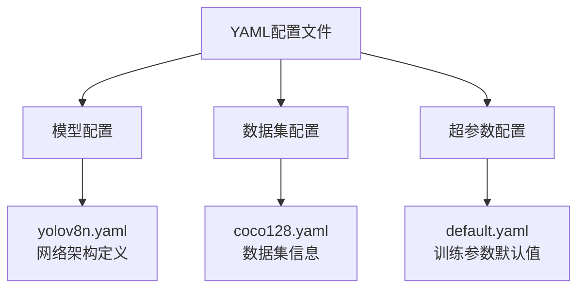

# 配置文件说明

> **目标**: 深入理解Ultralytics的YAML配置文件结构，掌握自定义配置的方法

---

## 📁 配置文件类型

### Ultralytics使用的主要配置文件



---

## 🏗️ 1. 模型配置文件 (Model YAML)

**作用**: 定义YOLO的网络架构、各层通道数和模块数量

### 完整示例: yolov8n.yaml

```yaml
# YOLOv8n 模型配置文件
# Ultralytics YOLOv8, AGPL-3.0 license

# ========== 基本信息 ==========
nc: 80          # 类别数量 (COCO数据集有80类)
scales:         # 模型缩放因子 (用于生成不同规模的模型)
  # [depth, width, max_channels]
  n: [0.33, 0.25, 1024]   # nano版本
  s: [0.33, 0.50, 1024]   # small版本
  m: [0.67, 0.75, 768]    # medium版本
  l: [1.00, 1.00, 512]    # large版本
  x: [1.00, 1.25, 512]    # xlarge版本

# ========== Backbone骨干网络 ==========
backbone:
  # [from, repeats, module, args]
  
  # Stem: 快速下采样层
  - [-1, 1, Conv, [64, 3, 2]]     # 0: 卷积层, 输出64通道, kernel=3, stride=2
  
  # Stage 2: 特征提取
  - [-1, 1, Conv, [128, 3, 2]]    # 1: 继续下采样到/4
  - [-1, 3, C2f, [128, True]]      # 2: C2f模块 (C3k2的旧名称), 重复3次
  
  # Stage 3: 中级特征
  - [-1, 1, Conv, [256, 3, 2]]    # 3: 下采样到/8
  - [-1, 6, C2f, [256, True]]      # 4: C2f模块, 重复6次
  
  # Stage 4: 高级特征
  - [-1, 1, Conv, [512, 3, 2]]    # 5: 下采样到/16
  - [-1, 6, C2f, [512, True]]      # 6: C2f模块, 重复6次
  
  # Stage 5: 全局特征 + SPPF
  - [-1, 3, C2f, [512, True]]      # 7: C2f模块
  - [-1, 1, SPPF, [512, 5]]        # 8: 空间金字塔池化快速版, k=5

# ========== Neck颈部网络 ==========
neck:
  - [-1, 1, nn.Upsample, [None, 2, 'nearest']]  # 9: 上采样2x
  - [[-1, 4], 1, Concat, [1]]                    # 10: 拼接P3和上采样的P4
  - [-1, 3, C2f, [256, False]]                  # 11: 融合模块
  
  - [-1, 1, nn.Upsample, [None, 2, 'nearest']]  # 12: 再次上采样
  - [[-1, 2], 1, Concat, [1]]                    # 13: 拼接P2和上采样的结果
  - [-1, 3, C2f, [128, False]]                  # 14: Top-down最终融合
  
  - [-1, 1, Conv, [128, 3, 2]]                  # 15: 下采样
  - [[-1, 11], 1, Concat, [1]]                   # 16: Bottom-up拼接
  - [-1, 3, C2f, [256, False]]                  # 17: BU融合
  
  - [-1, 1, Conv, [256, 3, 2]]                  # 18: 下采样
  - [[-1, 8], 1, Concat, [1]]                    # 19: 与SPPF输出拼接
  - [-1, 3, C2f, [512, False]]                  # 20: 最终融合

# ========== Head检测头 ==========
head:
  - [[14, 17, 20], 1, Detect, [nc]]             # 21: Detect层, 从P3/P4/P5检测
```

### 配置字段详解

#### `from` 字段 (来源)

```python
# from字段的含义:
# -1: 前一层的输出
# 正整数: 指定层的输出 (如 4 表示第4层)
# 列表: 多个层的输出拼接 (如 [-1, 4])
```

#### `repeats` 字段 (重复次数)

```yaml
# 重复次数会乘以 depth_multiplier
# 例如:
# scales.n 的 depth = 0.33
# repeats = 6 时, 实际执行 6 * 0.33 ≈ 2 次 (取整)
```

#### `module` 字段 (模块类型)

| 模块 | 说明 | 典型args |
|------|------|----------|
| `Conv` | 标准卷积块 (Conv+BN+SiLU) | `[c_out, k, s, p]` |
| `C2f` / `C3k2` | CSPNet风格模块 | `[c_out, shortcut]` |
| `SPPF` | 快速空间金字塔池化 | `[c_out, k]` |
| `Concat` | 张量拼接 | `[axis]` |
| `Detect` | 检测头 | `[nc]` |
| `nn.Upsample` | 上采样 | `[scale_factor, mode]` |

#### `args` 字段 (模块参数)

```python
# Conv的args示例: [64, 3, 2]
# 对应: out_channels=64, kernel_size=3, stride=2

# C2f的args示例: [128, True]
# 对应: channels=128, shortcut=True
```

---

## 📊 2. 数据集配置文件 (Dataset YAML)

### COCO格式示例: coco128.yaml

```yaml
# COCO128 数据集配置 (COCO的子集，用于快速测试)

# ========== 数据集路径 ==========
path: ../datasets/coco128  # 数据集根目录 (相对于当前路径)
train: images/train        # 训练集图像文件夹 (相对path)
val: images/val            # 验证集图像文件夹 (相对path)
test:                      # 测试集 (可选)

# ========== 类别定义 ==========
nc: 80                     # 类别数量
names:                     # 类别名称列表 (必须与nc对应!)
  0: person
  1: bicycle
  2: car
  3: motorcycle
  4: airplane
  5: bus
  6: train
  7: truck
  8: boat
  9: traffic light
  10: fire hydrant
  11: stop sign
  12: parking meter
  13: bench
  14: bird
  15: cat
  16: dog
  17: horse
  18: sheep
  19: cow
  20: elephant
  21: bear
  22: zebra
  23: giraffe
  24: backpack
  25: umbrella
  26: handbag
  27: tie
  28: suitcase
  29: frisbee
  30: skis
  31: snowboard
  32: sports ball
  33: kite
  34: baseball bat
  35: baseball glove
  36: skateboard
  37: surfboard
  38: tennis racket
  39: bottle
  40: wine glass
  41: cup
  42: fork
  43: knife
  44: spoon
  45: bowl
  46: banana
  47: apple
  48: sandwich
  49: orange
  50: broccoli
  51: carrot
  58: hot dog
  59: pizza
  60: donut
  61: cake
  62: chair
  63: couch
  64: potted plant
  65: bed
  66: dining table
  67: toilet
  68: tv
  69: laptop
  70: mouse
  71: remote
  72: keyboard
  73: cell phone
  74: microwave
  75: oven
  76: toaster
  77: sink
  78: refrigerator
  79: book
  80: clock
  81: vase
  82: scissors
  83: teddy bear
  84: hair drier
  85: toothbrush

# Download script/URL (可选)
download: |
  from ultralytics.utils.downloads import download
  from pathlib import Path
  
  path = Path(path)
  # ... 下载逻辑
```

### 自定义数据集配置示例

```yaml
# 工业缺陷检测数据集配置

# ========== 路径设置 ==========
path: datasets/industrial_defects
train: images/train
val: images/val
test: images/test           # 可选，用于最终评估

# ========== 类别定义 ==========
nc: 6                       # 6种缺陷类别
names:
  0: scratch                # 划痕
  2: dent                   # 凹陷
  3: crack                  # 裂纹
  4: color_error            # 色差
  5: contamination          # 污染
  6: missing_part           # 缺件

# ========== 可选的高级设置 ==========
# 用于特殊场景的数据增强或处理配置
```

---

## ⚙️ 3. 默认超参数配置 (default.yaml)

**位置**: `ultralytics/cfg/default.yaml`

这是Ultralytics所有任务的默认配置，理解它对于调优至关重要。

### 核心部分详解

```yaml
# ===================== 训练相关 =====================
train:

  # ===== 任务与模式 =====
  task: detect               # 任务类型: detect, segment, pose, classify
  mode: train                # 运行模式: train, val, predict, export, track

  # ===== 模型加载 =====
  model: null                 # 模型路径 (.pt 或 .yaml)
  pretrained: true           # 是否使用预训练权重 (从头训练设为false)
  
  # ===== 数据集 =====
  data: null                 # 数据集配置文件路径 (.yaml)
  
  # ===== 训练轮数与批次 =====
  epochs: 100                # 总训练轮数
  patience: 50               # 早停耐心值
  batch: 16                  # 批量大小 (-1=auto, 0=单张图片)
  imgsz: 640                 # 图像尺寸 (整数或 [h, w])
  
  # ===== 优化器设置 =====
  optimizer: SGD             # 优化器选择: SGD, Adam, AdamW, RMSProp, auto
  lr0: 0.01                  # 初始学习率
  lrf: 0.01                  # 最终学习率 = lr0 * lrf
  momentum: 0.937            # SGD动量
  weight_decay: 0.0005       # 权重衰减 (L2正则化)
  warmup_epochs: 3.0         # 学习率预热轮数
  warmup_momentum: 0.8       # 预热初始动量
  warmup_bias_lr: 0.1        # 预热偏置学习率
  
  # ===== 数据增强 - 几何变换 =====
  degrees: 0.0               # 旋转角度 (+/- deg)
  translate: 0.1             # 平移比例 (+/- ratio)
  scale: 0.5                 # 缩放增益 (+/- gain)
  shear: 0.0                 # 剪切角度 (+/- deg)
  perspective: 0.0           # 透视变换范围
  flipud: 0.0                # 上下翻转概率
  fliplr: 0.5                # 左右翻转概率
  mosaic: 1.0                # Mosaic增强概率
  mixup: 0.0                 # MixUp增强概率
  copy_paste: 0.0            # Copy-Paste增强概率
  
  # ===== 数据增强 - 颜色空间 =====
  hsv_h: 0.015               # HSV色调增强
  hsv_s: 0.7                 # HSV饱和度增强
  hsv_v: 0.4                 # HSV明度增强
  
  # ===== 损失函数权重 =====
  box: 7.5                   # 边界框损失权重
  cls: 0.5                   # 分类损失权重
  dfl: 1.5                   # 分布焦点损失权重
  pos_weight: 1.0            # 正样本权重 (类别不平衡时调整)
  
  # ===== 硬件与性能 =====
  device: ''                  # 设备: cpu, 0, 1, 2, 3, [0,1]
  workers: 8                  # DataLoader工作线程数
  amp: true                   # 自动混合精度训练 (AMP)
  cache: false                # 数据缓存: False, True(ram), 'disk'
  fraction: 1.0              # 使用数据集的比例 (快速实验用)
  
  # ===== 输出与日志 =====
  project: runs/train         # 项目根目录
  name: exp                   # 实验名称
  exist_ok: false             # 是否覆盖已有实验
  save: true                  # 保存检查点
  save_period: -1             # 每N个epoch保存一次 (-1=仅保存best和last)
  verbose: true               # 详细日志输出
  
  # ===== 种子与可复现性 =====
  seed: 0                     # 全局随机种子
  deterministic: true         # 确定性模式
  single_cls: false           # 单类别模式 (合并所有类别)
  
  # ===== 图像尺寸相关 =====
  rect: false                 # 矩形训练 (不同尺寸图像)
  cos_lr: false               # 余弦学习率调度
  close_mosaic: 10            # 最后N轮关闭Mosaic增强


# ===================== 验证相关 =====================
val:

  # ===== 基本设置 =====
  split: val                  # 数据分割: val, test
  conf: 0.001                 # 置信度阈值 (验证时设低以获得完整PR曲线)
  iou: 0.65                   # NMS IoU阈值
  max_det: 300                # 最大检测数
  
  # ===== 输出设置 =====
  save_json: false            # 保存COCO JSON结果
  save_hybrid: false          # 保存混合预测
  half: true                  # FP16推理
  
  # ===== 任务特定 =====
  task: detect                # 自动继承
  plots: true                 # 生成评估图表


# ===================== 预测相关 =====================
predict:

  # ===== 来源与基本参数 =====
  source: null                # 输入源
  conf: 0.25                  # 置信度阈值
  iou: 0.7                    # NMS IoU阈值
  imgsz: 640                  # 推理尺寸
  
  # ===== 过滤与后处理 =====
  classes: null               # 过滤类别列表 (如 [0, 2, 5])
  agnostic_nms: false         # 类别无关NMS
  augment: false              # 测试时增强(TTA)
  visualize: false            # 可视化特征图
  
  # ===== 视频与流式 =====
  stream: false               # 流式生成器
  show: false                 # 显示窗口
  save: true                  # 保存结果
  
  # ===== 高级选项 =====
  retina_masks: false         # 高分辨率掩码 (分割任务)
  embeds: false               # 提取嵌入向量
  vid_stride: false            # 视频帧间隔
  save_crop: false            # 保存裁剪目标


# ===================== 导出相关 =====================
export:
  format: onnx                # 导出格式
  imgsz: 640                  # 导出时的输入尺寸
  half: false                 # FP16量化
  dynamic: false              # 动态batch size
  simplify: true              # 简化ONNX图
  opset: 12                   # ONNX opset版本
  workspace: 4                # TensorRT工作空间 (GB)
  int8: false                 # INT8量化


# ===================== 跟踪相关 =====================
track:
  tracker: botsort.yaml       # 跟踪算法配置
  persist: false              # 保持ID一致性
  conf: 0.3                   # 置信度阈值
  iou: 0.5                    # IoU阈值
  show: false
  save: true
```

---

## 🔧 自定义配置方法

### 方法1: 命令行覆盖参数

```bash
# 直接在命令行中指定参数（优先级最高）
yolo detect train data=coco128.yaml model=yolov8n.pt \
    epochs=200 \
    batch=32 \
    imgsz=1280 \
    lr0=0.001 \
    device=0,1 \
    amp=true \
    project=my_project \
    name=my_experiment
```

### 方法2: Python API传参

```python
from ultralytics import YOLO

model = YOLO('yolov8n.pt')

# 方法A: 使用字典传递
custom_config = {
    'data': 'my_dataset.yaml',
    'epochs': 150,
    'batch': 24,
    'imgsz': 800,
    'optimizer': 'AdamW',
    'lr0': 0.001,
    'amp': True,
}
results = model.train(**custom_config)


# 方法B: 直接指定每个参数
results = model.train(
    data='my_dataset.yaml',
    epochs=150,
    batch=24,
    imgsz=[640, 480],         # 支持非正方形尺寸
    patience=30,
    optimizer='AdamW',
    lr0=0.001,
    weight_decay=0.0001,
    mosaic=0.8,
    mixup=0.1,
    copy_paste=0.05,
    device=0,
    workers=12,
    amp=True,
    project='experiments',
    name='custom_config_test',
    exist_ok=False,
    verbose=True,
)
```

### 方法3: 创建自定义YAML配置文件

**创建 my_custom_config.yaml**:

```yaml
# 我的自定义训练配置
# 基于 default.yaml 进行修改

# ===== 修改的训练参数 =====
epochs: 200
batch: 32
imgsz: 1280

# ===== 优化器调整 =====
optimizer: AdamW
lr0: 0.001
lrf: 0.01
weight_decay: 0.0001

# ===== 增强的数据增强 =====
degrees: 15.0
translate: 0.15
scale: 0.6
mosaic: 0.8
mixup: 0.15
copy_paste: 0.05

# ===== 性能优化 =====
amp: true
workers: 16
cache: disk

# ===== 输出设置 =====
project: runs/custom
name: v8_experiment_01
save_period: 10
```

**使用自定义配置**:

```python
from ultralytics import YOLO

model = YOLO('yolov8n.pt')
results = model.train(cfg='my_custom_config.yaml', data='dataset.yaml')


# 或者命令行方式
yolo detect train cfg='my_custom_config.yaml' data='dataset.yaml'
```

---

## 🎯 不同场景的推荐配置

### 场景1: 小数据集 (<1000张)

```yaml
# 小数据集专用配置 - 防止过拟合
epochs: 300
patience: 100
batch: 16
imgsz: 640

# 强数据增强
degrees: 30.0
translate: 0.2
scale: 0.9
shear: 5.0
perspective: 0.0005
flipud: 0.2
fliplr: 0.5
mosaic: 1.0
mixup: 0.2
copy_paste: 0.1

# 降低学习率
lr0: 0.001
lrf: 0.01
weight_decay: 0.001

# 正则化
amp: true
close_mosaic: 0  # 不关闭Mosaic
```

### 场景2: 大规模数据集 (>10K张)

```yaml
# 大规模数据集配置 - 追求性能
epochs: 100
patience: 30
batch: 64
imgsz: 1280

# 适中的数据增强
degrees: 10.0
translate: 0.1
scale: 0.5
fliplr: 0.5
mosaic: 1.0
mixup: 0.0  # 大数据集通常不需要MixUp

# 较高学习率
lr0: 0.01
lrf: 0.01
momentum: 0.937
weight_decay: 0.0005

# 性能优化
workers: 16
amp: true
cache: ram  # 如果内存足够

# 多GPU训练
device: 0,1,2,3
```

### 场景3: 实时应用 (边缘设备部署)

```yaml
# 面向推理速度优化的配置
epochs: 100
patience: 50
batch: 32
imgsz: 320  # 较小输入尺寸

# 轻量增强
degrees: 5.0
translate: 0.05
scale: 0.3
fliplr: 0.5
mosaic: 0.8
mixup: 0.0
copy_paste: 0.0

# 使用nano模型
# model: yolov8n.pt

# 训练后导出为TensorRT INT8
# export format=engine int8=True
```

### 场景4: 高精度需求 (竞赛/科研)

```yaml
# 追求极致精度的配置
epochs: 500
patience: 100
batch: 16  # 较小batch以获得更稳定的梯度
imgsz: 1280

# 全面增强
degrees: 45.0
translate: 0.2
scale: 0.9
shear: 10.0
perspective: 0.001
flipud: 0.5
fliplr: 0.5
mosaic: 1.0
mixup: 0.2
copy_paste: 0.15

# 精细的学习率调度
optimizer: AdamW
lr0: 0.0005
lrf: 0.01
weight_decay: 0.0001
warmup_epochs: 10

# 使用大模型
# model: yolov8x.pt

# TTA测试时增强
# predict augment=True
```

---

## 🛠️ 配置调试技巧

### 1. 查看当前使用的配置

```python
from ultralytics import YOLO

model = YOLO('yolov8n.pt')

# 打印完整的配置
print(model.model.args)     # 模型配置
print(model.task)           # 当前任务
print(model.overrides)      # 用户覆盖的参数
```

### 2. 保存实验配置以便复现

```python
import yaml

def save_experiment_config(config_dict, filename='experiment_config.yaml'):
    """保存实验配置"""
    with open(filename, 'w') as f:
        yaml.dump(config_dict, f, default_flow_style=False)
    print(f"✅ 配置已保存至 {filename}")


# 在训练前保存配置
experiment_config = {
    'data': 'my_dataset.yaml',
    'epochs': 100,
    'batch': 16,
    'imgsz': 640,
    'optimizer': 'SGD',
    'lr0': 0.01,
    # ... 其他参数
}

save_experiment_config(experiment_config)
```

### 3. 配置验证工具

```python
def validate_yaml_config(yaml_path):
    """验证YAML配置文件的正确性"""
    import yaml
    
    try:
        with open(yaml_path, 'r', encoding='utf-8') as f:
            config = yaml.safe_load(f)
        
        print("✅ YAML 格式正确")
        
        # 检查必要字段
        required_fields = {
            'data': ['path', 'train', 'val', 'nc', 'names'],
            'model': ['nc', 'backbone', 'neck', 'head']
        }
        
        config_type = None
        if 'path' in config and 'nc' in config and 'names' in config:
            config_type = 'dataset'
        elif 'backbone' in config and 'head' in config:
            config_type = 'model'
        
        if config_type == 'dataset':
            assert len(config['names']) == config['nc'], \
                f"❌ names数量({len(config['names'])})与nc({config['nc']})不匹配!"
            
            required_paths = ['path', 'train', 'val']
            for p in required_paths:
                assert p in config, f"❌ 缺少必要字段: {p}"
            
            print("✅ 数据集配置验证通过")
            print(f"   类别数: {config['nc']}")
            print(f"   路径: {config.get('path', 'N/A')}")
            
        elif config_type == 'model':
            print("✅ 模型配置验证通过")
            print(f"   类别数: {config['nc']}")
        
        return True
        
    except yaml.YAMLError as e:
        print(f"❌ YAML 解析错误: {e}")
        return False
        
    except AssertionError as e:
        print(f"{e}")
        return False
        
    except Exception as e:
        print(f"❌ 未知错误: {e}")
        return False


# 使用示例
validate_yaml_config('coco128.yaml')
validate_yaml_config('yolov8n.yaml')
```

---

## 📋 配置最佳实践总结

### ✅ 推荐做法

1. **始终保存配置**: 每次实验都记录完整配置
2. **渐进式调参**: 先用默认值跑通，再逐步调整
3. **文档化修改**: 注释清楚为什么修改某个参数
4. **版本控制**: 将配置文件纳入Git管理
5. **对比实验**: 只改变一个变量进行对照实验

### ❌ 常见错误

1. **盲目复制配置**: 不同数据集需要不同配置
2. **同时改太多参数**: 无法确定哪个改动有效果
3. **忽略数据特性**: 不根据数据特点调整增强策略
4. **忘记保存配置**: 无法复现实验结果

---

## 🔗 相关链接

- [[环境搭建与安装]] - 安装ultralytics
- [[快速开始指南]] - 第一个程序
- [[核心API详解]] - Python API详细用法
- [[03-实战应用/数据集准备与格式转换]] - 如何准备自己的数据集

---

## 💡 进阶学习

掌握配置文件后，建议：

1. 🔄 尝试不同的数据增强组合
2. ⚙️ 为你的特定场景定制配置模板
3. 🧪 进行系统的超参数搜索实验
4. 📊 使用[[05-性能优化/超参数调优指南]]中的自动化工具
