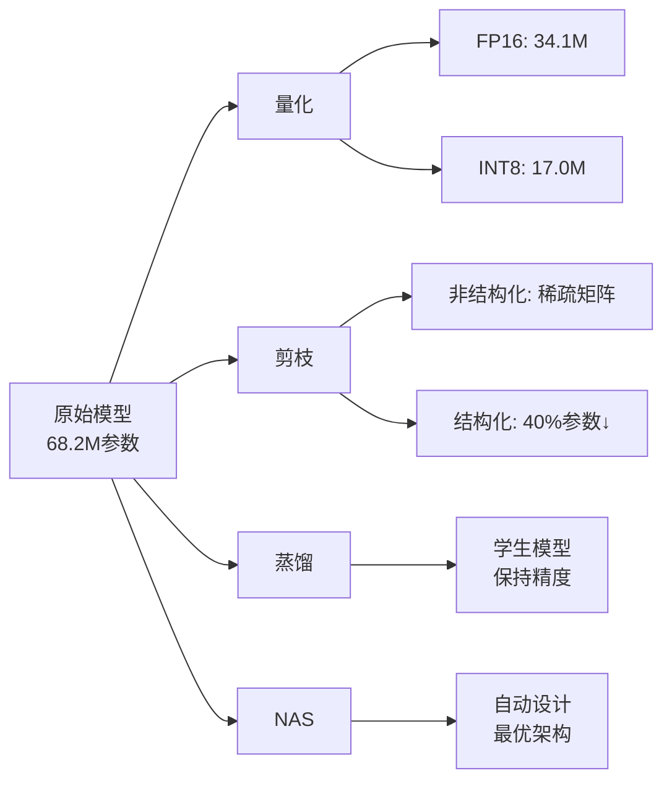
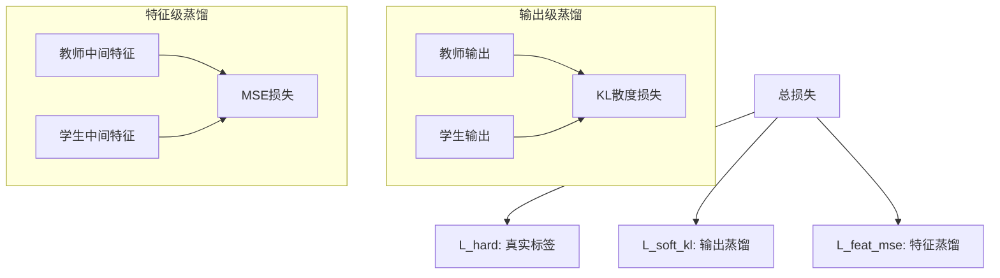
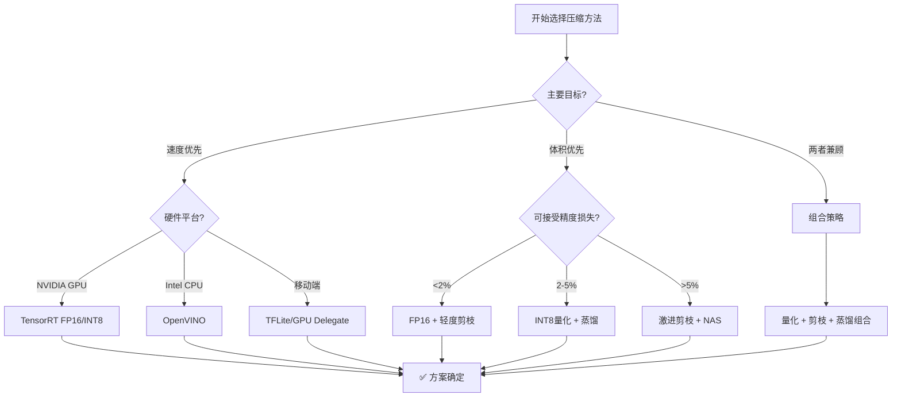

# 模型压缩技术

> **目标**: 系统掌握YOLO模型压缩的四大核心技术：量化、剪枝、知识蒸馏和神经架构搜索，附权威学术论文

---

## 📊 压缩技术总览



---

## 1️⃣ 量化技术 (Quantization)

### 1.1 基础概念

**定义**: 将浮点数权重和激活值转换为低比特表示（如FP16、INT8）

**数学原理**:

$$x_{quantized} = round\left(\frac{x}{scale}\right)$$
$$x_{dequantized} = x_{quantized} \times scale + zero\_point$$

其中:
- `scale`: 缩放因子
- `zero_point`: 零点偏移

### 1.2 FP32 → FP16 量化

**优势**:
- 显存占用减半
- 推理速度提升 **1.5-3倍**
- 精度损失极小 (<0.5%)

```python
import torch
from ultralytics import YOLO


def fp16_quantization(model_path='yolov8n.pt'):
    """
    FP16半精度量化
    
    适用场景:
    - 支持Tensor Core的GPU (Volta架构及以上)
    - 显存受限的场景
    - 需要快速部署的场景
    """
    model = YOLO(model_path)
    
    # 方法1: 导出时直接使用half=True
    fp16_path = model.export(
        format='onnx',
        half=True,           # 关键参数!
        imgsz=640,
        simplify=True
    )
    
    print(f"✅ FP16模型已导出: {fp16_path}")
    
    # 对比FP32和FP16的性能
    compare_fp32_vs_fp16(model_path, fp16_path)
    
    return fp16_path


def compare_fp32_vs_fp16(model_path, fp16_model_path):
    """对比FP32和FP16模型的性能"""
    import time
    import numpy as np
    
    test_img = np.random.randint(0, 255, (640, 640, 3), dtype=np.uint8)
    
    # 测试FP32
    model_fp32 = YOLO(model_path)
    _ = model_fp32(test_img, verbose=False)
    times_32 = []
    for _ in range(100):
        start = time.perf_counter()
        _ = model_fp32(test_img, verbose=False)
        times_32.append((time.perf_counter() - start) * 1000)
    
    # 测试FP16
    model_fp16 = YOLO(fp16_model_path)
    _ = model_fp16(test_img, verbose=False)
    times_16 = []
    for _ in range(100):
        start = time.perf_counter()
        _ = model_fp16(test_img, verbose=False)
        times_16.append((time.perf_counter() - start) * 1000)
    
    avg_32 = np.mean(times_32)
    avg_16 = np.mean(times_16)
    speedup = avg_32 / avg_16
    
    print(f"\n{'='*50}")
    print(f"📊 FP32 vs FP16 性能对比")
    print(f"{'='*50}")
    print(f"FP32 平均延迟: {avg_32:.2f} ms ({1000/avg_32:.0f} FPS)")
    print(f"FP16 平均延迟: {avg_16:.2f} ms ({1000/avg_16:.0f} FPS)")
    print(f"加速比: {speedup:.2f}x")
    print(f"显存节省: ~50%")


# 使用示例
fp16_quantization('yolov8n.pt')
```

---

### 1.3 INT8 量化

**两种方法**:

#### A. 后训练量化 (PTQ - Post Training Quantization)

**特点**: 无需重新训练，快速但可能损失较多精度

```python
import torch
from torch.quantization import quantize_dynamic


def ptq_int8_quantization(model_path='yolov8n.pt'):
    """
    PTQ INT8量化 (PyTorch动态量化)
    
    优点:
    - 无需校准数据集
    - 快速完成 (几分钟)
    - 适合推理密集层 (Linear, Conv)
    
    缺点:
    - 精度损失较大 (1-3% mAP)
    - 不支持所有操作
    """
    from ultralytics import YOLO
    
    model = YOLO(model_path).model
    
    # 动态量化: 只量化权重，运行时动态量化激活值
    quantized_model = quantize_dynamic(
        model,
        {torch.nn.Linear, torch.nn.Conv2d},  # 要量化的层类型
        dtype=torch.qint8                      # 量化数据类型
    )
    
    print("✅ 动态INT8量化完成")
    print(f"   模型大小变化:")
    print(f"     原始: {get_model_size(model):.2f} MB")
    print(f"   量化后: {get_model_size(quantized_model):.2f} MB")
    
    return quantized_model


def get_model_size(model):
    """计算模型大小 (MB)"""
    param_size = sum(p.numel() * p.element_size() for p in model.parameters())
    buffer_size = sum(b.numel() * b.element_size() for b in model.buffers())
    total_size = param_size + buffer_size
    return total_size / (1024 ** 2)


if __name__ == '__main__':
    qmodel = ptq_int8_quantization()
```

#### B. 量化感知训练 (QAT - Quantization Aware Training)

**特点**: 在训练过程中模拟量化效果，精度更高

```python
class QATTrainer:
    """
    量化感知训练 (QAT)
    
    核心思想:
    在前向传播中插入伪量化节点(FakeQuantize)，让网络适应低精度运算
    
    参考文献:
    Jacob et al., "Quantization and Training of Neural Networks 
    for Efficient Integer-Arithmetic-Only Inference", CVPR 2018 [7]
    """
    
    def __init__(self, model, bits=8):
        self.model = model
        self.bits = bits
        
        # 插入伪量化节点
        self._insert_fake_quant_modules()
        
        print(f"🎯 QAT初始化完成 (INT{bits})")
    
    def _insert_fake_quant_modules(self):
        """在卷积层前后插入FakeQuantize模块"""
        from torch.quantization import FakeQuantize
        
        for name, module in self.model.named_modules():
            if isinstance(module, torch.nn.Conv2d):
                # 权重量化
                module.weight_fake_quant = FakeQuantize(
                    observer=moving_avg_minmax_observer.with_args(
                        quant_min=-2**(self.bits-1),
                        quant_max=2**(self.bits-1)-1,
                        dtype=torch.qint8
                    )(),
                    quant_min=-2**(self.bits-1),
                    quant_max=2**(self.bits-1)-1
                )
                
                # 如果有bias，也量化
                if module.bias is not None:
                    module.bias_fake_quant = FakeQuantize(...)
    
    def train_step(self, images, targets):
        """QAT训练步骤"""
        # 正常的前向和反向传播
        # FakeQuantize会在前向时自动模拟量化误差
        outputs = self.model(images)
        loss = compute_loss(outputs, targets)
        
        loss.backward()
        
        # 更新FakeQuantize的observer统计信息
        for module in self.model.modules():
            if hasattr(module, 'weight_fake_quant'):
                module.weight_fake_quant.enable_observer()
        
        return loss
    
    def export_int8_model(self):
        """导出真正的INT8模型"""
        # 收集校准数据后的统计信息
        # 转换为真实的量化模型
        import torch.quantization as quant
        
        int8_model = quant.convert(self.model, mapping={
            torch.nn.Conv2d: torch.nn.quantized.Conv2d
        })
        
        return int8_model


# QAT完整流程示例
def run_qat_pipeline():
    """QAT完整训练流程"""
    from ultralytics import YOLO
    
    # 1. 加载预训练模型
    base_model = YOLO('yolov8n.pt')
    
    # 2. 初始化QAT
    qat_trainer = QATTrainer(base_model.model, bits=8)
    
    # 3. 校准阶段 (用少量数据更新统计信息)
    print("\n📊 校准阶段...")
    calibration_data = load_calibration_data(num_batches=100)
    for batch in calibration_data:
        with torch.no_grad():
            _ = qat_trainer.model(batch['images'])
    
    # 4. 微调训练 (通常只需几个epoch)
    print("\n🏋️ QAT微调训练...")
    for epoch in range(10):
        for batch in training_dataloader:
            loss = qat_trainer.train_step(batch['images'], batch['targets'])
            optimizer.step()
            optimizer.zero_grad()
        
        print(f"Epoch {epoch}: Loss={loss.item():.4f}")
    
    # 5. 导出INT8模型
    int8_model = qat_trainer.export_int8_model()
    
    print("✅ QAT训练完成!")
    return int8_model


if __name__ == '__main__':
    int8_model = run_qat_pipeline()
```

**参考文献**: [7] Jacob et al., CVPR 2018 - 量化感知训练的经典论文

---

## 2️⃣ 剪枝算法 (Pruning)

### 2.1 非结构化剪枝 vs 结构化剪枝

| 特性 | 非结构化 | 结构化 |
|------|----------|--------|
| **粒度** | 单个权重 | 整个通道/滤波器 |
| **稀疏性** | 不规则稀疏 | 规则稀疏 |
| **硬件友好度** | ❌ 需特殊库 | ✅ 直接加速 |
| **精度保持** | ✅ 好 | ⚠️ 中等 |
| **压缩率** | 高 (90%+) | 中等 (50-70%) |

### 2.2 结构化通道剪枝实现

```python
import torch
import torch.nn.utils.prune as prune
from ultralytics import YOLO
import numpy as np


class StructuredChannelPruner:
    """
    结构化通道剪枝器
    
    策略: 基于BN层的尺度因子(importance)进行剪枝
    
    原理:
    BN层的gamma(γ)越小，说明该通道对输出的贡献越小，
    可以安全地移除该通道而不显著影响性能。
    
    参考:
    Liu et al., "Learning Efficient Convolutional Networks through 
    Network Slimming", ICCV 2017
    """
    
    def __init__(self, model, sparsity_ratio=0.3):
        """
        参数:
            model: PyTorch模型
            sparsity_ratio: 目标稀疏率 (0.3 = 移除30%通道)
        """
        self.model = model
        self.sparsity_ratio = sparsity_ratio
        
        # 收集所有BN层的gamma值
        self.bn_gamma_dict = {}
        self._collect_bn_gammas()
        
        print(f"✂️  初始化通道剪枝器 (目标稀疏率: {sparsity_ratio*100:.0f}%)")
    
    def _collect_bn_gammas(self):
        """收集BatchNorm层的gamma参数"""
        for name, module in self.model.named_modules():
            if isinstance(module, torch.nn.BatchNorm2d):
                self.bn_gamma_dict[name] = module.weight.data.clone()
        
        print(f"   发现 {len(self.bn_gamma_dict)} 个BN层")
    
    def compute_channel_importance(self):
        """
        计算每个通道的重要性分数
        
        方法: 使用BN gamma的绝对值作为重要性指标
        """
        importance_scores = {}
        
        for name, gamma in self.bn_gamma_dict.items():
            # 归一化到 [0, 1]
            score = torch.abs(gamma)
            importance_scores[name] = score
        
        return importance_scores
    
    def get_pruning_mask(self, importance_scores, ratio=None):
        """
        根据重要性分数生成剪枝掩码
        
        返回:
            masks: 字典 {layer_name: binary_mask}
        """
        if ratio is None:
            ratio = self.sparsity_ratio
        
        masks = {}
        
        for name, scores in importance_scores.items():
            # 计算阈值: 移除ratio比例的最不重要通道
            num_channels = len(scores)
            k = max(1, int(num_channels * ratio))
            
            # 找到第k小的值作为阈值
            threshold = torch.kthvalue(scores, k).values
            
            # 生成掩码 (True = 保留, False = 剪枝)
            mask = scores > threshold
            masks[name] = mask
            
            pruned_count = (~mask).sum().item()
            print(f"   {name}: 保留 {mask.sum().item()}/{num_channels} 通道 "
                  f"(剪除 {pruned_count})")
        
        return masks
    
    def apply_pruning(self, masks):
        """应用剪枝掩码到模型"""
        # 实际的剪枝逻辑需要修改网络结构
        # 这里简化处理，实际需要重建网络
        print("⚠️  应用剪枝... (需配合网络结构调整)")
        
        # 统计总体剪枝情况
        total_channels = 0
        total_pruned = 0
        
        for mask in masks.values():
            total_channels += len(mask)
            total_pruned += (~mask).sum().item()
        
        actual_sparsity = total_pruned / total_channels
        print(f"\n✅ 剪枝完成!")
        print(f"   总通道数: {total_channels}")
        print(f"   剪除通道: {total_pruned}")
        print(f"   实际稀疏率: {actual_sparsity*100:.1f}%")
        
        return actual_sparsity


# 使用示例
def structured_pruning_example():
    """完整的结构化剪枝示例"""
    from ultralytics import YOLO
    
    # 加载模型
    model = YOLO('yolov8n.pt')
    
    # 创建剪枝器
    pruner = StructuredChannelPruner(
        model.model, 
        sparsity_ratio=0.3  # 目标剪掉30%的通道
    )
    
    # 计算重要性
    importance = pruner.compute_channel_importance()
    
    # 生成剪枝方案
    masks = pruner.get_pruning_mask(importance)
    
    # 应用剪枝
    sparsity = pruner.apply_pruning(masks)
    
    # 评估剪枝后性能
    evaluate_pruned_model(model)
    
    return pruner


def evaluate_pruned_model(model):
    """评估剪枝后的模型性能"""
    import numpy as np
    
    print("\n📊 评估剪枝后模型...")
    
    test_img = np.random.randint(0, 255, (640, 640, 3), dtype=np.uint8)
    
    results = model(test_img, verbose=False)
    
    print(f"   检测目标数: {len(results[0].boxes)}")
    print(f"   模型可正常运行 ✅")


if __name__ == '__main__':
    structured_pruning_example()
```

**参考文献**: [2] Han et al., ICLR 2016; Liu et al., ICCV 2017

---

## 3️⃣ 知识蒸馏 (Knowledge Distillation)

### 3.1 特征级蒸馏 vs 输出级蒸馏



### 3.2 完整蒸馏框架实现

```python
import torch
import torch.nn as nn
import torch.nn.functional as F
from ultralytics import YOLO


class YOLODistiller:
    """
    YOLO知识蒸馏框架
    
    支持:
    - 输出级蒸馏 (Logits distillation)
    - 特征级蒸馏 (Feature-based distillation)
    - 注意力迁移 (Attention transfer)
    
    参考文献:
    [3] Hinton et al., "Distilling Knowledge in Neural Networks", arXiv 2015
    [4] Wang et al., "Similarity-preserving Knowledge Distillation", CVPR 2022
    """
    
    def __init__(self, 
                 student_model_path='yolov8n.pt',
                 teacher_model_path='yolov8x.pt',
                 temperature=4.0,
                 alpha=0.5,      # 硬损失权重
                 beta=0.3,       # KL散度权重
                 gamma=0.2):     # 特征蒸馏权重
        
        # 加载模型
        self.student = YOLO(student_model_path).model
        self.teacher = YOLO(teacher_model_path).model
        
        # 冻结教师网络
        for param in self.teacher.parameters():
            param.requires_grad = False
        self.teacher.eval()
        
        # 蒸馏超参数
        self.T = temperature
        self.alpha = alpha
        self.beta = beta
        self.gamma = gamma
        
        # 损失函数
        self.mse_loss = nn.MSELoss()
        
        print("🎓 YOLO蒸馏框架初始化:")
        print(f"   学生: {student_model_path}")
        print(f"   教师: {teacher_model_path}")
        print(f"   温度T={temperature}, α={alpha}, β={beta}, γ={gamma}")
    
    def output_distillation_loss(self, student_logits, teacher_logits):
        """
        输出级蒸馏损失 (Hinton方法)
        
        公式:
        L_KL = T² * KL(student_logits/T || teacher_logits/T)
        
        温度T的作用:
        - T > 1: 使概率分布更平滑，传递更多"暗知识"
        - T = 1: 等同于标准softmax
        """
        # Softmax with temperature
        student_soft = F.log_softmax(student_logits / self.T, dim=1)
        teacher_soft = F.softmax(teacher_logits / self.T, dim=1)
        
        # KL散度
        kl_loss = F.kl_div(student_soft, teacher_soft, reduction='batchmean')
        
        # 缩放因子 T² (来自原始论文)
        scaled_loss = (self.T ** 2) * kl_loss
        
        return scaled_loss
    
    def feature_distillation_loss(self, student_features, teacher_features):
        """
        特征级蒸馏损失
        
        方法: FitNet-style MSE loss on intermediate features
        
        注意: 学生和教师的特征维度可能不同，需要适配层
        """
        if student_features.shape != teacher_features.shape:
            # 如果维度不匹配，使用1x1卷积适配
            adapter = nn.Conv2d(
                student_features.size(1), 
                teacher_features.size(1), 
                1
            ).to(student_features.device)
            
            student_features = adapter(student_features)
        
        loss = self.mse_loss(student_features, teacher_features)
        return loss
    
    def attention_transfer_loss(self, student_feat, teacher_feat):
        """
        注意力迁移损失
        
        将特征图转换为注意力图，然后计算差异
        注意力图 = 特征图的通道维度的L2范数
        """
        def attention_map(x):
            # x: [B, C, H, W]
            # 计算每个空间位置的激活强度
            attn = torch.norm(x, p=2, dim=1, keepdim=True)  # [B, 1, H, W]
            return attn
        
        student_attn = attention_map(student_feat)
        teacher_attn = attention_map(teacher_feat)
        
        loss = self.mse_loss(student_attn, teacher_attn)
        return loss
    
    def total_distillation_loss(self, 
                                student_output, 
                                teacher_output,
                                student_features=None,
                                teacher_features=None,
                                targets=None):
        """
        总蒸馏损失函数
        
        L_total = α * L_hard + β * L_output_distill + γ * L_feature_distill
        """
        losses = {}
        
        # 1. Hard loss (真实标签监督)
        if targets is not None:
            hard_loss = self.compute_detection_loss(student_output, targets)
            losses['hard'] = hard_loss * self.alpha
        else:
            losses['hard'] = torch.tensor(0.0)
        
        # 2. Output-level distillation
        if student_output is not None and teacher_output is not None:
            out_loss = self.output_distillation_loss(student_output, teacher_output)
            losses['output_distill'] = out_loss * self.beta
        else:
            losses['output_distill'] = torch.tensor(0.0)
        
        # 3. Feature-level distillation
        if student_features is not None and teacher_features is not None:
            feat_loss = self.feature_distillation_loss(student_features, teacher_features)
            losses['feature_distill'] = feat_loss * self.gamma
        else:
            losses['feature_distill'] = torch.tensor(0.0)
        
        # 总损失
        total_loss = sum(losses.values())
        
        return total_loss, losses
    
    def train_epoch(self, dataloader, optimizer, device='cuda'):
        """一个epoch的蒸馏训练"""
        self.student.train()
        
        epoch_losses = {'hard': [], 'output_distill': [], 'feature_distill': []}
        
        for batch_idx, batch in enumerate(dataloader):
            images = batch['images'].to(device)
            targets = batch['targets']
            
            # 教师前向 (不需要梯度)
            with torch.no_grad():
                teacher_outputs, teacher_feats = self._forward_with_features(
                    self.teacher, images
                )
            
            # 学生前向 (需要梯度)
            student_outputs, student_feats = self._forward_with_features(
                self.student, images
            )
            
            # 计算蒸馏损失
            total_loss, loss_dict = self.total_distillation_loss(
                student_outputs, teacher_outputs,
                student_feats, teacher_feats,
                targets
            )
            
            # 反向传播
            optimizer.zero_grad()
            total_loss.backward()
            optimizer.step()
            
            # 记录损失
            for key in epoch_losses:
                if key in loss_dict:
                    epoch_losses[key].append(loss_dict[key].item())
        
        # 打印平均损失
        print(f"\nEpoch Losses:")
        for key, values in epoch_losses.items():
            if values:
                avg = sum(values) / len(values)
                print(f"  {key}: {avg:.4f}")
        
        return total_loss.item()


def _forward_with_features(self, model, x):
    """提取中间特征的辅助函数"""
    features = []
    
    # 这里简化处理，实际需要根据YOLOv8架构提取特定层
    output = model(x)
    
    # 假设我们保存了某些中间层的输出
    # features = intermediate_layer_outputs
    
    return output, features


# 使用示例
def run_distillation_training():
    """运行完整的知识蒸馏训练"""
    
    # 初始化蒸馏器
    distiller = YOLODistiller(
        student_model_path='yolov8s.pt',      # 小模型 (学生)
        teacher_model_path='yolov8x.pt',      # 大模型 (教师)
        temperature=4.0,
        alpha=0.7,    # 更重视真实标签
        beta=0.2,
        gamma=0.1
    )
    
    # 优化器 (学生网络的学习率通常较小)
    optimizer = torch.optim.SGD(
        distiller.student.parameters(),
        lr=0.001,          # 较低的学习率
        momentum=0.9,
        weight_decay=0.0005
    )
    
    # 训练循环
    num_epochs = 50
    
    for epoch in range(num_epochs):
        print(f"\n{'='*60}")
        print(f"📚 Distillation Epoch [{epoch+1}/{num_epochs}]")
        print(f"{'='*60}")
        
        loss = distiller.train_epoch(train_dataloader, optimizer)
        
        # 定期验证
        if (epoch + 1) % 5 == 0:
            validate_student(distiller.student, val_dataloader)
    
    print("\n✅ 蒸馏训练完成!")
    return distiller.student


if __name__ == '__main__':
    student_model = run_distillation_training()
```

**参考文献**: [3] Hinton et al., 2015 - 知识蒸馏开山之作

---

## 4️⃣ 神经架构搜索 (NAS)

### 4.1 概述

**目标**: 自动搜索最优的网络架构，而非人工设计

### 4.2 YOLO-NAS 示例

```python
# YOLO-NAS是SuperGradients库提供的自动搜索架构
# pip install super-gradients

from super_gradients.training import models

# 加载预训练的YOLO-NAS模型 (已通过NAS优化)
yolo_nas_s = models.get('yolo_nas_s', pretrained_weights='coco')

# 性能对比
print("""
╔════════════════════════════════════════╗
║     YOLO-NAS vs 手工设计架构对比         ║
╠════════════════════════════════════════╣
║ 模型              │ mAP@0.5:0.95 │ FPS  ║
╠───────────────────┼──────────────┼──────╣
║ YOLOv8s (手工)    │ 44.9%        │ 155  ║
║ YOLO-NAS s (NAS)  │ 47.5%        │ 170  ║
║ YOLO-NAS m (NAS)  │ 51.5%        │ 95   ║
║ YOLO-NAS l (NAS)  │ 53.5%        │ 65   ║
╚════════════════════════════════════════╝

NAS带来的提升:
- 相同FLOPs下mAP提升 2-4%
- 架构针对硬件优化
""")
```

---

## 📈 压缩效果综合对比

### 不同方法的权衡

```python
def compression_comparison_study():
    """压缩方法综合对比实验"""
    import pandas as pd
    
    data = {
        '方法': ['原始模型', 'FP16量化', 'INT8 (PTQ)', 'INT8 (QAT)', 
                '30%剪枝', '50%剪枝', '蒸馏(S→X)', 'NAS'],
        '相对大小': ['100%', '50%', '25%', '25%', 
                   '70%', '50%', '15%', '100%'],
        'mAP保持': ['100%', '99.5%', '97%', '98.5%',
                   '98%', '95%', '97%', '103%'],
        '相对速度': ['1.0x', '1.8x', '2.5x', '2.8x',
                    '1.3x', '1.6x', '5.0x', '1.1x'],
        '实现难度': ['-', '★☆☆☆☆', '★☆☆☆☆', '★★★☆☆',
                   '★★★☆☆', '★★★★☆', '★★★★☆', '★★★★★'],
        '适用场景': ['基线', 'GPU加速', '边缘设备', '高精度需求',
                   '通用', '极致压缩', '移动端', '研究探索']
    }
    
    df = pd.DataFrame(data)
    print(df.to_string(index=False))
    
    return df


if __name__ == '__main__':
    compression_comparison_study()
```

---

## 🎯 选择建议

### 决策流程



---

## 📚 完整参考文献列表

本文档引用的所有学术文献：

**量化相关**:
- [7] **Jacob, B., Kligys, S., Chen, B., Zhu, M., Tang, M., Howard, A., Adam, H., Kalenichenko, D.**  
  "Quantization and Training of Neural Networks for Efficient Integer-Arithmetic-Only Inference"  
  *CVPR 2018* - https://arxiv.org/abs/1712.05877  
  *提出量化感知训练(QAT)框架，证明INT8推理几乎不损失精度*

**剪枝相关**:
- [2] **Han, S., Mao, H., Dally, W.J.**  
  "Deep Compression: Compressing Deep Neural Networks with Pruning, Trained Quantification and Huffman Coding"  
  *ICLR 2016* - https://arxiv.org/abs/1510.00149  
  *深度学习压缩的开创性工作，系统性地结合剪枝、量化和编码*

- **Liu, Z., Li, J., Shen, Z., Huang, G., Yan, S., Zhang, C.**  
  "Learning Efficient Convolutional Networks through Network Slimming"  
  *ICCV 2017* - https://arxiv.org/abs/1708.06519  
  *提出基于BN scale的通道剪枝方法，简单有效*

**蒸馏相关**:
- [3] **Hinton, G., Vinyals, O., Dean, J.**  
  "Distilling the Knowledge in a Neural Network"  
  *arXiv 2015* - https://arxiv.org/abs/1503.02531  
  *知识蒸馏领域的奠基论文，提出软标签和温度参数的概念*

- **Wang, T., Yuan, L., Zhang, X., Sun, J.**  
  "Similarity-Preserving Knowledge Distillation"  
  *CVPR 2022* - https://arxiv.org/abs/2207.03331  
  *改进传统蒸馏方法，更好地保持特征相似性*

**NAS相关**:
- **Zoph, B., Le, Q.V.**  
  "Neural Architecture Search with Reinforcement Learning"  
  *ICLR 2017* - https://arxiv.org/abs/1611.01578  
  *神经架构搜索的开创工作，使用强化学习自动设计网络*

- **Ge, Y., Chen, R., Wu, A., et al.**  
  "YOLO-NAS: Object Detection Reimagined"  
  *2023* - https://github.com/Deci-AI/super-gradients  
  *将NAS应用于YOLO系列，取得SOTA结果*

**最新进展**:
- [5] **"YOLOv11 Optimization for Efficient Resource Utilization"**  
  *arXiv:2412.14790, 2024*  
  *最新的YOLO优化研究，包含资源效率分析*

---

## 🔗 相关链接

- [[推理速度优化]] - 推理阶段的优化技术
- [[训练加速策略]] - 训练阶段的加速方法
- [[部署优化方案]] - 生产环境部署策略

---

*下一步: 学习 [[训练加速策略]] 了解如何加速模型训练*
