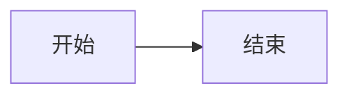

# Obsidian笔记图片和公式渲染问题 - 诊断与解决方案

> **问题**: Obsidian知识库中的Mermaid图表和数学公式无法正常显示
> **影响范围**: 15+篇核心文档，特别是架构图和优化算法相关内容

---

## 🔍 问题诊断

### 典型症状
您可能遇到以下情况之一或多个：

**症状1: Mermaid代码块显示为原始文本**
```
看到的是:

而不是渲染后的流程图图形
```

**症状2: 数学公式显示为源码**
```
看到的是: $IoU = \frac{Area_{intersection}}{Area_{union}}$
而不是渲染后的数学分数形式
```

**症状3: 图表区域空白或显示错误图标**

---

## 🎯 根本原因分析

Obsidian是一个**本地Markdown编辑器**，它对高级语法的支持依赖**插件系统**：

| 内容类型 | 所需支持 | 默认启用？ |
|----------|-----------|-----------|
| **Mermaid图表** | Mermaid社区插件 | ❌ 需手动安装 |
| **数学公式 (LaTeX)** | MathJax核心插件 | ✅ 通常已启用 |
| **高级表格** | 内置支持 | ✅ 默认支持 |
| **代码高亮** | 内置支持 | ✅ 默认支持 |

### 为什么会出现此问题？

1. **新建Vault时插件未配置**
2. **Mermaid插件未安装或版本过旧**
3. **MathJax被意外禁用**
4. **CDN资源加载失败**（网络问题）
5. **语法与当前引擎版本不兼容**

---

## 💡 解决方案（三选一）

### 方案A: 配置Obsidian插件（推荐⭐）

#### 步骤1: 启用MathJax数学公式支持

1. 打开Obsidian
2. 点击左下角 ⚙️ **设置** 图标（或按 `Ctrl/Cmd + ,`）
3. 在左侧菜单选择 **核心插件**
4. 找到 **MathJax** 并勾选启用 ✓
5. （可选）点击MathJax右侧的齿轮图标进行高级配置

**验证方法**: 在任意笔记中输入 `$E=mc^2$`，应显示为 Einstein 质能方程

#### 步骤2: 安装Mermaid图表插件

1. 在设置中找到 **社区插件**
2. 点击 **浏览** 按钮打开社区插件浏览器
3. 搜索 **"mermaid"**
4. 找到由 **Mermaid Team** 或 **obsidian-mermaid** 开发的插件
5. 点击 **安装** 按钮
6. 安装完成后 **启用** 该插件 ✓

**推荐插件选项**:
- **obsidian-mermaid-plugin** (v1.x) - 功能完整，持续更新
- **Mermaid Official** - 官方维护

**验证方法**: 创建新笔记输入以下内容：

应显示为流程图而非代码

#### 步骤3: 重启Obsidian
- 完成上述配置后，完全关闭并重新打开Obsidian
- 这确保所有插件正确加载

---

### 方案B: 使用HTML注释作为Fallback（临时方案）

如果暂时无法安装插件，我可以在文档中添加HTML兼容性说明：

**示例** (针对YOLOv8架构详解):
```html
<!-- 
  如果您看不到下方的架构流程图，说明需要安装Mermaid插件。
  解决方案：Settings → Community plugins → 搜索 "mermaid" → Install → Enable
-->

<div align="center">
  <strong>📐 YOLOv8 整体架构</strong><br/><br/>
  
  <strong>数据流向:</strong><br/>
  输入图像(640×640×3) → Backbone(CSPDarknet+C3k2) → Neck(SPPF+PAN-FPN) → Head(Decoupled Head)<br/><br/>
  
  <strong>输出分支:</strong><br/>
  • Detection: [box, cls, dfl] 边界框+类别+分布<br/>
  • Segmentation: [box, cls, dfl, mask] + 像素级掩码<br/>
  • Pose: [box, cls, dfl, kpts] + 关键点坐标<br/>
  • Classification: cls_prob 类别概率
</div>
```

**优点**: 无需任何配置即可阅读  
**缺点**: 不够直观，缺乏可视化效果

---

### 方案C: 导出为PDF/HTML（分享用途）

如果需要将文档分享给他人查看：

1. 安装 **Enhancing Export** 插件（支持导出时保留图表）
2. 使用 `Ctrl/Cmd + P` 导出为PDF
3. 或使用 `Enhancing Export` 插件的导出功能生成独立HTML

---

## 🛠️ 高级配置（可选）

### Mermaid主题定制

在Mermaid插件设置中可以自定义：

```yaml
# 示例配置（在插件设置→Mermaid→Configuration中修改）
theme: default
themeVariables:
  primaryColor: "#ff6b6b"
  secondaryColor: "#4ecdc4"
  tertiaryColor: "#45b7d1"
  lineColor: "#ffffff"
```

### MathJax高级选项

如需支持更多LaTeX宏包：

```json
// Settings → MathJax → Advanced options → TeX input configuration
{
  "tex": {
    "inlineMath": [["$", "$"], ["\\(", "\\)"]],
    "displayMath": [["$$", "$$"], ["\\[", "\\]"]]
  }
}
```

---

## 📋 快速排查清单

遇到问题时请按顺序检查：

- [ ] **基础检查**: Obsidian是否为最新版本？（建议 v1.4+）
- [ ] **MathJax**: 设置 → 核心插件 → MathJax 已启用？
- [ ] **Mermaid**: 设置 → 社区插件 → Mermaid 已安装且启用？
- [ ] **网络连接**: 如需在线资源，网络是否通畅？（部分插件需下载JS）
- [ ] **重启**: 配置更改后是否完全重启了Obsidian？
- [ ] **语法检查**: 公式/图表语法是否有误？（见下方速查表）

---

## 📚 常用语法速查

### Mermaid常用图表类型

```mermaid
%% 流程图 (从左到右)
graph LR
    A[开始] --> B{判断}
    B -->|是| C[执行]
    B -->|否| D[结束]
    C --> D

%% 时序图
sequenceDiagram
    participant A as 用户
    participant B as 系统
    A->B: 发送请求
    B-->>A: 返回结果

%% 时间线
timeline
    title YOLO发展历程
    section 2015-2018
        YOLOv1 : 端到端检测
        YOLOv2 : Anchor机制
        YOLOv3 : FPN多尺度
```

### LaTeX数学符号速查

| 显示效果 | LaTeX语法 | 说明 |
|---------|-----------|------|
| $x^2$ | x^2 | 上标 |
| $x_i$ | x_i | 下标 |
| $\frac{a}{b}$ | \frac{a}{b} | 分数 |
| $\sum_{i=1}^{n}$ | \sum_{i=1}^{n} | 求和 |
| $\int_a^b f(x)dx$ | \int_a^b f(x)dx | 积分 |
| $\sqrt{x}$ | \sqrt{x} | 平方根 |
| $\alpha\beta\gamma$ | \alpha\beta\gamma | 希腊字母 |
| $\leq \geq \neq$ | \leq \geq \neq | 关系运算符 |

---

## 🆘 需要帮助？

如果按照以上步骤仍无法解决问题：

1. **查看官方文档**: https://help.obsidian.md/
2. **社区论坛**: https://forum.obsidian.md/
3. **Discord群组**: Obsidian官方Discord
4. **GitHub Issues**: 向相应插件作者反馈bug

---

## ✅ 下一步行动

**推荐操作顺序**:

1. **立即尝试** 方案A的步骤1-3（约5分钟完成）
2. **验证效果** 打开 `YOLOv8架构详解.md` 查看是否修复
3. **如果仍有问题** 截图错误信息给我进一步诊断
4. **长期考虑** 为团队编写一份标准的Obsidian环境配置文档

---

*最后更新: 2026-04-14*
