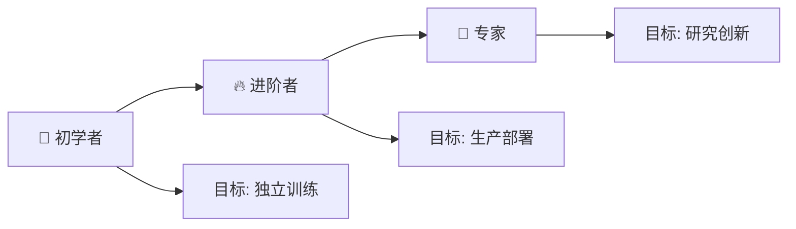

# 学习路线图

> **目标**: 为不同基础的学习者提供清晰、可执行的YOLO学习路径，从零基础到专家级别

---

## 🗺️ 总体导航



---

## 🌱 路径一：初学者（0基础 → 独立训练）

**适合人群**: Python基础薄弱或刚接触深度学习的同学
**预计时间**: 4-6周
**前置知识**: Python编程基础

### Week 1-2: 基础夯实

#### Day 1-3: Python环境搭建

**学习目标**: 配置好开发环境

**任务清单**:
- [ ] 安装Python 3.9+ 和VS Code
- [ ] 学习使用pip和虚拟环境
- [ ] 安装Jupyter Notebook
- [ ] 完成[[02-Ultralytics框架入门/环境搭建与安装]]

**推荐资源**:
- Python官方教程: https://docs.python.org/zh-cn/3/tutorial/
- VS Code配置: 搜索"VS Code Python配置"

**动手练习**:
```bash
# 创建你的第一个YOLO项目
python -m venv ylo_env
ylo_env\Scripts\activate  # Windows
# source ylo_env/bin/activate  # Linux/Mac

pip install ultralytics jupyter matplotlib
jupyter notebook
```

---

#### Day 4-7: 深度学习快速入门

**学习目标**: 理解基本概念

**必读内容**:
- [[01-YOLO基础概念/目标检测基础]] 的前半部分
- 重点理解: mAP、IoU、Precision、Recall

**核心概念速查表**:

| 概念 | 定义 | 直观理解 |
|------|------|----------|
| **IoU** | 交并比 | 预测框和真实框的重叠程度 |
| **Precision** | 精确率 | 预测为正的样本中真正正的比例 |
| **Recall** | 召回率 | 所有正样本中被正确预测的比例 |
| **mAP** | 平均精度均值 | 综合评价指标 |
| **Anchor** | 先验框 | 预设的不同尺寸参考框 |
| **NMS** | 非极大值抑制 | 去除重复检测 |

**推荐资源**:
- 吴恩达《Deep Learning Specialization》Week 1-2
- 李沐《动手学深度学习》第1-3章

---

### Week 3-4: YOLO实战入门

#### Day 8-10: 第一个YOLO程序

**学习目标**: 运行预训练模型进行推理

**任务清单**:
- [ ] 阅读[[02-Ultralytics框架入门/快速开始指南]]
- [ ] 运行第一个检测程序
- [ ] 尝试不同的输入源（图片/视频/摄像头）

**代码实践**:
```python
from ultralytics import YOLO

# 加载模型
model = YOLO('yolov8n.pt')

# 检测图片
results = model('your_image.jpg')
results[0].show()  # 显示结果

# 检测视频
model('your_video.mp4', save=True)
```

**练习项目**: 
用手机拍摄5张照片，包含人、车、动物等目标，运行检测并观察结果

---

#### Day 11-14: 理解检测结果

**学习目标**: 掌握结果解析和可视化

**重点内容**:
- [[02-Ultralytics框架入门/核心API详解]] 的predict()部分
- 理解Results对象结构
- 自定义可视化效果

**关键知识点**:
```python
result = results[0]

# 边界框坐标 (xyxy格式)
boxes = result.boxes.xyxy  # [N, 4]

# 置信度分数
confs = result.boxes.conf    # [N, ]

# 类别预测
clses = result.boxes.cls     # [N, ]
names = result.names         # 类别名称字典
```

---

### Week 5-6: 训练自定义模型

#### Day 15-18: 数据准备

**学习目标**: 准备自己的数据集

**任务清单**:
- [ ] 阅读[[03-实战应用/数据集准备与格式转换]]
- [ ] 选择标注工具 (LabelImg)
- [ ] 标注至少100张图片 (建议200+)
- [ ] 数据集格式验证

**标注流程**:
1. 收集图像 (网络爬取/自己拍摄)
2. 使用LabelImg标注
3. 划分train/val (80%/20%)
4. 创建data.yaml配置文件

**data.yaml示例**:
```yaml
path: my_dataset
train: images/train
val: images/val

nc: 3
names:
  0: cat
  1: dog
  2: bird
```

---

#### Day 19-21: 模型训练

**学习目标**: 完成端到端训练流程

**任务清单**:
- [ ] 阅读[[03-实战应用/模型训练完整流程]]
- [ ] 编写训练脚本
- [ ] 启动训练并监控过程
- [ ] 分析训练日志

**完整训练代码**:
```python
from ultralytics import YOLO

# 加载预训练模型
model = YOLO('yolov8n.pt')

# 开始训练
results = model.train(
    data='my_dataset/data.yaml',
    epochs=100,
    imgsz=640,
    batch=16
)

print(f"最佳模型保存在: {results.save_dir}/weights/best.pt")
```

**训练监控要点**:
- Loss是否稳定下降？
- 是否出现过拟合？（val loss上升而train loss下降）
- GPU利用率是否正常？

---

#### Day 22-28: 评估与优化

**学习目标**: 评估模型性能并进行初步优化

**任务清单**:
- [ ] 阅读[[03-实战应用/模型验证与评估]]
- [ ] 运行验证并解读指标
- [ ] 尝试调整超参数重新训练
- [ ] 导出模型为ONNX格式

**评估指标解读**:
```
mAP@0.5:      0.85   → 85%的检测IoU>0.5 (PASCAL标准)
mAP@0.5:0.95: 0.62   → COCO主指标 (更严格)
Precision:    0.88   → 预测准确率
Recall:       0.82   → 召回率
FPS:          150    → 推理速度
```

**路径一完成标志 ✅**:
- [x] 能够独立完成数据收集→标注→训练→评估全流程
- [x] 理解主要评估指标的含义
- [x] 可以将模型导出并在新数据上测试

---

## 🔥 路径二：进阶者（独立训练 → 生产部署）

**适合人群**: 已能独立训练YOLO模型的工程师
**预计时间**: 6-10周
**前置要求**: 完成路径一 + 有一定工程经验

### Month 2: 高级功能掌握

#### Week 7-8: 模型优化技术

**学习目标**: 提升模型精度和速度

**核心模块**:
- [[04-高级功能/模型微调技巧]] - 冻结层、差分学习率
- [[04-高级功能/迁移学习策略]] - 预训练权重选择
- [[05-性能优化/推理速度优化]] ⭐ - TensorRT等加速技术

**必做实验**:

**实验1: 对比不同模型规模**
```python
models = ['yolov8n', 'yolov8s', 'yolov8m']

for m in models:
    model = YOLO(f'{m}.pt')
    metrics = model.val(data='my_data.yaml')
    print(f"{m}: mAP={metrics.box.map:.4f}")
```

**实验2: TensorRT加速对比**
```python
# 基线: PyTorch FP32
# 优化1: ONNX FP16  
# 优化2: TensorRT FP16
# 记录每种方式的延迟和精度
```

**学习产出**: 一份详细的优化实验报告

---

#### Week 9-10: 部署技能

**学习目标**: 将模型投入生产环境

**核心模块**:
- [[03-实战应用/推理部署实战]]
- [[05-性能优化/部署优化方案]]

**部署方案学习顺序**:

1. **本地部署** (Week 9)
   - Flask/FastAPI封装
   - 批量处理脚本
   - 性能基准测试

2. **服务端部署** (Week 10)
   - Docker容器化
   - 多实例负载均衡
   - 监控和日志系统

3. **边缘部署** (可选)
   - NVIDIA Jetson系列
   - 树莓派优化
   - 移动端(TFLite/CoreML)

**实战项目**: 构建一个完整的检测服务API

```python
# FastAPI服务示例
from fastapi import FastAPI, UploadFile, File
from ultralytics import YOLO
import cv2
import numpy as np

app = FastAPI()
model = YOLO('best.pt')

@app.post("/detect")
async def detect(file: UploadFile = File(...)):
    # 读取图片
    contents = await file.read()
    nparr = np.fromstring(contents, np.uint8)
    img = cv2.imdecode(nparr, cv2.IMREAD_COLOR)
    
    # 推理
    results = model(img)
    
    # 返回结果
    return parse_results(results)

if __name__ == "__main__":
    import uvicorn
    uvicorn.run(app, host="0.0.0.0", port=8000)
```

**路径二完成标志 ✅**:
- [x] 能够优化模型达到生产级性能
- [x] 掌握至少一种部署方案
- [x] 了解性能调优的系统方法

---

## 👑 路径三：专家级（生产部署 → 研究创新）

**适合人群**: 有丰富实战经验，想深入研究或发表论文的开发者/研究者
**预计时间**: 12周+
**前置要求**: 完成路径二 + 数学基础（线性代数、概率论）

### Phase 1: 深入理论 (Week 11-14)

**学习目标**: 从实现者转变为理解者

**必读论文** (按优先级):

**第一梯队** (必须精读):
1. **YOLOv1** - Redmon et al., CVPR 2016
   - 理解单阶段检测的核心思想
   
2. **Faster R-CNN** - Ren et al., NeurIPS 2015
   - 理解两阶段检测作为对比
   
3. **Feature Pyramid Networks** - Lin et al., CVPR 2017
   - 多尺度特征融合的基础

4. **Deep Compression** - Han et al., ICLR 2016
   - 模型压缩的开创工作

**第二梯队** (选读):
- YOLOv4/v7/v8 相关论文
- Knowledge Distillation系列
- Neural Architecture Search相关工作

**阅读方法**:
- 见[[07-资源与参考/推荐论文列表]]中的"如何高效阅读论文"

**学习产出**: 10篇论文的详细笔记

---

### Phase 2: 前沿跟踪 (Week 15-20)

**学习目标**: 掌握最新研究动态

**关注渠道**:

1. **arXiv每日更新**
   - cs.CV (计算机视觉)
   - cs.LG (机器学习)
   
2. **顶级会议**:
   - CVPR/ECCV/ICCV (每年2-3月投稿截止)
   - NeurIPS/ICML (每年5月/2月截止)
   
3. **重要实验室**:
   - Ultralytics GitHub
   - Facebook AI Research
   - Google Research
   - 微软亚洲研究院

**当前热点方向** (2024-2025):
- ⭐ 大语言模型辅助的目标检测 (LLM-assisted Detection)
- ⭐ 开放词汇目标检测 (Open-Vocabulary Detection)
- ⭐ 3D目标检测与多模态融合
- ⭐ 边缘设备上的高效检测
- ⭐ 视频理解与时序检测

**每周例行**:
- 周一: 浏览上周arXiv新论文
- 周三: 精读1-2篇相关论文
- 周五: 整理笔记和思考

---

### Phase 3: 创新研究 (Week 21+)

**学习目标**: 开展自己的研究工作

**选题方向建议**:

**方向A: 应用改进** (适合工程师)
- 特定场景优化 (医学影像/工业检测/遥感)
- 小目标检测改进
- 实时性极致优化

**方向B: 方法创新** (适合研究者)
- 新的网络架构设计
- 更高效的注意力机制
- 新的训练范式

**方向C: 系统集成** (适合全栈开发者)
- 端到端检测系统
- 多模态融合框架
- 自动化机器学习平台

**研究流程**:
```
1. 文献调研 (2-3周)
   ↓
2. 问题定义与方法设计 (2周)
   ↓
3. 实现原型 (3-4周)
   ↓
4. 实验验证与对比 (2-3周)
   ↓
5. 论文撰写 (3-4周)
   ↓
6. 投稿与修改 (持续)
```

**路径三完成标志 ✅**:
- [x] 能阅读和理解顶会论文
- [x] 能复现SOTA方法
- [x] 有自己的研究方向和成果
- [x] 能撰写学术论文

---

## 📊 各阶段能力矩阵

| 能力维度 | 初学者 | 进阶者 | 专家 |
|----------|--------|--------|------|
| **环境配置** | ✅ 独立完成 | ✅ Docker/K8s | ✅ 云原生架构 |
| **模型训练** | ✅ 基本训练 | ✅ 微调/迁移学习 | ✅ 从头设计 |
| **性能优化** | ⚠️ 了解概念 | ✅ TensorRT/INT8 | ✅ 自研优化方法 |
| **模型部署** | ❌ 未涉及 | ✅ API/服务化 | ✅ 大规模系统 |
| **文献阅读** | ⚠️ 读教程 | ✅ 读论文 | ✅ 追踪前沿 |
| **研究创新** | ❌ 未涉及 | ⚠️ 改进现有方法 | ✅ 发表原创工作 |

---

## 🎯 快速定位指南

### 我是新手，该从哪开始？

**回答以下问题**:

Q1: 你有Python基础吗？
- 没有 → 先花1周学Python基础
- 有一些 → 直接开始路径一
- 很熟练 → 可跳过部分内容

Q2: 你的最终目标是什么？

| 目标 | 推荐路径 | 关键节点 |
|------|----------|----------|
| **完成课程作业** | 路径一 (4-6周) | Week 6: 训练出模型 |
| **找工作/实习** | 路径一+二 (8-10周) | Week 10: 完整项目作品集 |
| **科研/读研** | 路径一→三 (16周+) | Week 20+: 投出第一篇论文 |
| **工业项目落地** | 路径二 (6-10周) | Week 10: 部署上线 |

---

## ⏰ 时间规划建议

### 全职学习 (每天4-6小时)

```
路径一: 4周 (集中冲刺)
├─ Week 1: 环境搭建 + 基础概念
├─ Week 2: 第一个程序 + 结果解析
├─ Week 3: 数据准备 + 标注
└─ Week 4: 训练 + 评估 + 导出

路径二: 6周
├─ Week 1-2: 复习路径一核心内容
├─ Week 3-4: 高级功能 + 优化技术
└─ Week 5-6: 部署实战 + 项目整合
```

### 业余学习 (每天1-2小时)

```
路径一: 8-10周 (稳步推进)
├─ 每2天完成一个Day的任务
├─ 周末进行总结和复习
└─ 预留缓冲时间应对突发情况

建议节奏:
- 工作日: 1小时学习 + 30分钟实践
- 周末: 2-3小时项目实战
```

---

## 💡 学习建议

### 高效学习原则

1. **70/20/10法则**
   - 70%时间动手写代码
   - 20%时间阅读文档
   - 10%时间整理笔记

2. **项目驱动学习**
   - 不要只看教程
   - 每个知识点都要有对应的小项目
   - 例如: 学完推理 → 做个批量检测工具

3. **建立反馈循环**
   - 定期测试自己的掌握程度
   - 尝试向他人解释概念 (费曼技巧)
   - 参与社区讨论

### 常见误区避免

❌ **只看不练**: 看了很多视频但没写过代码
✅ **边看边做**: 每看完一节就立即实践

❌ **追求完美**: 想要完全理解才开始
✅ **先跑通再优化**: 先让程序跑起来，再逐步改进

❌ **孤立学习**: 自己闭门造车
✅ **参与社区**: 提问、回答、分享经验

❌ **贪多嚼不烂**: 同时学太多东西
✅ **聚焦深入**: 一次只学透一个主题

---

## 🛠️ 学习资源工具箱

### 必备工具

| 工具 | 用途 | 推荐理由 |
|------|------|----------|
| **VS Code** | 代码编辑 | 轻量、插件丰富 |
| **Jupyter** | 实验记录 | 交互式、可视化好 |
| **Git** | 版本控制 | 必须掌握 |
| **Obsidian** | 笔记管理 | 本知识库使用的工具 |
| **Weights & Biases** | 实验跟踪 | 免费的ML实验平台 |
| **Google Colab** | GPU计算 | 免费GPU资源 |

### 推荐书籍

| 书籍 | 难度 | 适合阶段 |
|------|------|----------|
| 《Python编程：从入门到实践》 | ⭐ | 入门 |
| 《动手学深度学习》 | ⭐⭐ | 初学者 |
| 《深度学习》(花书) | ⭐⭐⭐ | 进阶 |
| 《Computer Vision: Algorithms...》 | ⭐⭐⭐⭐ | 专家 |

---

## 🎉 里程碑检查点

### 路径一里程碑

- [ ] **M1** (Week 2): 成功运行第一个YOLO检测程序
- [ ] **M2** (Week 4): 使用自定义数据集训练出模型 (mAP > 50%)
- [ ] **M3** (Week 6): 完成一个完整的小项目（如宠物识别）

### 路径二里程碑

- [ ] **M4** (Week 8): 模型优化后性能提升30%+
- [ ] **M5** (Week 10): 部署可用的检测API服务
- [ ] **M6** (Week 10): 技术博客/开源贡献

### 路径三里程碑

- [ ] **M7** (Week 14): 精读并笔记10+篇核心论文
- [ ] **M8** (Week 18): 复现一篇SOTA论文的结果
- [ ] **M9** (Week 24): 完成第一份研究报告或论文初稿

---

## 🔗 相关链接

- [[00-首页]] - 回到知识库主页
- [[推荐论文列表]] - 配合各阶段的论文阅读
- [[开源项目推荐]] - 实战代码资源

---

## 💬 社区支持

遇到问题？不要独自纠结！

**求助渠道**:
- Ultralytics Discord: https://ultralytics.com/discord/
- GitHub Issues: https://github.com/ultralytics/ultralytics/issues
- Stack Overflow: 搜索 `ultralytics` 或 `yolo`
- 本知识库: [[06-常见问题与解决方案]]

**记住**: 每个专家都曾是新手，提问是学习的一部分！ 🚀

---

*最后更新: 2026-04-14 | 祝你学习顺利！*
