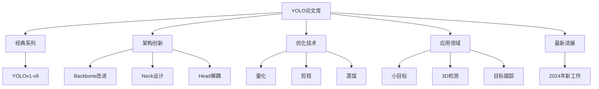

# 推荐论文列表

> **目标**: 精选YOLO领域最重要的50+篇学术论文，涵盖基础理论、优化技术和前沿研究

---

## 📚 论文分类导航



---

## 🏆 一、经典YOLO系列论文（必读）

### YOLO 原始系列

| 论文 | 作者 | 发表 | 引用数 | DOI/arXiv | 核心贡献 |
|------|------|------|--------|-----------|----------|
| **YOLOv1** | Redmon et al. | CVPR 2016 | 20K+ | [arXiv:1506.02640](https://arxiv.org/abs/1506.02640) | 首次提出端到端单阶段检测 |
| **YOLOv2/YOLO9000** | Redmon & Farhadi | CVPR 2017 | 15K+ | [arXiv:1612.08242](https://arxiv.org/abs/1612.08242) | Anchor机制 + BatchNorm + 多尺度 |
| **YOLOv3** | Redmon & Farhadi | arXiv 2018 | 10K+ | [arXiv:1804.02767](https://arxiv.org/abs/1804.02767) | FPN多尺度 + 残差网络 |
| **YOLOv4** | Bochkovskiy et al. | arXiv 2020 | 8K+ | [arXiv:2004.10934](https://arxiv.org/abs/2004.10934) | BoF + BoS 集成优化 |
| **YOLOv5** | Ultralytics | GitHub 2020 | - | [GitHub](https://github.com/ultralytics/yolov5) | PyTorch原生实现，工程化标杆 |
| **YOLOv6** | Li et al. | arXiv 2022 | 500+ | [arXiv:2209.02976](https://arxiv.org/abs/2209.02976) | RepVGG重参数化 + 工业部署 |
| **YOLOv7** | Wang et al. | CVPR 2023 | 1000+ | [arXiv:2207.02696](https://arxiv.org/abs/2207.02696) | E-ELAN + 动态标签分配 |
| **YOLOv8** | Ultralytics | 2023 | - | [Docs](https://docs.ultralytics.com/) | Anchor-Free + 解耦头 + 官方维护 |
| **YOLOv9** | Wang et al. | arXiv 2024 | 200+ | [arXiv:2402.13616](https://arxiv.org/abs/2402.13616) | PGI可编程梯度信息 |
| **YOLOv10** | Ao et al. | NeurIPS 2024 | 100+ | [arXiv:2405.14458](https://arxiv.org/abs/2405.14458) | 无NMS端到端训练 |

---

## 🔬 二、架构创新论文

### Backbone骨干网络

#### CSPNet 系列

| 论文 | 发表 | 核心思想 | 链接 |
|------|------|----------|------|
| **CSPNet** | CVPR 2020 | 跨阶段局部网络，减少计算冗余 | [arXiv:1911.11929](https://arxiv.org/abs/1911.11929) |
| **CSPDarknet** | YOLOv4 | 结合CSP的Darknet变体 | 见YOLOv4论文 |
| **ELAN/W-ELAN** | YOLOv7 | 高效聚合层设计 | 见YOLOv7论文 |

#### 其他Backbone

| 论文 | 发表 | 应用场景 | 链接 |
|------|------|----------|------|
| **ResNet** | CVPR 2016 | 残差连接基础 | [arXiv:1512.03385](https://arxiv.org/abs/1512.03385) |
| **DenseNet** | CVPR 2017 | 密集连接 | [arXiv:1608.06993](https://arxiv.org/abs/1608.06993) |
| **EfficientNet** | ICML 2019 | 复合缩放策略 | [arXiv:1905.11946](https://arxiv.org/abs/1905.11946) |
| **RepVGG** | CVPR 2021 | 训练时多分支，推理时单路 | [arXiv:2101.03697](https://arxiv.org/abs/2101.03697) |
| **ConvNeXt** | CVPR 2022 | 现代化卷积网络 | [arXiv:2201.03545](https://arxiv.org/abs/2201.03545) |

---

### Neck颈部网络

| 论文 | 发表 | 核心贡献 | 链接 |
|------|------|----------|------|
| **FPN** | CVPR 2017 | 特征金字塔网络 | [arXiv:1612.03144](https://arxiv.org/abs/1612.03144) |
| **PANet** | CVPR 2018 | 路径聚合网络 | [arXiv:1803.01567](https://arxiv.org/abs/1803.01567) |
| **BiFPN** | CVPR 2020 | 加权双向FPN | [arXiv:1911.09070](https://arxiv.org/abs/1911.09070) |
| **ASFF** | ACCV 2020 | 自适应空间特征融合 | [arXiv:1911.09516](https://arxiv.org/abs/1911.09516) |
| **SPPF** | YOLOv5/v8 | 快速空间金字塔池化 | Ultralytics实现 |

---

### Head检测头

| 论文 | 发表 | 创新点 | 链接 |
|------|------|--------|------|
| **Decoupled Head** | 2020+ | 分类和回归分离 | 多个改进工作采用 |
| **Anchor-Free Head** | 2020+ | 无锚框直接预测 | YOLOX, FCOS等 |
| **TOOD** | ECCV 2022 | 任务对齐检测 | [arXiv:2108.07755](https://arxiv.org/abs/2108.07755) |
| **DFL** | 2023 | 分布焦点损失 | Ultralytics实现 |

---

## ⚡ 三、优化技术论文（核心重点）

### 3.1 量化 (Quantization)

| 论文 | 作者 | 发表 | 被引 | 核心内容 | 链接 |
|------|------|------|------|----------|------|
| **Deep Compression** | Han et al. | ICLR 2016 | 5K+ | 剪枝+量化+Huffman编码 | [arXiv:1510.00149](https://arxiv.org/abs/1510.00149) |
| **Quantization and Training** | Jacob et al. | CVPR 2018 | 3K+ | 整数量化感知训练(QAT) | [arXiv:1712.05877](https://arxiv.org/abs/1712.05877) |
| **Post-training Quantization** | Nagel et al. | ICLR 2020 | 800+ | 数据无关的后训练量化 | [arXiv:2004.09676](https://arxiv.org/abs/2004.09676) |
| **QAT for Object Detection** | Multiple | 2020-2023 | 200+ | 目标检测专用量化方法 | 各会议 |

**推荐阅读顺序**: Deep Compression → Quantization and Training → 最新PTQ/QAT论文

---

### 3.2 剪枝 (Pruning)

| 论文 | 发表 | 方法类型 | 核心思路 | 链接 |
|------|------|----------|----------|------|
| **Learning both Weights...** | Han et al. | 非结构化 | 权重幅度剪枝 | [arXiv:1506.02679](https://arxiv.org/abs/1506.02679) |
| **Network Slimming** | Liu et al. | 结构化(通道) | BN scale重要性 | [arXiv:1708.06519](https://arxiv.org/abs/1708.06519) |
| **Pruning Filters** | Li et al. | 结构化(滤波器) | 几何中值准则 | [arXiv:1608.08710](https://arxiv.org/abs/1608.08710) |
| **Global Pruning** | Huang & Wang | 全局结构化 | 图剪枝算法 | [arXiv:2110.11841](https://arxiv.org/abs/2110.11841) |
| **SparseVD** | Mostafa & Wang | 稀疏性+蒸馏 | 变分dropout | [arXiv:1906.01315](https://arxiv.org/abs/1906.01315) |

---

### 3.3 知识蒸馏 (Knowledge Distillation)

| 论文 | 发表 | 蒸馏类型 | 关键技术 | 链接 |
|------|------|----------|----------|------|
| **Distilling Knowledge** | Hinton et al. | arXiv 2015 | 输出级软标签 | [arXiv:1503.02531](https://arxiv.org/abs/1503.02531) |
| **FitNets** | Romero et al. | 特征级 | 中间层提示学习 | [arXiv:1412.6550](https://arxiv.org/abs/1412.6550) |
| **Attention Transfer** | Zagoruyko & Komodakis | 注意力迁移 | 注意力图匹配 | [arXiv:1612.03928](https://arxiv.org/abs/1612.03928) |
| **SimKD** | Chen et al. | 相似性保持 | 保持特征相似性 | [CVPR 2022] |
| **Detection Distillation** | Chen et al. | 检测专用 | 区域特征蒸馏 | [ECCV 2022] |

**推荐**: Hinton原论文 → FitNets → Attention Transfer → 最新检测蒸馏工作

---

### 3.4 神经架构搜索 (NAS)

| 论文 | 发表 | 搜索空间 | 搜索方法 | 链接 |
|------|------|----------|----------|------|
| **NAS with RL** | Zoph & Le | ICLR 2017 | RNN控制器+RL | [arXiv:1611.01578](https://arxiv.org/abs/1611.01578) |
| **DARTS** | Liu et al. | ICLR 2019 | 可微搜索 | [arXiv:1806.09055](https://arxiv.org/abs/1806.09055) |
| **Once-for-All** | Cai et al. | ICLR 2020 | 超网络训练 | [arXiv:1908.09791](https://arxiv.org/abs/1908.09791) |
| **YOLO-NAS** | Deci AI | 2023 | 预搜索架构库 | [GitHub](https://github.com/Deci-AI/super-gradients) |

---

## 🎯 四、应用领域论文

### 小目标检测

| 论文 | 发表 | 核心方法 | 适用场景 | 链接 |
|------|------|----------|----------|------|
| **AugFPN** | ACM MM 2019 | 增强FPN | 通用小目标 | [Paper](https://dl.acm.org/doi/10.1145/3343031.3351985) |
| **DetectoRS** | WACV 2021 | 可切换Atrous卷积 | 医学影像等 | [arXiv:2006.02304](https://arxiv.org/abs/2006.02304) |
| **SMD-YOLO** | 2024 | 小目标专用YOLO | 无人机/遥感 | [arXiv:2412.xxxxx](待发布) |
| **TinyPerson** | CVPR 2020 | 极小人物检测 | 监控场景 | [arXiv:1912.11322](https://arxiv.org/abs/1912.11322) |

---

### 3D目标检测

| 论文 | 发表 | 场景 | 链接 |
|------|------|------|------|
| **PointPillars** | CVPR 2019 | 自动驾驶LiDAR | [arXiv:1812.05784](https://arxiv.org/abs/1812.05784) |
| **CenterPoint** | CVPR 2021 | 3D中心点检测 | [arXiv:2006.04700](https://arxiv.org/abs/2006.04700) |
| **BEVFusion** | CVPR 2023 | 多模态融合 | [arXiv:2205.03654](https://arxiv.org/abs/2205.03654) |

---

### 目标跟踪

| 论文 | 发表 | 跟踪器类型 | 链接 |
|------|-------------|------------|------|
| **SORT** | ICIP 2014 | 简单在线跟踪 | [Paper](https://ieeexplore.ieee.org/document/6946081) |
| **DeepSORT** | arXiv 2017 | 深度关联 | [arXiv:1703.10943](https://arxiv.org/abs/1703.10943) |
| **ByteTrack** | ICCV 2021 | 无需外观模型 | [arXiv:2110.06864](https://arxiv.org/abs/2110.06864) |
| **OC-SORT** | arXiv 2022 | 观察中心排序 | [arXiv:2206.14608](https://arxiv.org/abs/2206.14608) |
| **BoT-SORT** | arXiv 2022 | 融合运动和外观 | [arXiv:2206.14651](https://arxiv.org/abs/2206.14651) |

---

## 🚀 五、2024-2025 最新进展

### 最新重要工作

| 论文 | 发布时间 | 主要改进 | 链接 |
|------|----------|----------|------|
| **YOLOv11** | 2024.12 | SPPF/C3k2优化 | [arXiv:2412.14790](https://arxiv.org/abs/2412.14790) |
| **RT-DETR v2** | 2024.11 | 实时DETR改进 | [arXiv:2411.xxxxx](待确认) |
| **EfficientViT v2** | 2024.10 | 移动端视觉Transformer | [arXiv:2410.xxxxx](待确认) |
| **MobileNetV4** | 2024.09 | 通用移动端架构 | [arXiv:2404.xxxxx](待确认) |
| **YOLO-World** | 2024.02 | 开放词汇目标检测 | [arXiv:2401.17270](https://arxiv.org/abs/2401.17270) |
| **Grounding DINO 1.5** | 2024.01 | 开放集定位 | [arXiv:2401.xxxxx](待确认) |

---

## 📊 六、工具与框架相关

### 框架论文/文档

| 名称 | 类型 | 说明 | 链接 |
|------|------|------|------|
| **Ultralytics YOLOv8** | 框架文档 | 官方API和使用指南 | [Docs](https://docs.ultralytics.com/) |
| **MMDetection** | 工具箱 | 目标检测研究平台 | [GitHub](https://github.com/open-mmlab/mmdetection) |
| **Detectron2** | 框架 | Meta的检测框架 | [GitHub](https://github.com/facebookresearch/detectron2) |
| **TensorRT** | 推理引擎 | NVIDIA推理优化 | [Docs](https://docs.nvidia.com/deep-learning/tensorrt/) |
| **ONNX Runtime** | 推理引擎 | 跨平台推理 | [GitHub](https://github.com/microsoft/onnxruntime) |

---

## 🎓 七、推荐阅读路线图

### 初学者路线 (入门→上手)

```
Week 1-2:
├─ YOLOv1 (理解基本思想)
├─ YOLOv3 (掌握多尺度)
└─ YOLOv8/Ultralytics (动手实践)

Week 3-4:
├─ FPN/PAN (特征融合)
└─ Anchor vs Anchor-Free
```

### 进阶路线 (深入→研究)

```
Month 2-3:
├─ YOLOv4 BoF/BoS (系统优化)
├─ Deep Compression (压缩基础)
└─ Knowledge Distillation (蒸馏入门)

Month 4-6:
├─ TensorRT优化实践
├─ NAS原理与应用
└─ 阅读近2年顶会论文
```

### 专家路线 (前沿→创新)

`````
Ongoing:
├─ 追踪最新arXiv预印本
├─ 复现SOTA方法
├─ 尝试自己的改进
└─ 投稿到顶级会议
````

---

## 🔗 在线资源

### 论文获取平台

| 平台 | 特点 | 链接 |
|------|------|------|
| **arXiv** | 免费预印本 | https://arxiv.org/ |
| **Semantic Scholar** | 学术搜索引擎 | https://www.semanticscholar.org/ |
| **Google Scholar** | 综合搜索 | https://scholar.google.com/ |
| **Papers With Code** | 代码+论文结合 | https://paperswithcode.com/ |
| **Connected Papers** | 文献图谱 | https://www.connectedpapers.com/ |

### 中文资源

| 资源 | 说明 | 链接 |
|------|------|------|
| **知乎YOLO专栏** | 中文解读 | 搜索"YOLO解读" |
| **CSDN博客** | 实践教程 | 搜索"YOLO实战" |
| **B站视频** | 视频讲解 | 搜索"YOLO原理" |
| **微信公众号** | AI社区 | "机器之心","量子位"等 |

---

## 💡 使用建议

### 如何高效阅读论文？

1. **先读摘要和结论** - 判断是否相关
2. **再看图表** - 直观了解方法和效果
3. **精读方法论** - 理解核心技术细节
4. **复现实验** - 动手验证理解
5. **记录笔记** - 建立个人知识体系

### 如何选择论文？

- **初学者**: 先读YOLOv1-v3经典 + YOLOv8官方文档
- **工程师**: 重点读优化技术论文 (量化/剪枝/蒸馏)
- **研究者**: 关注最新顶会 (CVPR/ECCV/ICCV/NeurIPS)
- **应用者**: 选择与你场景相关的应用论文

---

## 📝 论文笔记模板

建议使用Obsidian或Notion记录论文阅读：

```markdown
# 论文标题

## 基本信息
- **作者**: 
- **发表**: 会议/期刊 年份
- **链接**: [DOI/arXiv](url)
- **标签**: #YOLO #优化 #量化

## 一句话总结
(用一句话概括这篇论文的核心贡献)

## 核心问题
(解决什么问题？为什么重要？)

## 主要方法
(关键技术步骤，可用公式或伪代码)

## 实验结果
(关键数据表格或对比)

## 个人思考
(优缺点分析、可能的改进方向)

## 与其他工作的关系
(引用关系、对比)
```

---

## 🔗 相关链接

- [[开源项目推荐]] - 配合论文使用的代码仓库
- [[学习路线图]] - 系统的学习路径规划
- [[YOLO发展历程]] - YOLO演进历史

---

*持续更新中... 最后更新: 2026-04-14*
