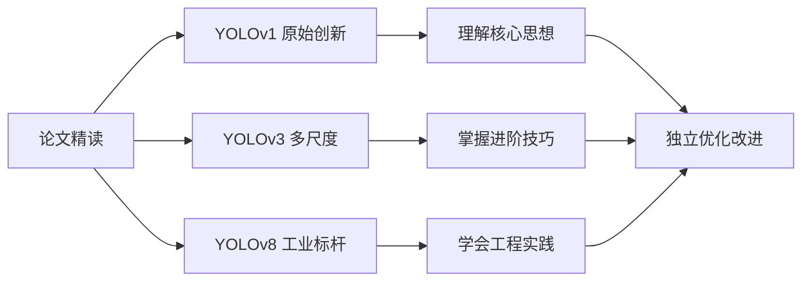
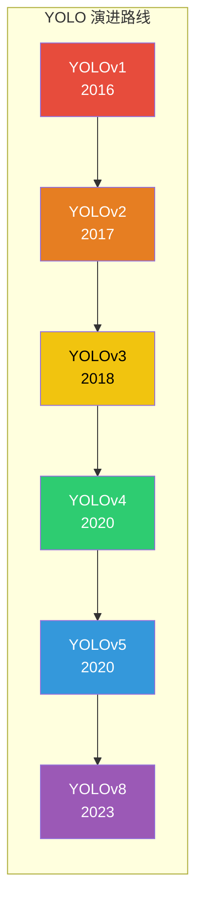
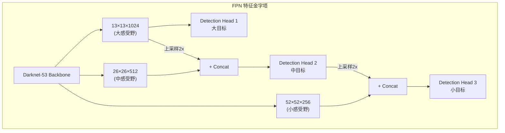
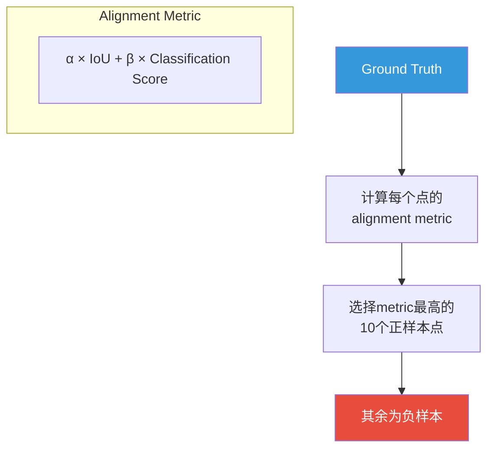
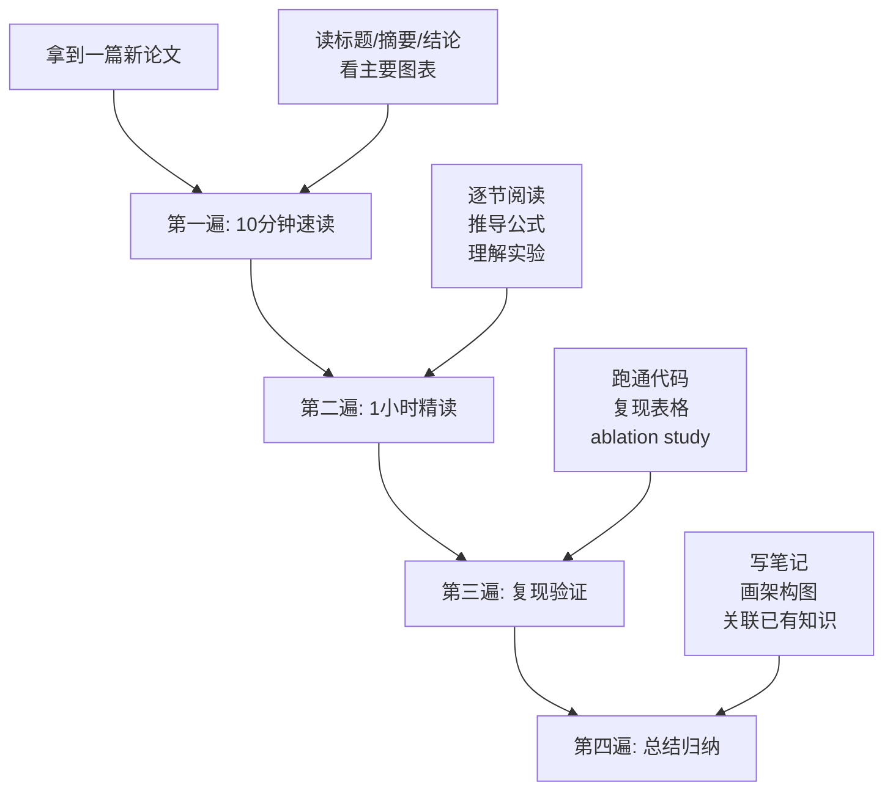

# 论文精读：YOLO系列核心论文深度解析

> **目标**: 逐篇精读YOLO领域最具影响力的论文，从数学原理到工程实现，建立完整的知识体系

---

## 📖 阅读指南



**建议阅读方式**: 每篇论文按「背景→方法→实验→思考」的顺序阅读，配合代码实践效果最佳

---

## 🏆 一、YOLOv1: You Only Look Once (CVPR 2016)

> **Joseph Redmon, Santosh Divvala, Ross Girshick, Ali Farhadi**
> 
> [arXiv:1506.02640](https://arxiv.org/abs/1506.02640) | 引用: 20,000+

### 1.1 论文背景与动机

#### 为什么需要YOLO？

在YOLO出现之前（2015年之前），目标检测主要分为两大流派：

| 方法类型 | 代表算法 | 核心思路 | 缺点 |
|----------|----------|----------|------|
| **两阶段检测器** | R-CNN, Fast R-CNN | 先生成候选区域 → 再分类 | 速度慢，难以实时 |
| **单阶段检测器** | (当时几乎没有) | 直接回归位置和类别 | 精度较低 |

> 💡 **关键洞察**: Redmon发现，可以将目标检测重新构架为**单一的回归问题**——直接从图像像素预测边界框坐标和类别概率！

#### 传统方法的痛点

```
R-CNN 检测流程:
┌──────────┐     ┌───────────┐     ┌──────────┐     ┌──────────┐
│ 输入图片 │────▶│ 区域提议  │────▶│ CNN特征   │────▶│ SVM分类  │
│          │     │ (2000个)  │     │ 提取      │     │ + 边框回归│
└──────────┘     └───────────┘     └──────────┘     └──────────┘
                    ↓
              耗时瓶颈！每张图需要2秒+
```

### 1.2 核心方法详解

#### 整体架构：统一检测框架

YOLO的核心思想可以用一句话概括：

> **将输入图像划分为 $S \times S$ 个网格，每个网格负责检测中心点落在该网格内的目标。**

```mermaid
graph TB
    subgraph "YOLOv1 检测流程"
        A[448×448 输入图像] --> B[S×S 网格划分]
        B --> C[每个网格预测]
        C --> B1[B个边界框]
        C --> C1[C个类别概率]
        B1 & C1 D[置信度过滤]
        D --> E[NMS去重]
        E --> F[最终检测结果]
    end
    
    style A fill:#1a1a2e,color:#e94560
    style F fill:#0f3460,color:#16c79a
```

#### 数学建模

对于每个网格 $(i, j)$，YOLO需要预测：

$$
\text{Prediction} = \underbrace{(x, y, w, h, \text{conf})}_{\text{每个边界框} \times B} + \underbrace{(p_1, p_2, ..., p_C)}_{\text{类别概率}}
$$

其中：
- **$(x, y, w, h)$**: 边界框的中心坐标、宽、高（相对于网格单元）
- **$\text{conf}$**: 置信度 = 该框包含目标的概率 × IOU精度
- **$(p_1, ..., p_C)$**: 属于每个类别的条件概率

**最终检测分数**:

$$
\text{Score}(c) = P(\text{Object}) \times \text{IOU}_{\text{pred}}^{\text{truth}} \times P(\text{Class}=c | \text{Object})
$$

#### 网络结构

```
输入层: 448 × 448 × 3
    │
    ▼
┌─────────────────────────────┐
│  卷积层 1: 7×7, 64, stride 2  │  → 224×224×64
│  + MaxPool: 2×2, stride 2    │  → 112×112×64
├─────────────────────────────┤
│  卷积层 2: 3×3, 192           │  → 112×112×192
│  + MaxPool: 2×2, stride 2    │  → 56×56×192
├─────────────────────────────┤
│  卷积层 3-5: 3×3, 128/256/256│  → 28×28×256
│  + MaxPool: 2×2, stride 2    │  → 14×14×256
├─────────────────────────────┤
│  卷积层 6-8: 3×3, 512/1024/  │  → 7×7×1024
├─────────────────────────────┤
│  全连接层 1-2: 4096/4096      │
├─────────────────────────────┤
│  输出层: S×S×(B×5+C)         │  → 7×7×30 (B=2, C=20)
└─────────────────────────────┘
```

> ⚠️ **注意**: YOLOv1使用全连接层做最终预测，这限制了输入尺寸必须固定为448×448。

#### 损失函数设计

损失函数是理解YOLO的关键。它由三部分组成：

$$
\mathcal{L} = \lambda_{\text{coord}} \mathcal{L}_{\text{coord}} + \mathcal{L}_{\text{conf}} + \lambda_{\text{class}} \mathcal{L}_{\text{class}}
$$

##### (1) 定位损失（边界框坐标）

$$
\mathcal{L}_{\text{coord}} = \sum_{i=0}^{S^2} \sum_{j=0}^{B} \mathbb{1}_{ij}^{\text{obj}} \left[
(x_i - \hat{x}_i)^2 + (y_i - \hat{y}_i)^2
\right] + \sum_{i=0}^{S^2} \sum_{j=0}^{B} \mathbb{1}_{ij}^{\text{obj}} \left[
(\sqrt{w_i} - \sqrt{\hat{w}_i})^2 + (\sqrt{h_i} - \sqrt{\hat{h}_i})^2
\right]
$$

> 💡 **为什么对宽高开根号？** 小目标的绝对误差影响更大，开根号后让大小不同的框的误差贡献更均衡。

##### (2) 置信度损失

$$
\mathcal{L}_{\text{conf}} = \sum_{i=0}^{S^2} \sum_{j=0}^{B} \mathbb{1}_{ij}^{\text{obj}} (C_i - \hat{C}_i)^2 + \lambda_{\text{noobj}} \sum_{i=0}^{S^2} \sum_{j=0}^{B} \mathbb{1}_{ij}^{\text{noobj}} (C_i - \hat{C}_i)^2
$$

> 💡 **关键设计**: $\lambda_{\text{noobj}} = 0.5$，降低不含目标网格的置信度损失权重，解决正负样本不平衡问题。

##### (3) 分类损失

$$
\mathcal{L}_{\text{class}} = \sum_{i=0}^{S^2} \mathbb{1}_i^{\text{obj}} \sum_{c \in \text{classes}} (p_i(c) - \hat{p}_i(c))^2
$$

### 1.3 训练策略细节

#### 预训练策略

```
Step 1: 在 ImageNet 上预训练前20层卷积网络
        ├── 输入: 224×224
        ├── 训练: ~1周
        └── 目标: 学习通用视觉特征

Step 2: 增加4层卷积 + 2层全连接，随机初始化
        ├── 输入: 448×448 (更高分辨率)
        ├── 微调: 用检测数据继续训练
        └── 目标: 适应检测任务
```

#### 数据增强技巧

| 技巧 | 说明 | 效果 |
|------|------|------|
| **随机缩放** | 输入尺寸在原尺寸的±20%间随机变化 | 提升对不同尺度目标的鲁棒性 |
| **随机裁剪** | 随机裁剪后再resize到448×448 | 增加数据多样性 |
| **颜色抖动** | 随机调整曝光/饱和度 | 减少过拟合 |

### 1.4 实验结果分析

#### Pascal VOC 2007 性能对比

| 方法 | mAP | FPS | 架构 |
|------|-----|-----|------|
| **YOLOv1** | **63.4%** | **45** | 单阶段 |
| Fast R-CNN | 70.0% | 0.5 | 两阶段 |
| DPM | 26.8% | 0.07 | 传统 |

> 🎯 **关键结论**: YOLO以**90倍的速度**达到了接近Fast R-CNN的精度，首次实现了**实时目标检测**！

#### YOLO的优势与局限

**✅ 优势:**
- 速度极快（实时检测成为可能）
- 全局上下文信息（看到整张图）
- 泛化能力强（艺术品等非自然图像）

**❌ 局限:**
- 小目标检测差（7×7网格太粗糙）
- 定位不够精确（每个网格只预测2个框）
- 相邻目标互相干扰（如鸟群）

### 1.5 个人思考与启示

> **YOLOv1最大的贡献不是精度，而是范式转换。** 它证明了目标检测可以是一个简单的回归问题，而不需要复杂的候选区域生成。这种"端到端"的思想深刻影响了后续所有单阶段检测器的设计。

**值得深入思考的问题:**
1. 为什么用 $S \times S$ 网格而不是滑动窗口？（计算效率 vs 精度的权衡）
2. 置信度设计的巧妙之处在哪里？（将"有没有物体"和"框准不准"解耦）
3. $\sqrt{w}, \sqrt{h}$ 的设计对实际应用有何启发？

---

## 🚀 二、YOLOv3: An Incremental Improvement (2018)

> **Joseph Redmon, Ali Farhadi**
>
> [arXiv:1804.02767](https://arxiv.org/abs/1804.02767) | 引用: 10,000+

### 2.1 从YOLOv1到YOLOv3的演进



### 2.2 YOLOv3三大核心改进

#### 改进一：Darknet-53 骨干网络

```
YOLOv1: 自定义简单CNN + 全连接层
YOLOv3: Darknet-53 (残差连接)
```

**Darknet-53 结构:**

```
Input: 416×416×3
    │
    ├─ Conv 3×3, 32
    ├─ Conv 3×3, 64       + Residual Block ×1
    ├─ Conv 3×3, 128      + Residual Block ×2
    ├─ Conv 3×3, 256      + Residual Block ×8   ← stride 2 (52×52)
    ├─ Conv 3×3, 512      + Residual Block ×8   ← stride 2 (26×26)
    └─ Conv 3×3, 1024     + Residual Block ×4   ← stride 2 (13×13)

输出三个尺度的特征图:
    - 13×13×255 (大目标) ← 检测头 1
    - 26×26×255 (中目标) ← 检测头 2 (上采样+融合)
    - 52×52×255 (小目标) ← 检测头 3 (上采样+融合)
```

> 💡 **残差连接的作用**: 让网络可以更深（53层）而不会出现梯度消失问题，提取更丰富的特征。

#### 改进二：FPN多尺度检测（Feature Pyramid Network）

这是YOLOv3最重要的改进之一！



**为什么需要多尺度？**

| 尺度 | 感受野 | 适用场景 | 示例 |
|------|--------|----------|------|
| 13×13 | 大 | 大目标、全局上下文 | 人、车、建筑 |
| 26×26 | 中 | 中等目标 | 狗、椅子、桌子 |
| 52×52 | 小 | 小目标细节 | 交通标志、远处的行人 |

#### 改进三：Anchor Box机制

YOLOv3引入了**先验框(Anchor)**的概念：

```python
# K-means聚类得到的9个Anchor（针对COCO数据集）
anchors = [
    # 大尺度 (13×13)
    (116, 90), (156, 198), (373, 326),
    # 中尺度 (26×26)  
    (30, 61), (62, 45), (59, 119),
    # 小尺度 (52×52)
    (10, 13), (16, 30), (33, 23),
]

# 每个网格预测 3 个边界框（对应3组anchor）
# 每个框: (tx, ty, tw, th, confidence, class_probs...)
```

**Anchor预测公式:**

$$
b_x = \sigma(t_x) + c_x, \quad b_y = \sigma(t_y) + c_y
$$

$$
b_w = p_w e^{t_w}, \quad b_h = p_h e^{t_h}
$$

其中 $(p_w, p_h)$ 是anchor的宽高，$(t_x, t_y, t_w, t_h)$ 是网络输出。

### 2.3 损失函数的变化

相比YOLOv1，YOLOv3的损失函数更加复杂：

$$
\mathcal{L}_{\text{total}} = \mathcal{L}_{\text{box}} + \mathcal{L}_{\text{obj}} + \mathcal{L}_{\text{class}}
$$

**关键区别:**
- 使用**二元交叉熵**代替softmax做分类（支持多标签）
- 每个**尺度**都有独立的损失计算
- 不再对宽高开根号（因为有了anchor作为参考）

### 2.4 实践经验总结

#### YOLOv3调参心得

| 参数 | 推荐值 | 影响 |
|------|--------|------|
| `input_size` | 416~608 | 越大越精确但越慢 |
| `iou_threshold` | 0.5 (NMS) | 过高会漏检，过低会重复 |
| `confidence_threshold` | 0.25~0.5 | 根据业务需求调整 |
| `learning_rate` | 0.001 (初始) | 配合cosine annealing |

#### 常见问题诊断

```mermaid
graph TD
    A[检测结果不理想] --> B{什么问题?}
    B -->|"漏检太多"| C[降低confidence阈值<br/>或增加input_size]
    B -->|"重复框多"| D[提高NMS iou阈值<br/>或检查anchor设置]
    B -->|"定位不准"| E[增加训练epoch<br/>或调整数据增强强度]
    B -->"|小目标丢失"| F[启用更多检测尺度<br/>或使用高分辨率输入]
```

---

## 🔥 三、YOLOv8: Ultralytics官方实现 (2023)

> **Ultralytics Team**
>
> [GitHub](https://github.com/ultralytics/ultralytics) | [Docs](https://docs.ultralytics.com/)

### 3.1 YOLOv8 vs YOLOv5: 核心差异

| 特性 | YOLOv5 | YOLOv8 |
|------|---------|--------|
| **检测头** | Anchor-Based | **Anchor-Free** |
| **标签分配** | 手动匹配 | **Task Aligned Assigner** |
| **分类分支** | 独立标签 | **解耦头(DFL)** |
| **损失函数** | CIoU Loss | **CIoU + DFL + BCE** |
| **训练策略** | 固定超参 | **Ultralytics Auto- Tuning** |

### 3.2 Anchor-Free机制详解

这是YOLOv8最本质的改变！

```mermaid
graph LR
    subgraph "Anchor-Based (YOLOv5)"
        A1["预设9个Anchor框"] --> B1["预测相对偏移量"]
        B1 C1["解码为绝对坐标"]
    end
    
    subgraph "Anchor-Free (YOLOv8)"
        A2["无预设Anchor"]
        B2["直接预测中心点(x,y)<br/>距离四条边的距离(l,r,t,b)"]
        B2 C2["解码为边界框"]
    end
    
    style A1 fill:#e74c3c,color:white
    style A2 fill:#2ecc71,color:white
```

**Anchor-Free 的优势:**
1. ✅ 无需预先聚类计算Anchor
2. ✅ 对不同数据集适应性更强
3. ✅ 减少超参数调优负担
4. ✅ 对极端长宽比的目标更友好

### 3.3 解耦头 (Decoupled Head) 与 DFL

传统YOLO用一个分支同时预测类别和位置，YOLOv8将其分离：

```
Backbone Feature Map (80通道)
        │
        ▼
   ┌────┴────┐
   │         │
   ▼         ▼
Cls Branch  Reg Branch
(80类概率)  (4个边界框值)
   │         │
   ▼         ▼
  BCE Loss  DFL + CIoU Loss
```

**DFL (Distribution Focal Loss):**

DFL将边界框回归转化为**分布预测**问题：

$$
\hat{l} = \sum_{i=0}^{S-1} i \cdot P(i)
$$

其中 $P(i)$ 是网络预测的位置分布概率。这让模型能学习到**更精细的定位**。

### 3.4 Task Aligned Assigner (TAA)

TAA是YOLOv8训练效率提升的关键：



> 💡 **核心思想**: 同时考虑分类得分和定位质量来分配正负样本，避免"分类好但定位差"或"定位好但分类差"的样本干扰训练。

### 3.5 YOLOv8 实战代码示例

#### 快速推理

```python
from ultralytics import YOLO

# 加载预训练模型
model = YOLO('yolov8n.pt')  # nano版本，最快

# 推理
results = model.predict(
    source='image.jpg',
    conf=0.25,      # 置信度阈值
    iou=0.7,        # NMS IoU阈值
    imgsz=640,      # 输入尺寸
    device='0',     # GPU设备
    verbose=True
 )

# 可视化结果
results[0].plot(save=True, filename='result.jpg')
```

#### 自定义训练

```python
from ultralytics import YOLO

model = YOLO('yolov8n.yaml')  # 从配置文件构建

results = model.train(
    data='my_dataset.yaml',  # 数据集配置
    epochs=100,
    imgsz=640,
    batch=16,
    device=0,
    workers=8,
    optimizer='SGD',
    lr0=0.01,
    lrf=0.01,           # 最终学习率
    momentum=0.937,
    weight_decay=0.0005,
    warmup_epochs=3,
    augment=True,       # 数据增强
    mosaic=1.0,         # Mosaic增强比例
    mixup=0.1,          # MixUp增强比例
    project='runs/train',
    name='yolov8_custom',
    exist_ok=False,
    pretrained=True,
    val=True,
    plots=True,         # 生成训练曲线图
    save=True,
    save_period=10,     # 每10轮保存
)
```

#### 导出为ONNX/TensorRT格式

```python
# 导出ONNX
model.export(format='onnx', dynamic=True, simplify=True)

# 导出TensorRT (需要NVIDIA GPU)
model.export(format='engine', device=0, half=True)

# 导出OpenVINO (Intel CPU优化)
model.export(format='openvino', half=True)
```

### 3.6 YOLOv8 各版本对比

| 模型 | 参数量(m) | FLOPs(G) | mAPval | TPU latency | 适用场景 |
|------|-----------|----------|--------|-------------|----------|
| **YOLOv8n** | 3.2 | 8.7 | 37.3 | **0.77ms** | 移动端/边缘设备 |
| **YOLOv8s** | 11.2 | 28.6 | 44.9 | 1.31ms | 轻量服务器 |
| **YOLOv8m** | 25.9 | 78.9 | 50.2 | 2.15ms | 通用场景 |
| **YOLOv8l** | 43.7 | 165.2 | 52.9 | 3.46ms | 高精度需求 |
| **YOLOv8x** | 68.2 | 257.8 | 53.9 | 5.19ms | 追求极致精度 |

> 🎯 **推荐**: 生产环境首选 **YOLOv8s** 或 **YOLOv8m**，精度和速度的最佳平衡点。

---

## 📊 四、论文对比总览

### 核心技术演进表

| 技术 | YOLOv1 | YOLOv2 | YOLOv3 | YOLOv5 | YOLOv8 |
|------|--------|--------|--------|--------|--------|
| **Backbone** | Custom CNN | Darknet-19 | Darknet-53 | CSPDarknet | CSPDarknet-PAN |
| **Neck** | 无 | Passthrough | FPN | PANet | PANet |
| **Head** | FC | Anchor | Anchor | Anchor | **Anchor-Free** |
| **多尺度** | ❌ | ❌ | ✅ FPN | ✅ PAN | ✅ PAN |
| **标签分配** | 手工 | Anchor匹配 | Anchor匹配 | Anchor匹配 | **TAA** |
| **Loss** | MSE+SSE | CIoU | CIoU+BCE | CIoU+BCE | **CIoU+DFL+BCE** |
| **激活函数** | LeakyReLU | LeakyReLU | LeakyReLU | SiLU | **SiLU** |
| **归一化** | BatchNorm | BatchNorm | BatchNorm | BatchNorm | **BatchNorm** |
| **输入尺寸** | 448×448 | 416×416 | 416×416 | 640×640 | **自适应** |

### 关键指标趋势

```
精度 (mAP):
YOLOv1(63.4%) → YOLOv2(78.6%) → YOLOv3(57.9%@0.5IOU) → YOLOv5(56.8%) → YOLOv8(53.9%)

注意: 不同版本的评估数据集不同(PASCAL VOC/COCO)，不能直接比较数值。
但趋势清晰: 早期追求极致精度，后期追求实用平衡。

速度 (FPS@GPU):
YOLOv1(45) → YOLOv2(67) → YOLOv3(33) → YOLOv5(140+) → YOLOv8(280+)

趋势: 速度持续提升，得益于网络结构优化和硬件适配。
```

---

## 🧠 五、深入理解：如何阅读检测论文？

### 5.1 论文阅读方法论



### 5.2 YOLO论文阅读检查清单

阅读每篇YOLO相关论文时，问自己这些问题：

- [ ] **动机是什么？** 解决了什么具体问题？
- [ ] **核心创新点在哪？** 和之前的方法有什么本质区别？
- [ ] **网络结构如何设计？** 能画出完整的前向传播图吗？
- [ ] **损失函数怎么写？** 每一项的含义是什么？
- [ ] **实验做了哪些？** ablation study说明了什么？
- [ ] **局限性有哪些？** 作者自己也承认了什么不足？
- [ ] **我能从中借鉴什么？** 可以应用到我的项目中吗？

### 5.3 推荐阅读顺序

```
入门级 (建立直觉):
  1. YOLOv1 — 理解基本思想
  2. YOLOv3 — 理解多尺度检测
  
进阶级 (深入原理):
  3. FPN (Feature Pyramid Networks) — 特征金字塔基础
  4. IoU Loss 系列 (IoU/GIoU/DIoU/CIoU) — 损失函数演进
  5. Focal Loss — 解决正负样本不平衡
  
高级 (前沿研究):
  6. DETR/Deformable DETR — Transformer检测
  7. RT-DETR — 实时Transformer检测
  8. YOLO-NAS / YOLOv10 — 最新进展
```

---

## 🔗 相关链接

- [[YOLO发展历程]] - YOLO系列完整时间线
- [[YOLOv8架构详解]] - YOLOv8详细架构解读
- [[快速开始指南]] - Ultralytics框架上手教程
- [[推理速度优化]] - TensorRT/ONNX部署实战
- [[学习路线图]] - 系统化学习路径规划

---

*最后更新: 2026-04-14*
